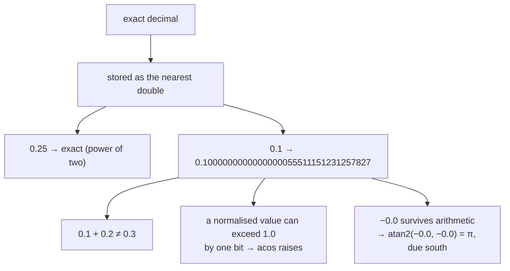

# Floating-point representation

Computers store real numbers approximately. Knowing where the approximation
bites — and where it does not — explains several guards in this codebase that
otherwise look like superstition.

## What it is

A double-precision float stores a number as sign, exponent, and a 53-bit
fraction. That gives roughly 15–17 significant decimal digits, and a fixed
relative precision rather than an absolute one.

Three consequences do all the damage:

**Most decimals are not representable.** `0.1` in binary is a repeating
fraction, so it is stored as the nearest double — slightly off. Hence the
classic `0.1 + 0.2 !== 0.3`.

**Precision is relative.** Near 1.0, doubles resolve about 2×10⁻¹⁶. Near
1 000 000, about 10⁻¹⁰. Adding a small number to a large one can change nothing
at all.

**Special values exist.** `NaN` (not a number) is not equal to itself, `inf`
propagates through arithmetic, and `-0.0` equals `0.0` but behaves differently
under `atan2`.

Some numbers *are* exact: integers up to 2⁵³, and any fraction whose denominator
is a power of two — 0.5, 0.25, 0.125. That fact is used deliberately here.

## The picture



## Where this project uses it

Four distinct defences, each against a specific consequence.

### Clamping before `acos`

`poggio_webapp/pipeline/true_dip.py`:

```python
x, y, z = (component / length for component in normal)
if z < 0:
    x, y, z = -x, -y, -z

dip = math.degrees(math.acos(max(-1.0, min(1.0, z))))
```

After dividing by the vector's own length, `z` should lie in `[−1, 1]`.
Floating-point rounding can produce `1.0000000000000002`, and `math.acos` raises
`ValueError` on it. The clamp is not defensive programming in the vague sense —
it is guarding a known, reproducible consequence of division.

### Handling negative zero

The same function, a few lines later:

```python
if math.hypot(x, y) == 0.0:
    # Perfectly flat: the dip direction is undefined, and the sign flip
    # above can leave negative zeros that atan2 would read as due south.
    return dip, 0.0
```

`-0.0 == 0.0` is `True`, so the values look identical — but
`atan2(-0.0, -0.0)` returns π while `atan2(0.0, 0.0)` returns 0. A perfectly
flat surface would be reported as dipping **due south**. The comment names the
mechanism, which is what makes the guard maintainable.

### Choosing constants that are exact

`poggio_webapp/static/canvas/grid.mjs`:

```javascript
export const PIXELS_PER_METER = 200;
export const GRID_SPACING_METERS = 0.25;
```

0.25 is a power of two, so it is stored exactly. 200 × 0.25 = **exactly 50**
pixels. Every grid line lands on an integer pixel and every snapped point
converts back to metres with no error. Had the spacing been 0.3 m, the
conversions would accumulate drift and two "identical" vertices might not
compare equal.

Choosing representable constants is cheaper than tolerating the error later.

### Rejecting non-finite values at the boundary

`poggio_webapp/pipeline/editor/geometry.py`:

```python
def _point_coordinates(point: dict) -> tuple[float, float] | None:
    x_coordinate = point.get("x")
    y_coordinate = point.get("y")
    if (
        not isinstance(x_coordinate, (int, float))
        or isinstance(x_coordinate, bool)
        or not math.isfinite(x_coordinate)
        ...
    ):
        return None
    return float(x_coordinate), float(y_coordinate)
```

Two checks in one expression. `math.isfinite` excludes `NaN` and `inf`, which
would otherwise propagate silently through every geometric predicate — `NaN`
comparisons are all `False`, so a self-intersection test would quietly report
"no intersection."

`isinstance(x, bool)` is the Python-specific trap: `bool` is a subclass of
`int`, so `True` passes an `isinstance(x, (int, float))` check and arithmetics
as 1. The same pattern appears in
`poggio_webapp/backend/services/viewer_files.py`:

```python
def _valid_number(value):
    return (
        isinstance(value, (int, float))
        and not isinstance(value, bool)
        and math.isfinite(value)
    )
```

and in `true_dip._number`, and in `manual_extraction._positive_number`. Four
independent implementations of the same trust-boundary rule, each at the point
where untrusted JSON becomes numbers. See
[validation at trust boundaries](validation-at-trust-boundaries.md).

## Why this and not something else

| Alternative | How it would work here | Why it lost |
|---|---|---|
| **`decimal.Decimal`** | Exact decimal arithmetic | Removes the base-2 representation error entirely. It is orders of magnitude slower, has no equivalent in the browser, and does not help with the actual problems here — `acos` overshoot comes from division, and geometry needs transcendental functions Decimal handles poorly. |
| **Rational arithmetic (`fractions.Fraction`)** | Exact ratios | Exact for the arithmetic that stays rational, and square roots and trigonometry are not rational. Denominators also grow without bound. |
| **Fixed-point integers** | Store micrometres as integers | Exact, fast, and used in some CAD systems. It would mean reimplementing every geometric operation, and interoperating with OpenCV, NumPy, and JSON — all of which are float — at every boundary. |
| **Doubles, with guards at the known failure points** *(chosen)* | Clamp, check finiteness, choose exact constants, use tolerances where arithmetic has occurred | The failure points are few, well understood, and individually cheap to guard. Everything interoperates. |
| **Doubles, ungraded** | Ignore it | Produces the exact bugs this codebase's comments describe: a `ValueError` from `acos`, a flat surface dipping south, a `NaN` silently passing a validity check. |

The pattern worth extracting: **guard at the point where the failure is
generated, and say what generates it.** Each of the four guards above is
accompanied by a comment or a name explaining the mechanism, so a later reader
does not remove it as redundant.

## What it costs

The guards themselves are free — a comparison, a clamp, a type check.

The real cost is that **equality is unreliable after arithmetic**, which forces
the tolerance decisions documented in [epsilon comparison](epsilon-comparison.md).
This repository makes that choice differently in different modules, correctly:
`editor/geometry.py` compares `== 0` exactly because its
[orientation test](signed-area-and-orientation-test.md) involves no division and
its inputs are raw clicks, while `layer-fill.mjs` uses an epsilon because its
coordinates have been through [interpolation](linear-interpolation.md).

Two policies, each justified by what has happened to the numbers.

## Where else you meet it

- **Currency.** Never store money in floats; `0.1 + 0.2` problems become
  accounting discrepancies. Fixed-point or integer cents is standard.
- **The Patriot missile failure (1991)**, where accumulated error in a
  time counter caused a targeting miss.
- **Game physics**, where accumulated float error causes objects to drift
  through walls.
- **GIS**, where global coordinates in single precision lose sub-metre accuracy —
  which is why local grids like this project's exist.
- **Machine learning**, where reduced-precision training is a deliberate
  trade of accuracy for speed.
- **JavaScript**, where all numbers are doubles, so integers above 2⁵³ silently
  lose precision — hence `Number.isSafeInteger` in `volume3d-core.mjs`.

## Related pages

- [Epsilon comparison](epsilon-comparison.md) — how to compare inexact values.
- [Grid snapping and quantisation](grid-snapping-and-quantisation.md) — rounding
  deliberately, and choosing exact constants.
- [Bit depth and dynamic range](bit-depth-and-dynamic-range.md) — the integer
  side of the same concern.
- [Plane normals](plane-normals.md) — where the `acos` clamp and negative-zero
  guard live.
- [Validation at trust boundaries](validation-at-trust-boundaries.md) — where non-finite values are
  rejected.
