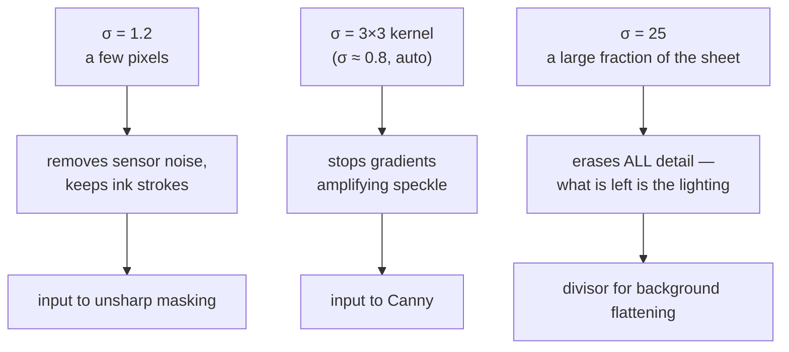

# Gaussian blur

Smoothing an image by averaging each pixel with its neighbours, weighted by a
bell curve. Used here for three completely different purposes at three very
different widths.

## What it is

A Gaussian blur is a [convolution](convolution.md) whose weights follow the
normal distribution:

```
G(x, y) = (1 / 2πσ²) · e^(−(x² + y²) / 2σ²)
```

The single parameter σ (sigma) sets the width. Nearby pixels count heavily,
distant ones fade off smoothly, and the weights sum to 1 so brightness is
preserved.

Why the bell curve rather than a plain average:

- **No ringing.** A box average has sharp edges in its weights, which produces
  visible banding and halos. The Gaussian has none.
- **Separable.** A 2D Gaussian equals a 1D Gaussian applied horizontally then
  vertically, so a σ=25 blur costs ~150 multiplies per pixel instead of ~5600.
- **Rotationally symmetric.** It blurs equally in every direction, so it does
  not favour horizontal or vertical structure — which matters when the next
  stage is looking for lines at arbitrary angles.
- **Repeated blurs compose.** Two Gaussians of σ₁ and σ₂ give one of
  √(σ₁² + σ₂²), which is what makes scale-space theory work.

## The picture

σ controls everything, and this project uses three wildly different values:



That third use is the counter-intuitive one. Blurring so heavily that the
drawing disappears is not a mistake — the residue *is* the illumination field,
and dividing by it removes the illumination. See
[homomorphic illumination correction](homomorphic-illumination-correction.md).

## Where this project uses it

### Estimating the lighting field — σ = 25

`poggio_webapp/pipeline/preprocess.py`:

```python
def flatten_background(gray):
    """Divide out large-scale illumination/paper tone so faint ink is even."""
    bg = cv2.GaussianBlur(gray, (0, 0), sigmaX=25)
    bg = np.where(bg == 0, 1, bg)
    norm = gray.astype(np.float32) / bg.astype(np.float32)
    ...
```

`(0, 0)` for the kernel size tells OpenCV to derive it from σ. The
`np.where(bg == 0, 1, bg)` guard prevents division by zero in a region that
blurred to pure black.

### Building the sharpening mask — σ = 1.2

```python
blur = cv2.GaussianBlur(eq, (0, 0), sigmaX=1.2)
sharp = cv2.addWeighted(eq, 1.5, blur, -0.5, 0)
```

### Denoising before edge detection — 3×3

`poggio_webapp/pipeline/detect_features.py`:

```python
gray = cv2.cvtColor(analysis, cv2.COLOR_BGR2GRAY)
gray = cv2.GaussianBlur(gray, (3, 3), 0)
```

[Canny](canny-edge-detection.md) differentiates the image, and differentiation
amplifies high-frequency noise. Blurring first is not optional; it is part of
the Canny algorithm as originally specified.

## Why this and not something else

| Alternative | How it would work here | Why it lost |
|---|---|---|
| **Box blur (plain average)** | Uniform weights over a k×k window | Faster — constant time per pixel with a summed-area table, regardless of radius. But it rings: sharp weight edges create halos and directional artefacts along the axes. On a σ=25 background estimate those artefacts would be divided into every pixel. |
| **Median filter** | Replace each pixel with the median of its neighbourhood | Far better at removing salt-and-pepper speckle while keeping edges crisp. It is non-linear, so it does not compose, is not separable, and is much slower at large radii. It also *preserves* edges, which is exactly wrong for a background estimate — the drawing would survive into the divisor. |
| **Bilateral filter** | Gaussian in space *and* in intensity, so edges are preserved | Excellent for denoising photographs. Same objection for the background estimate, plus an order of magnitude more cost. |
| **Morphological opening or closing with a huge kernel** | Estimate the background by grey-scale morphology | A standard alternative for document background estimation, and genuinely good on text. Costs more at radius 25 and produces a piecewise-flat estimate where the real illumination is smooth. |
| **Fit a low-order polynomial surface** | Least-squares fit a 2D quadratic to the intensities | Very cheap and gives an explicitly smooth field. It assumes the lighting has a simple shape. A phone photo with a shadow from the photographer's own hand does not. |

The blur is chosen once and used at three scales because its properties —
smooth, symmetric, separable, composable — hold at every scale. A filter that
had to be swapped depending on radius would be three decisions instead of one.

## What it costs

| | |
|---|---|
| Naive 2D | O(n · k²) |
| Separable *(what OpenCV does)* | O(n · k) |
| Kernel size from σ | roughly k ≈ 6σ + 1 |

At σ = 25 that is a kernel around 151 wide: 22 801 multiplies per pixel naively,
302 separably. The separability is the difference between "usable" and "not."

## Where else you meet it

- **Portrait mode** on a phone camera — the background blur is a depth-guided
  Gaussian.
- **CSS `filter: blur()`** and every frosted-glass interface effect.
- **Scale-space and SIFT features**, built entirely from Gaussians at
  successive σ.
- **Anti-aliasing** in rendering, which is low-pass filtering before sampling.
- **Statistics.** Kernel density estimation is a Gaussian blur of a histogram.

## Related pages

- [Convolution](convolution.md) — the mechanism.
- [Homomorphic illumination correction](homomorphic-illumination-correction.md) —
  the σ=25 use.
- [Unsharp masking](unsharp-masking.md) — the σ=1.2 use.
- [Canny edge detection](canny-edge-detection.md) — the 3×3 use.
