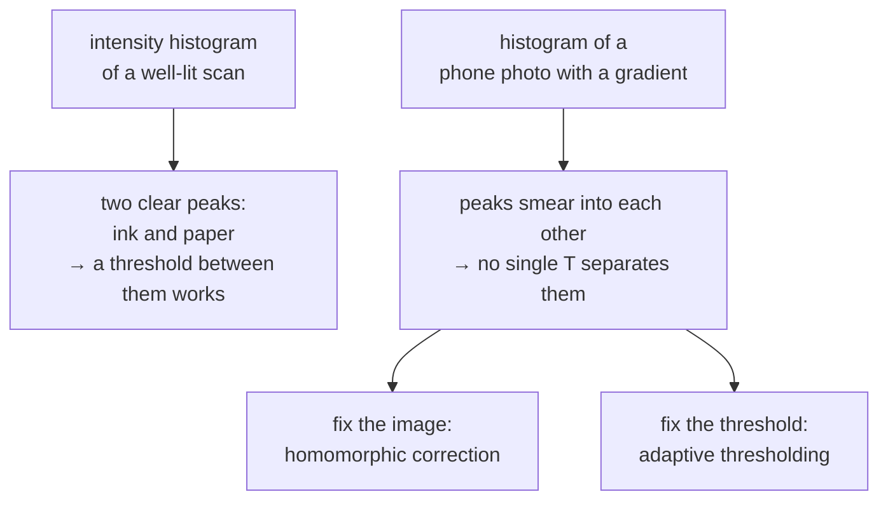

# Global thresholding

Pick one number. Everything darker is ink, everything lighter is paper. The
simplest possible segmentation, and the one this project deliberately abandoned.

## What it is

Thresholding turns a grayscale image into a binary one:

```
out(x, y) = 255  if in(x, y) < T   else 0
```

*Global* means a single `T` for the entire image. It is one comparison per
pixel, it has no parameters beyond `T`, and it is completely predictable.

Its assumption is strong and usually false: that ink and paper occupy
non-overlapping intensity ranges **across the whole image at once**. That holds
for a flat-lit 300 DPI scan. It fails for a phone photograph of a field sheet,
where paper in the shadowed corner is darker than pencil in the lit one.

## The picture

One row across a badly lit sheet, with `T = 130`:

```
position     left ─────────────────────────────► right
paper         240   225   190   160   130   110
ink           120   112    95    80    65    55

T = 130   →   paper: ✓ ✓ ✓ ✓ ✗ ✗      the right-hand paper is misread as ink
              ink:   ✓ ✓ ✓ ✓ ✓ ✓
```



Those two fixes are both used in this repository, in different modules, for
different reasons.

## Where this project uses it

Only in the narrow case where the value being tested is *already* illumination-
independent. `poggio_webapp/pipeline/detect_markers.py`:

```python
b, g, r = cv2.split(img.astype(np.int32))
redness = r - (g + b) / 2.0
...
return cv2.bitwise_and(ad, (redness < 25).astype(np.uint8) * 255)
```

`redness < 25` is a global threshold with a hard-coded constant, and it is
correct here precisely because
[the subtraction already cancelled the illumination](colour-channel-arithmetic.md).
Grey pencil scores ~3 and red pen ~142 regardless of how brightly that part of
the sheet is lit, so one number genuinely does fit the whole image.

For the *darkness* half of the same mask, the module uses
[adaptive thresholding](adaptive-thresholding.md) instead, because raw
intensity is exactly the quantity a lighting gradient corrupts.

That contrast, inside four lines of one function, is the clearest statement of
the rule: **a global threshold is right when the measured quantity is already
normalised, and wrong otherwise.**

`preprocess.high_contrast()` reaches the same conclusion by the other route,
using [adaptive thresholding](adaptive-thresholding.md) after flattening.

## Why this and not something else

| Alternative | How it would work here | Why it lost, or won |
|---|---|---|
| **Fixed global `T`, chosen by hand** | `gray < 130` | The original CLI tool did this. `detect_markers.py` records the outcome: "a fixed gray<130 threshold fragments light pencil and breaks under phone-photo lighting." |
| **[Otsu's method](otsu-thresholding.md)** | Compute `T` automatically from the histogram | Removes the hand-tuning and keeps the one-threshold-per-image assumption. Better, not sufficient. |
| **[Adaptive thresholding](adaptive-thresholding.md)** | A local `T` per neighbourhood | What the project uses where intensity is the input. Costs a box filter. |
| **[Flatten first](homomorphic-illumination-correction.md), then global** | Remove the gradient, then one `T` works | Also used here, in `preprocess.py`. Produces a corrected *grayscale* image, which adaptive thresholding does not. |
| **Global on a normalised quantity** *(chosen for `redness`)* | Threshold something that has no illumination component | Cheapest correct answer when it applies. One comparison, no window, no parameters. |

## What it costs

O(n), one comparison per pixel, no memory beyond the output. Nothing is cheaper.

The cost is entirely in the assumption. When it holds, global thresholding is
unbeatable; when it does not, it fails **silently**, producing a plausible
binary image with whole regions misclassified, which the next stage then
processes with complete confidence.

## Where else you meet it

- Document scanners in "black and white" mode.
- Barcode readers, which threshold a scan line before decoding.
- Industrial inspection under controlled lighting, the one environment
  where the assumption reliably holds.
- Medical image segmentation by Hounsfield unit: bone is above a fixed CT
  threshold because the units are physically calibrated, which is the same
  "already normalised" argument as `redness`.

## Related pages

- [Otsu's method](otsu-thresholding.md): choosing `T` from the data.
- [Adaptive thresholding](adaptive-thresholding.md): a different `T` per
  region, used here.
- [Homomorphic illumination correction](homomorphic-illumination-correction.md):
  fixing the image instead of the threshold.
- [Colour-channel arithmetic](colour-channel-arithmetic.md): why `redness < 25`
  is legitimate.
- [Binary masks and bitwise operations](binary-masks-and-bitwise-operations.md):
  what the result is used for.
