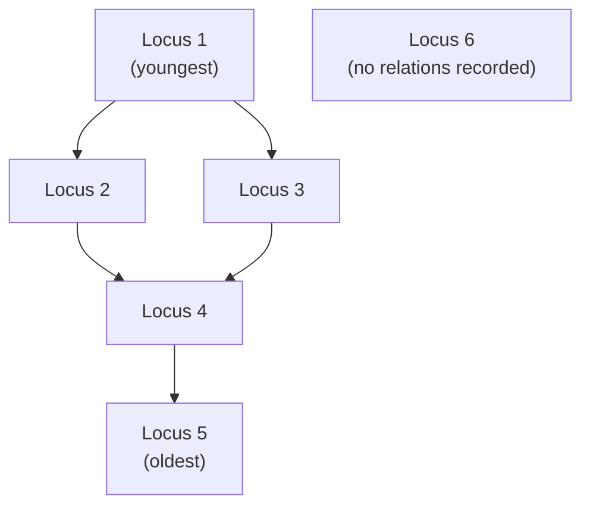

# Graphs and terminology

Things, and the connections between them. The data structure a Harris Matrix
already is, before any software touches it.

## What it is

A **graph** is a set of **nodes** (also called vertices) joined by **edges**.
That is all. Its power is that an enormous variety of problems have this shape.

The vocabulary needed to read the rest of these pages:

| Term | Meaning |
|---|---|
| **Directed** | Edges have a direction. `A → B` is not `B → A`. |
| **Undirected** | Edges are symmetric. |
| **Path** | A sequence of nodes joined by edges. |
| **Cycle** | A path returning to where it started. |
| **Acyclic** | Containing no cycle. |
| **[DAG](directed-acyclic-graphs.md)** | Directed and acyclic — the important case here. |
| **Degree** | How many edges touch a node. **In-degree** counts incoming edges, **out-degree** outgoing. |
| **[Connected component](connected-components.md)** | A group of nodes reachable from one another. |
| **Reachability** | Whether a path exists from one node to another. |
| **Transitive** | If `A → B` and `B → C` imply `A → C`. |

An archaeological chronology is a directed graph whose nodes are stratigraphic
units and whose edges mean "is younger than." The
[Harris Matrix](../archaeology/index.md) is the standard way of drawing one, and
it predates any of this software by decades.

## The picture



Reading it:

- **Nodes** are stratigraphic units.
- **Edges** run from younger to older.
- **Locus 4** has in-degree 2 and out-degree 1.
- There are **two components**: everything connected, and Locus 6 alone.
- No **cycle** — nothing is both younger and older than something else.
- The edge `Locus 1 → Locus 4` is *implied* by two paths and would be
  [transitively redundant](transitive-reduction.md) if recorded.

## Where this project uses it

Two independent graph problems, in two modules.

### The Harris Matrix

`poggio_webapp/pipeline/harris_matrix.py` models the chronology directly:

```python
class HarrisRelation(_HarrisModel):
    id: RelationId
    younger_id: UnitId
    older_id: UnitId
    kind: RelationKind
    evidence: HumanText
    source: RelationSource
    notes: HumanText | None
```

A relation **is** a directed edge, and it carries more than endpoints:
`evidence` (why an archaeologist asserted it), `kind` (above, cuts, fills,
precedes, other), and `source` (a person, or an accepted suggestion). The
edge is a piece of scholarship, not just a pointer.

There is also a second, subtler structure. A **correlation** — the judgement
that two separately recorded units are the same deposit — is an *undirected*
grouping laid over the directed graph:

```python
class HarrisCorrelation(_HarrisModel):
    id: CorrelationId
    unit_ids: list[UnitId]
    notes: HumanText | None
```

Those groups are collapsed into single display nodes by
[Union-Find](union-find.md), producing a **quotient graph** —
`_collapsed_graph()` — on which everything else operates.

### Layer order across several walls

`poggio_webapp/pipeline/merge_walls.py` builds a completely separate graph:

```python
for earlier, later in zip(sequence, sequence[1:]):
    if earlier == later:
        notes.append(...)
        continue
    if later not in successors[earlier]:
        successors[earlier].add(later)
        indegree[later] += 1
```

Nodes are model surface names; an edge means "this surface is above that one on
at least one wall." Each face contributes the constraints its own layer order
implies, and the union is
[topologically sorted](topological-sorting.md) into one trench-wide sequence.

Two graphs, two node types, the same algorithms.

## Why this and not something else

| Alternative | How it would model chronology | Why it lost |
|---|---|---|
| **A flat ordered list** | Number the units 1..n oldest to youngest | Forces a **total** order where the evidence gives only a **partial** one. Two deposits on opposite sides of a trench may have no relationship at all, and a list forces one — inventing chronology. |
| **A tree** | Parent/child | A unit can be younger than several others *and* older than several others. Locus 4 above has two parents; a tree cannot express that. |
| **A relational table of pairs** | `(younger, older)` rows in a database | This *is* a graph — an edge list. The question is only whether the code treats it as one, and using graph algorithms is what makes cycle detection and transitive reduction available. |
| **A matrix of "is younger than" booleans** | An adjacency matrix | Equivalent for small graphs and O(n²) in memory. See [adjacency representations](adjacency-representations.md). |
| **A directed graph** *(chosen)* | Nodes and directed edges | Matches the evidence exactly: it records the relationships an excavator observed and asserts nothing about pairs they did not. |

The decisive property is **partiality**. Excavation yields relationships between
*some* pairs of units, and a graph represents precisely that. Any structure
requiring a total order would have to manufacture the missing relationships —
which is why `merge_walls.merged_series_order` refuses when the walls
contradict each other rather than picking an order:

> Raises ValueError if the walls contradict each other (a cycle). Guessing an
> order there would invent stratigraphy, so it refuses.

## What it costs

A graph itself costs nothing; the algorithms over it have their own complexities,
covered on their own pages.

The conceptual costs:

- **A partial order needs care to display.** A list can be printed. A graph needs
  [layout](layered-graph-drawing.md).
- **Not every edge set is valid.** A chronology must be
  [acyclic](cycle-detection.md), and the code has to check.
- **Some edges are redundant**, implied by longer paths, and showing them all
  makes a diagram unreadable. See
  [transitive reduction](transitive-reduction.md).
- **The graph is an interpretation.** Every edge is an archaeologist's judgement,
  which is why `HarrisRelation` carries `evidence` and why suggestions must be
  individually accepted.

## Where else you meet it

- **Build systems and package managers**, where dependencies form a DAG and
  a cycle is an error.
- **Spreadsheets**, where cell references form a DAG and a cycle is a circular
  reference.
- **Git history**, which is a DAG of commits.
- **Social networks**, road networks, and the web — the canonical examples.
- **Task scheduling**, where "must happen before" is exactly the Harris Matrix
  relation with different nouns.
- **Neural networks**, whose computation graph is a DAG.

## Related pages

- [Directed acyclic graphs](directed-acyclic-graphs.md) — the specific class
  used here.
- [Adjacency representations](adjacency-representations.md) — how a graph is
  stored.
- [Union-Find](union-find.md) — how correlations collapse into display nodes.
- [Topological sorting](topological-sorting.md) — turning a partial order into a
  sequence.
- [Harris Matrix](../archaeology/index.md) — the archaeological concept.
- [Build a Harris Matrix](../workflows/harris-matrix.md) — the workflow.
