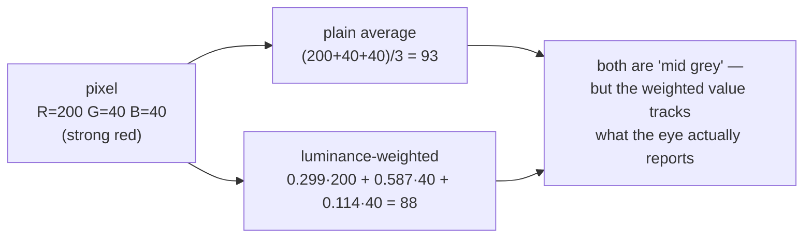

# Grayscale conversion

Collapsing three colour numbers into one brightness number — the first thing
almost every stage of this pipeline does, and the first thing it throws away.

## What it is

Grayscale conversion replaces each pixel's `(B, G, R)` triple with a single
intensity. The obvious formula is the plain average, and it is wrong for human
perception: the eye is far more sensitive to green than to blue.

The standard weighting, from ITU-R BT.601, is what OpenCV's
`COLOR_BGR2GRAY` uses:

```
Y = 0.299·R + 0.587·G + 0.114·B
```

Green carries nearly 60% of perceived brightness; blue barely a tenth. A pure
blue and a pure green of equal RGB magnitude look nothing alike in brightness,
and averaging them would say they do.

## The picture



The gap widens sharply for green and blue. A pure green (0, 255, 0) is 85
by average and **150** by luminance; a pure blue (0, 0, 255) is 85 by average
and **29** by luminance. Averaging would call them equally bright. They are not.

## Where this project uses it

Three times, always as the first operation on a freshly loaded image.

`poggio_webapp/pipeline/preprocess.py`:

```python
img = load_image(input_path, pdf_dpi=pdf_dpi, pdf_page=pdf_page)
if img is None:
    raise RuntimeError(f"could not read {input_path}")
gray = cv2.cvtColor(img, cv2.COLOR_BGR2GRAY)
```

Everything after that line — background flattening, deskew, CLAHE, sharpening —
operates on one channel.

`poggio_webapp/pipeline/detect_features.py` does the same, then blurs:

```python
gray = cv2.cvtColor(analysis, cv2.COLOR_BGR2GRAY)
gray = cv2.GaussianBlur(gray, (3, 3), 0)
```

`poggio_webapp/pipeline/detect_markers.py` is the interesting exception: it
converts to grayscale **and** keeps the colour channels, because it needs both
"how dark" and "how red" — see
[colour-channel arithmetic](colour-channel-arithmetic.md).

## Why this and not something else

The question every stage downstream asks is *"is there ink here?"* Ink on paper
is a brightness distinction, not a colour one.

| Alternative | How it would work here | Why it lost |
|---|---|---|
| **Work in full colour throughout** | Run every filter on three channels | Triples the memory and the work for information no downstream stage uses. Canny, Hough, thresholding, and contour tracing are all defined on single-channel input; OpenCV would convert internally anyway, just repeatedly. |
| **Plain channel average** | `(B + G + R) / 3` | Cheaper by two multiplications and perceptually wrong. On a sheet with coloured annotation it changes which marks survive thresholding. |
| **Take a single channel** — e.g. green only | `img[:, :, 1]` | Free, and a defensible trick for some documents: green is the highest-weighted channel anyway. It discards real information though, and a mark that happens to be green-dominant vanishes. |
| **Luminance in a perceptual space** (CIE L\*) | Convert to Lab, keep L | More perceptually uniform, and the uniformity buys nothing here — no stage compares two grey levels for perceived *difference*, only against a threshold. Costs a full colour-space conversion. |
| **Decolourisation that maximises contrast** (e.g. `cv2.decolor`) | Choose weights per image to preserve the most structure | Genuinely better on images where the signal is a colour distinction. Here the signal is dark-on-light, and the weights become image-dependent, which breaks reproducibility. |

The last row is the argument that matters for this repository: a
*data-dependent* conversion means the same drawing processed twice can give
different pixels. Fixed weights are boring and reproducible, and
[determinism](determinism-and-stable-sorting.md) is a design requirement here.

## What it costs

O(pixels), one pass, three multiplies and two adds each. It *reduces* memory to
one third, so it pays for itself immediately — which is why it happens before
the expensive filtering rather than after.

## Where else you meet it

- **Black-and-white photo filters** in every phone camera app.
- **OCR** — nearly every text recogniser converts to grayscale, then binarises.
- **Video compression** — the Y in YCbCr *is* this luminance, stored at full
  resolution while the colour channels are subsampled.
- **Barcode and QR scanning**, which is a thresholding problem on grayscale.
- **Accessibility contrast checking** uses a close relative (relative luminance
  with a gamma correction) to decide whether text is readable.

## Related pages

- [Colour spaces and channels](colour-spaces-and-channels.md) — what is being
  collapsed.
- [Colour-channel arithmetic](colour-channel-arithmetic.md) — when the project
  deliberately does *not* collapse.
- [Bit depth and dynamic range](bit-depth-and-dynamic-range.md) — what a single
  channel can hold.
- [Global thresholding](global-thresholding.md) — the usual next step.
