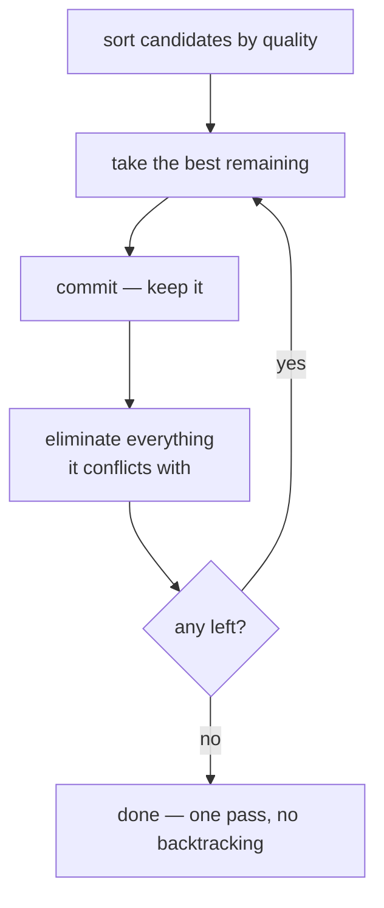

# Greedy algorithms

Take the best option available right now, commit to it, and never reconsider.
Sometimes provably optimal, often good enough, and used four times in this
repository — each time with a reason it is safe.

## What it is

A greedy algorithm builds a solution one step at a time, always choosing what
looks best at the moment, and never backtracking.

That is a strong restriction, and its consequences are worth stating plainly:

- **Fast.** One pass, no search tree.
- **Simple.** No state to unwind.
- **Deterministic**, provided ties are broken by a total order.
- **Not always optimal.** A locally best choice can foreclose a globally better
  one.

Some problems have the *greedy-choice property*, where the greedy answer is
provably optimal — Kruskal's minimum spanning tree, Dijkstra's shortest path,
Huffman coding. Most do not, and greedy is then a heuristic.

The engineering question is never "is this optimal?" but **"what does being
wrong cost here?"**

## The picture



Where greedy goes wrong, in this repository's own
[deduplication](non-maximum-suppression.md):

```
A overlaps B,  B overlaps C,  A does NOT overlap C

greedy:   keep A → suppress B → C survives (no conflict with A)
optimal:  keep B alone → covers all three

result:   two survivors where one might do
```

Two proposals instead of one. A reviewer clicks once more.

## Where this project uses it

### Deduplicating markers — biggest first

`poggio_webapp/pipeline/detect_markers.py`:

```python
cand.sort(key=lambda entry: -entry["diam"])

kept = []
for entry in cand:
    is_separate = all(
        ((entry["cx"] - existing["cx"]) ** 2
         + (entry["cy"] - existing["cy"]) ** 2) > (0.5 * min_d) ** 2
        for existing in kept)
    if is_separate:
        kept.append(entry)
```

### Deduplicating features — best score first

`poggio_webapp/pipeline/detect_features.py`:

```python
ordered = sorted(
    candidates,
    key=lambda candidate: (float(candidate["score"]), float(candidate["area_px"])),
    reverse=True,
)
```

The tie-break on area is what makes the order **total**, which is what makes the
greedy result deterministic. Without it, two equal-scoring candidates would be
ordered by whatever `sorted` happened to receive.

### Assigning features to layers — first band that contains it

`poggio_webapp/pipeline/manual_extraction.py`:

```python
for i, (top, bottom) in enumerate(layer_bands):
    top_depth = _depth_at_x(top, x)
    bottom_depth = _depth_at_x(bottom, x)
    low, high = sorted((top_depth, bottom_depth))
    if low - 0.02 <= depth <= high + 0.02:
        chosen = i
        break                      # first match wins
    distance = min(abs(depth - low), abs(depth - high))
    if distance < best_distance:
        best_distance = distance
        chosen = i
```

First containing band wins; if none contains it, the nearest does. Where bands
overlap within tolerance, a feature could arguably belong to either — and a
feature assigned to a neighbouring layer is visible to a reviewer looking at the
drawing.

### Choosing a wall pair for a true-dip solve — furthest from parallel

`poggio_webapp/pipeline/true_dip.py`:

```python
def _best_pair(faces, bearings, threshold):
    """The two faces whose bearings are furthest from parallel, or None.

    Pairs are scored by |sin(difference)|: 1 for perpendicular walls, 0 for
    parallel ones. Ties keep the earlier pair in face order, so the result does
    not depend on dict iteration luck.
    """
```

This one **is** optimal, because only one pair is chosen and the scan is
exhaustive over all pairs. Greedy over a single choice is just argmax. The
docstring's note about ties is the determinism guard again.

### And where greedy was refused

`merge_walls.merged_series_order` faces a genuine ordering problem and does
**not** solve it greedily. It runs [Kahn's algorithm](topological-sorting.md)
over the full constraint set and raises on a cycle:

> Raises ValueError if the walls contradict each other (a cycle). Guessing an
> order there would invent stratigraphy, so it refuses.

The contrast is the point. Greedy is used where being slightly wrong costs a
reviewer a click. It is refused where being wrong would mean **publishing an
invented stratigraphic sequence**.

## Why this and not something else

For the deduplication problem:

| Alternative | How it would work here | Why it lost |
|---|---|---|
| **Exhaustive search** | Try every subset, maximise coverage | Optimal, and it is set cover — NP-hard. For 250 candidates that is not computable. |
| **Clustering (DBSCAN, mean-shift)** | Group candidates, emit one per cluster | Handles the chaining case properly. It adds parameters, and it produces a *synthetic* representative — an averaged box corresponding to no real contour. This project keeps real measurements. |
| **Integer programming** | Formulate and solve exactly | Optimal for hundreds of candidates. A solver dependency and a formulation nobody can debug, to avoid an occasional extra proposal. |
| **Greedy** *(chosen)* | Sort, keep, suppress | One pass, deterministic, every survivor is a real measurement, and the failure mode is an extra item in a list a human is reading anyway. |

The generalisable rule this repository follows: **greedy is acceptable exactly
where a human reviews the output.** Both detectors are explicit that they
produce proposals:

> A person approves, rejects, and labels each proposal before extraction.

Where no human reviews — the stratigraphic order that feeds the model — greedy
is not used, and the code refuses rather than approximating.

## What it costs

Typically O(n log n) for the sort plus O(n) or O(n²) for the pass, depending on
whether each choice must be checked against all previous ones. Both
deduplications here are O(k²) with k capped at 250.

The correctness cost is bounded and specific: greedy NMS may keep two items
where one would do (chaining), and greedy band assignment may place a
borderline feature in a neighbouring layer. Both are visible to a reviewer.

The **determinism** cost is zero *provided the ordering is total*, which is why
`detect_features` breaks score ties by area and `true_dip._best_pair` documents
its tie behaviour. An incomplete order would make the greedy result depend on
input ordering — see [determinism and stable sorting](determinism-and-stable-sorting.md).

## Where else you meet it

- **Kruskal's and Prim's** minimum spanning tree algorithms — provably optimal,
  and Kruskal uses [Union-Find](union-find.md) for exactly the conflict check
  greedy needs.
- **Dijkstra's shortest path** — greedy and optimal for non-negative weights.
- **Huffman coding** — greedy and optimal.
- **Interval scheduling**, where earliest-finish-first is provably optimal.
- **The knapsack problem**, where greedy is a classic *failure* — the
  best value-per-weight-first heuristic can be arbitrarily bad.
- **Beam search** in language models, which is greedy with a widened frontier.

## Related pages

- [Non-maximum suppression](non-maximum-suppression.md) — the main greedy step
  here.
- [Intersection over union](intersection-over-union.md) — the conflict test.
- [Topological sorting](topological-sorting.md) — where greedy was refused.
- [Union-Find](union-find.md) — the structure that makes greedy conflict checks
  fast.
- [Determinism and stable sorting](determinism-and-stable-sorting.md) — the condition greedy needs to be
  reproducible.
