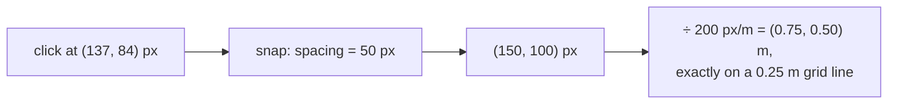

# Grid snapping and quantisation

Rounding a continuous value to the nearest allowed one. Used here to make
drawing on a grid precise, and (in a different form) to decide how many
decimal places a measurement deserves.

## What it is

**Quantisation** maps a continuous value onto a discrete set. **Snapping** is
quantisation applied to a position, so a click lands exactly on a grid
intersection rather than near one.

```
snapped = round(value / spacing) × spacing
```

The subtlety is the rounding rule at exact halves. Python's `round()` and
JavaScript's `Math.round()` disagree: Python uses banker's rounding (to even),
JavaScript rounds half **up** (toward +∞, so `Math.round(-0.5)` is `-0`, not
`-1`). Neither is wrong; both are surprising if unstated.

Rounding also appears as **precision control**: deciding that a coordinate is
meaningful to four decimal places and storing it that way. That is quantisation
of a measurement rather than of a position, and it is a claim about accuracy.

## The picture



The rounding rule made explicit:

```
value / spacing = 2.5      exactly halfway

Math.round(2.5)   = 3      round half up
Python round(2.5) = 2      round half to even
Python round(3.5) = 4      round half to even

floor(x + 0.5)    = 3      always half up, what grid.mjs uses
```

## Where this project uses it

### Snapping a click to the drawing grid

`poggio_webapp/static/canvas/grid.mjs`:

```javascript
/**
 * Snap to the closest grid intersection. A point exactly halfway between two
 * grid lines rounds to the line with the higher coordinate.
 */
export function nearestGridPoint(x, y, gridSpacingPixels) {
  if (gridSpacingPixels <= 0) {
    throw new RangeError("Grid spacing must be greater than zero.");
  }

  const snapCoordinate = (coordinate) => (
    Math.floor((coordinate / gridSpacingPixels) + 0.5) * gridSpacingPixels
  );

  return {
    x: snapCoordinate(x),
    y: snapCoordinate(y),
  };
}
```

`Math.floor(v + 0.5)` rather than `Math.round(v)`, and the docstring states the
resulting behaviour, "rounds to the line with the higher coordinate." The two
differ for negative values, and being explicit means the behaviour is
*specified* rather than inherited.

The grid itself is chosen so the arithmetic is exact:

```javascript
/**
 * The canvas uses 200 pixels per metre: at this scale the fixed 3m × 2m face
 * is 600 × 400 CSS pixels, large enough to work with on a typical laptop, and
 * the default 0.25m grid lands on exact 50-pixel intervals. Keep every future
 * geometry conversion anchored to this constant so display and saved real-world
 * measurements remain consistent.
 */
export const PIXELS_PER_METER = 200;
export const CANVAS_WIDTH_METERS = 3;
export const CANVAS_HEIGHT_METERS = 2;
export const GRID_SPACING_METERS = 0.25;
```

200 px/m × 0.25 m = **exactly 50 px**. Every grid line is at an integer pixel,
and every snapped point converts back to a metre value with no rounding error at
all. Choosing constants so the conversions are exact avoids a whole class of
[floating-point](floating-point-representation.md) drift.

### Quantising a measurement for storage

`poggio_webapp/pipeline/manual_extraction.py`:

```python
return round(x_m, 4), round(depth_m, 4)
```

Four decimal places: **0.1 mm**. That is a statement about what the measurement
means: finer digits would be recording pixel noise and calibration error as if
they were archaeology.

`poggio_webapp/pipeline/convert_coords.py` uses different precisions for
different quantities, and the difference is informative:

```python
rows.append({"X": round(X, 4), "Y": round(Y, 4), "Z": round(Z, 4),
             "surface": surface, "face": fname})
...
orient.append({
    "X": round(X, 4),
    ...
    "dip": round(dip, 2),
    "azimuth": round(azimuth, 2),
    "polarity": 1,
})
```

Positions to 4 decimal places (0.1 mm), angles to 2 (0.01°). An orientation
derived from a [least-squares fit](ordinary-least-squares.md) over a handful of
traced points does not justify more.

`detect_markers.py` goes further, quantising each output to its own meaningful
resolution:

```python
markers.append(
    {
        "id": marker_id,
        "pixel_x": round(entry["cx"], 1),
        "pixel_y": round(entry["cy"], 1),
        "x_m": round(x_m, 3),
        "depth_m": round(depth_m, 3),
        "diam_px": round(entry["diam"], 1),
        "circularity": round(entry["circularity"], 3),
    }
)
```

Pixels to a tenth, metres to a millimetre, a dimensionless ratio to three
places. Each number rounded to what it can support.

## Why this and not something else

For snapping:

| Alternative | How it would work | Why it lost |
|---|---|---|
| **No snapping** | Record the raw click | A hand-drawn polygon on a grid would have vertices a pixel or two off every line, so a "closed" shape might not close and a shared edge between two layers would not be shared. |
| **`Math.round`** | The built-in | Behaves differently for negatives, and inherits a rule rather than specifying one. `floor(x + 0.5)` states the intent. |
| **Snap only when close** (magnetic) | Snap within a threshold, else leave free | Common in design tools, and it makes the outcome depend on how steady the user's hand was: the same intended vertex sometimes snapped, sometimes not. |
| **`floor(x + 0.5)` always** *(chosen)* | Uniform, explicit | Deterministic, documented, and every vertex is exactly on the grid, so shared edges genuinely coincide. |

For precision:

| Alternative | Why it lost |
|---|---|
| **Store full float precision** | Publishes 15 significant digits of which perhaps 4 are meaningful. It reads as precision that was never measured. |
| **Round at display time only** | The stored file is the archive. What is stored is what a future reader believes was measured. |
| **Round at write time** *(chosen)* | The file states the accuracy honestly, and every consumer sees the same number. |

The second table is the interesting one, because it is not really about
arithmetic. A coordinate written as `0.7431` claims sub-millimetre knowledge;
written as `0.74312847` it claims nanometre knowledge, which is absurd for a
pencil line on graph paper. Rounding at write time is
[provenance](provenance-and-data-lineage.md) hygiene: the file should not overstate what was done.

## What it costs

O(1) per value. Free.

The costs are conceptual:

- Snapping discards information. If the grid is coarser than the drawing's
  real detail, snapping loses it. Here the grid is the *recorder's own* graph
  paper, so snapping to it is aligning with the source rather than degrading it.
- Rounding is not associative. Round twice at different precisions and the
  result can differ from rounding once. This project rounds once, at write time.
- Exact halves need a stated rule, or two implementations disagree at the
  boundary.
- Not every spacing is exact in binary. 0.25 m at 200 px/m is exact; 0.3 m
  would not be. The constants were chosen to avoid that. See
  [floating-point representation](floating-point-representation.md).

## Where else you meet it

- Design tools: snap-to-grid and snap-to-guide in Figma, Illustrator, and
  every CAD package.
- Audio: quantising notes to a beat grid in a DAW; bit-depth quantisation in
  digital recording.
- Digital imaging: an 8-bit pixel is a quantised light measurement.
- Machine learning, where quantising weights to 8-bit integers is standard
  for deployment.
- Financial systems, where rounding rules are specified by regulation
  precisely because "round half up" and "round half to even" give different
  totals.
- GPS, where reported precision is deliberately limited to what the fix
  supports.

## Related pages

- [Floating-point representation](floating-point-representation.md): why the
  canvas constants were chosen to be exact.
- [Epsilon comparison](epsilon-comparison.md): the other half of dealing with
  inexact arithmetic.
- [Bit depth and dynamic range](bit-depth-and-dynamic-range.md): quantisation
  of intensity.
- [Accuracy and provenance](../concepts/accuracy-and-provenance.md): why stored
  precision is a claim.
