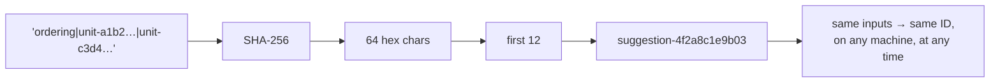

# Hash functions and SHA-256

Turning arbitrary input into a fixed-length fingerprint. Used here not for
security but for **identity**, so that regenerating a suggestion produces the
same ID it had last time.

## What it is

A hash function maps input of any size to a fixed-size output. A
*cryptographic* hash adds three guarantees:

- Deterministic: the same input always gives the same digest.
- Avalanche: one changed bit changes about half the output bits.
- Collision-resistant: finding two inputs with the same digest is
  computationally infeasible.

SHA-256 produces 256 bits, written as 64 hexadecimal characters.

For *identity* purposes only the first and third matter. Determinism means the
ID is a pure function of the content; collision resistance means two different
things will not accidentally share one.

**Truncation** trades collision resistance for brevity. Twelve hex characters is
48 bits, so by the birthday bound a collision becomes likely at roughly 2²⁴ ≈ 16
million items. For a Harris Matrix of a few hundred units, that margin is
enormous.

## The picture



## Where this project uses it

### Suggestion and relation IDs

`poggio_webapp/pipeline/harris_suggestions.py`:

```python
def _hash_suffix(*parts: str) -> str:
    identity = "|".join(parts)
    return hashlib.sha256(identity.encode("utf-8")).hexdigest()[:12]


def _suggestion_id(suggestion_type: str, *unit_ids: str) -> str:
    return f"suggestion-{_hash_suffix(suggestion_type, *unit_ids)}"


def _relation_id(suggestion_id: str) -> str:
    return f"rel-{_hash_suffix('suggestion', suggestion_id)}"


def _correlation_id(unit_ids: list[str]) -> str:
    return f"corr-{_hash_suffix('correlation', *sorted(unit_ids))}"
```

Four details worth naming.

**`"|".join(parts)`**: a separator, so that `("ab", "c")` and `("a", "bc")`
hash differently. Without it, concatenation would let distinct inputs collide by
construction rather than by chance.

**`sorted(unit_ids)` in `_correlation_id`**: a correlation between A and B is
the same correlation as between B and A, so the ID must not depend on argument
order. Sorting canonicalises it.

**`.encode("utf-8")`**: hashing operates on bytes, and pinning the encoding
means the digest is the same on any platform.

**A type prefix in the string, not just the output**: `_relation_id` hashes
`"suggestion"` alongside the ID, so a relation derived from a suggestion cannot
collide with one derived from anything else that happens to share an input.

### Unit IDs from source position

`poggio_webapp/pipeline/harris_import.py`:

```python
def _unit_id(
    job_id: str,
    schema_type: str,
    face: str,
    layer_index: int,
) -> str:
    identity = f"{job_id}|{schema_type}|{face}|{layer_index}"
    suffix = hashlib.sha256(identity.encode("utf-8")).hexdigest()[:12]
    return f"unit-{suffix}"
```

The ID is a function of **where the unit came from** (job, schema, face, layer
index) and nothing else. That is what makes re-importing the same job
[idempotent](idempotency.md):

```python
for imported_unit in imported_units:
    existing_unit = units_by_id.get(imported_unit.id)
    if existing_unit is None:
        imported_matrix.units.append(imported_unit)
        units_by_id[imported_unit.id] = imported_unit
        continue
    for source_ref in imported_unit.source_refs:
        if source_ref not in existing_unit.source_refs:
            existing_unit.source_refs.append(source_ref)
```

Import the same job twice and the second pass recognises every unit and merges
source references rather than duplicating. No "already imported?" flag is needed;
the ID *is* the check.

The same property makes suggestion regeneration safe:

```python
for suggestion in generated:
    previous = existing_by_id.get(suggestion.id)
    if previous is not None:
        suggestion.status = previous.status
    suggestions_by_id[suggestion.id] = suggestion
```

A user's accept or reject decision survives regeneration, because the
regenerated suggestion carries the same ID.

The IDs are also validated by [regular expression](regular-expressions.md)
before use (`^unit-[0-9a-f]{12}$`), so a malformed one is rejected at the
schema boundary.

## Why this and not something else

| Alternative | How it would identify | Why it lost |
|---|---|---|
| **Sequential integers** | 1, 2, 3, … | Requires a counter, which requires state, which breaks when two imports interleave. And it is not a function of content: re-importing the same job produces new numbers, so nothing can be deduplicated. |
| **`uuid4()`** | Random | Used elsewhere in this codebase for *job* IDs, correctly: a job is a new thing each time. Wrong here: a random ID for the same unit differs on every import, defeating idempotency entirely. |
| **The raw identity string** | `"job|schema|face|3"` as the ID | Genuinely simplest, and it embeds the face label, which may contain spaces, punctuation, or non-ASCII, and it is unbounded in length. A fixed-width hex ID is safe as a filename component, a heap key, and a regex-validated field. |
| **MD5 or SHA-1** | Shorter digests | Both are broken for adversarial collision resistance. Nothing here is adversarial, so they would work, and reaching for a deprecated primitive invites a later reader to assume security properties that are not there. SHA-256 costs nothing extra. |
| **Truncated SHA-256** *(chosen)* | 12 hex chars, content-derived | Deterministic, fixed-width, safe as an identifier, and collision-free at this scale by a wide margin. |

The honest framing is that this is **not a security use**. Nobody is trying to
forge a suggestion ID. SHA-256 is chosen for determinism and uniform
distribution, and the truncation to 48 bits would be indefensible if an
adversary were involved.

## What it costs

Microseconds per hash. Irrelevant.

The costs:

- 48 bits is not collision-proof. Around 16 million items before a collision
  is likely. A matrix has hundreds. If that ever changed, the truncation length
  is one constant.
- A collision would be confusing rather than caught. Two units sharing an ID
  would silently merge. No check exists, because the margin makes one
  unnecessary, but it is worth knowing the failure mode.
- The identity string is a contract. Changing the field order, the
  separator, or adding a component changes every ID, orphaning stored
  suggestions and their accept/reject decisions. That is a migration, not a
  refactor.

## Where else you meet it

- Git, where every commit, tree, and blob is named by its content hash, the
  same content-addressing idea at scale.
- Content-addressed storage: IPFS, Docker layers, Nix.
- Deduplication in backup systems.
- Subresource integrity on the web, and package lock files.
- Password storage, which uses deliberately *slow* hashes (bcrypt, Argon2)
  for the opposite reason: a fast hash is a liability there.

## Related pages

- [Content-addressed identifiers](content-addressed-identifiers.md): the
  pattern this enables.
- [Idempotency](idempotency.md): what content-derived IDs buy.
- [Regular expressions](regular-expressions.md): how the IDs are validated.
- [Hash tables](hash-tables.md): non-cryptographic hashing, a different job.
- [Determinism and stable sorting](determinism-and-stable-sorting.md): the
  property being relied on.
