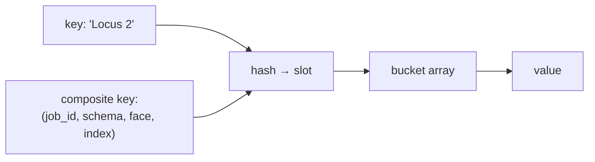

# Hash tables

Look something up by name in constant time. The dictionary is so ordinary in
Python that its use goes unremarked — but several correctness properties in this
repository depend on exactly how it is used.

## What it is

A hash table stores key–value pairs. Hashing the key gives a slot index
directly, so lookup, insertion, and deletion are O(1) on average rather than
O(n).

Three consequences matter here:

**Keys must be hashable and immutable.** Tuples work, lists do not — which is
why composite keys in this codebase are always tuples.

**Iteration order is an implementation detail.** Python 3.7+ guarantees
insertion order for `dict`, but `set` gives no guarantee at all. Code whose
output depends on set iteration order is not
[deterministic](determinism-and-stable-sorting.md).

**Membership is the cheap operation.** `x in d` is O(1), where the same question
against a list is O(n).

## The picture



## Where this project uses it

### Composite tuple keys

`poggio_webapp/pipeline/harris_suggestions.py` groups units by where they came
from, using a four-part tuple as the key:

```python
units_by_occurrence = defaultdict(list)
for unit in matrix.units:
    for source_ref in unit.source_refs:
        occurrence = (
            source_ref.job_id,
            source_ref.schema_type,
            source_ref.face,
            source_ref.layer_index,
        )
        units_by_occurrence[occurrence].append((unit, source_ref))
```

The whole ordering-suggestion algorithm then becomes a lookup: is there a unit
at the *next* layer index on the same face?

```python
lower_occurrence = (job_id, schema_type, face, layer_index + 1)
if lower_occurrence not in units_by_occurrence:
    continue
```

Without the hash table this would be a nested scan over every unit.

`poggio_webapp/pipeline/normalizer.py` builds a composite key from a *rounded
coordinate sequence* to detect duplicate features:

```python
def points_key(pts):
    if not pts:
        return None
    out = []
    for p in pts:
        x = p.get("xCoordinateMeters")
        y = p.get("yCoordinateMeters")
        out.append(
            (
                round(x, 3) if x is not None else None,
                round(y, 3) if y is not None else None,
            )
        )
    return tuple(out)
```

`tuple` rather than `list`, because it has to be hashable. The rounding is what
makes two nearly-identical traces compare equal — a deliberate
[quantisation](grid-snapping-and-quantisation.md) before hashing, since floats
that differ in the last bit hash differently.

### Where iteration order was made deterministic

`poggio_webapp/pipeline/merge_walls.py` builds a dictionary specifically to
record insertion order as a value:

```python
order_index = {}  # surface -> first-seen position (the tie-breaker)
...
if name not in order_index:
    order_index[name] = len(order_index)
```

`len(order_index)` at insertion time *is* the first-seen position. That number
then breaks ties in [Kahn's algorithm](topological-sorting.md), so the sort does
not depend on any iteration order at all.

`poggio_webapp/pipeline/assign_markers.py` uses `dict.fromkeys` for
order-preserving deduplication:

```python
for num in dict.fromkeys(n for n in listed if n):
```

`set` would lose the order; `dict.fromkeys` keeps it. A one-word choice with a
determinism consequence.

`poggio_webapp/pipeline/harris_matrix.py` goes further and sorts before
iterating, everywhere:

```python
for correlation in sorted(matrix.correlations, key=lambda item: item.id):
for relation in sorted(matrix.relations, key=lambda item: item.id):
for start in sorted(nodes):
```

Not because sorting is needed for correctness, but because the *reported* result
— which cycle, which order, which diagram — must be the same on every run.

## Why this and not something else

| Alternative | How it would work here | Why it lost |
|---|---|---|
| **Linear scan over a list** | `for unit in units: if unit.id == target` | O(n) per lookup. In `harris_suggestions` that turns an O(n) grouping pass into O(n²). |
| **Sorted list with binary search** | O(log n) lookup | Keeps order for free — genuinely attractive here given how much this codebase cares about determinism. Insertion is O(n), and Python's `dict` already preserves insertion order. |
| **A database** | Index and query | The entire dataset is a few hundred objects in one JSON file. |
| **Dictionary with tuple keys** *(chosen)* | O(1) lookup, explicit ordering where needed | Fast, idiomatic, and the ordering concern is handled by sorting at the point of iteration rather than by the container. |

The pattern worth naming: **use the hash table for speed, and impose order
explicitly at every point where order is observable.** The alternative — relying
on a container that happens to preserve order — makes a correctness property
depend on an implementation detail.

## What it costs

O(1) average lookup, O(n) worst case with pathological collisions (not a
practical concern with Python's hashing). Memory is roughly 2–3× the stored data
because of the load factor.

The costs that bite:

- **Float keys are dangerous.** `0.1 + 0.2` and `0.3` are different keys. Hence
  the rounding in `points_key`.
- **Set iteration order is unspecified**, so any output derived from it is
  irreproducible. This repository sorts before every observable iteration.
- **Mutable values in a dict can be aliased.** `units_by_id[unit.id] = unit`
  stores a reference, and mutating through it changes the original — used
  deliberately in `harris_import.import_source_jobs`, which appends to
  `existing_unit.source_refs` through exactly such a reference.

## Where else you meet it

- **Every language's map type** — Python `dict`, JavaScript `Map` and objects,
  Java `HashMap`.
- **Database indexes**, where a hash index gives O(1) equality lookup.
- **Caches**, from CPU caches to HTTP caches to memoisation.
- **Symbol tables** in compilers.
- **Deduplication** at every scale, from `uniq` to distributed shuffle.

## Related pages

- [Sets and membership](sets-and-membership.md) — the same structure without
  values.
- [Determinism and stable sorting](determinism-and-stable-sorting.md) — why
  iteration order is sorted here.
- [Hash functions and SHA-256](hash-functions-and-sha256.md) — cryptographic
  hashing, a different job.
- [Grid snapping and quantisation](grid-snapping-and-quantisation.md) — why
  coordinates are rounded before becoming keys.
