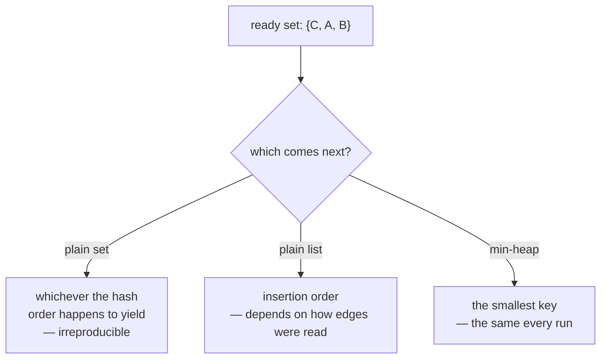

# Heaps and priority queues

A collection that always hands back its smallest element next. Used in both
topological sorts here — not for speed, but to make the answer the same every
time.

## What it is

A **priority queue** returns items in priority order rather than insertion
order. A **binary heap** is the standard implementation: a tree kept in an array
where every parent is smaller than its children.

```
push  O(log n)
pop   O(log n)      always the minimum
peek  O(1)
heapify a list  O(n)
```

Python's `heapq` operates on a plain list, so there is no wrapper object — which
is why heap usage in this codebase looks like ordinary list code with three
function calls.

The property that matters here is not the log-n cost. It is that
`heappop` is **total and deterministic**: given the same contents, it returns
the same element. A plain list or set gives no such guarantee.

## The picture



## Where this project uses it

Both [topological sorts](topological-sorting.md), for the same reason.

### Trench-wide layer order

`poggio_webapp/pipeline/merge_walls.py`:

```python
# Kahn's algorithm. The ready set is a heap of first-seen positions, so
# whenever several surfaces are simultaneously available the earliest-seen
# one wins and the output is stable.
by_index = {position: name for name, position in order_index.items()}
ready = [position for name, position in order_index.items()
         if indegree[name] == 0]
heapq.heapify(ready)
order = []
while ready:
    name = by_index[heapq.heappop(ready)]
    order.append(name)
    for later in sorted(successors[name], key=lambda n: order_index[n]):
        indegree[later] -= 1
        if indegree[later] == 0:
            heapq.heappush(ready, order_index[later])
```

The heap holds **integers — first-seen positions** — not names, and
`by_index` maps back. That indirection is the interesting decision.

Sorting by name would put `Locus 10` before `Locus 2`, because string
comparison is lexicographic. On a stratigraphic sequence that tie-break would be
actively misleading. Sorting by *document order* means "whichever wall listed it
first wins," which is arbitrary but neutral.

### Harris Matrix reading order

`poggio_webapp/pipeline/harris_matrix.py`:

```python
ready = [
    node
    for node in nodes
    if indegree[node] == 0
]
heapq.heapify(ready)
order = []

while ready:
    node = heapq.heappop(ready)
    order.append(node)
    for neighbor in adjacent[node]:
        indegree[neighbor] -= 1
        if indegree[neighbor] == 0:
            heapq.heappush(ready, neighbor)
```

Here the heap holds node IDs directly, and that is fine because unit IDs are
[content-addressed hashes](content-addressed-identifiers.md) —
`unit-<12 hex chars>`. They are stable for a given unit and carry no misleading
ordering, since no reader expects hex digests to sort meaningfully.

Two sorts, two key choices, each matched to what the identifiers mean.

## Why this and not something else

The question is what the *ready set* should be in Kahn's algorithm.

| Alternative | Which ready node comes next | Why it lost |
|---|---|---|
| **A plain `set`** | Whatever hash order yields | Non-deterministic. The same matrix could produce two different orders and two different diagrams on two runs, making saves impossible to diff. |
| **A `list` used as a queue** | Insertion order — the BFS default | Deterministic *given a fixed input order*, and the input order depends on how edges were read out of a dict, which reintroduces the problem one level down. |
| **A `list` used as a stack** | Most recently readied | Same objection, and it produces a depth-first order that groups a chain together — arguably nicer to read, and equally dependent on arrival order. |
| **Sort the whole ready set each iteration** | Smallest | Correct and O(n log n) *per iteration* rather than O(log n) per operation. |
| **Min-heap** *(chosen)* | Smallest key | Deterministic, O(log n), and the key can be chosen to mean something — document order or a stable ID. |

The comment in `merge_walls` states the reasoning directly: *"so whenever several
surfaces are simultaneously available the earliest-seen one wins and the output
is stable."*

That is the whole argument. Kahn's algorithm has a genuine choice at every step —
several nodes are legitimately ready, and the archaeology does not order them.
The heap does not make one *more correct*; it makes the same one get chosen
every time.

## What it costs

O(n log n) total for n pushes and pops, against O(n) for a plain list. On a
matrix of a few hundred units that is microseconds — the log factor is the price
of reproducibility, and it is cheap.

Two things to know:

- **`heapq` is a min-heap only.** For maximum-first, negate the key. This
  codebase does exactly that elsewhere, without a heap:
  `cand.sort(key=lambda entry: -entry["diam"])` in
  [non-maximum suppression](non-maximum-suppression.md).
- **The heap is not sorted.** Only the smallest element is at a known position;
  printing the underlying list shows a partially ordered array, which surprises
  people debugging it.

The design point generalises: **where an algorithm has a legitimate free choice,
make it with a total order rather than leaving it to the container.** The same
principle drives `min()` as the
[Union-Find representative](union-find.md) and the area tie-break in
[greedy deduplication](greedy-algorithms.md).

## Where else you meet it

- **Dijkstra's and A\* shortest path**, where the frontier is a priority queue.
- **Task schedulers and event loops**, ordering by deadline.
- **Huffman coding**, repeatedly merging the two least frequent symbols.
- **Heapsort**, and `heapq.nlargest` / `nsmallest` for top-k queries.
- **Operating system run queues**, ordering processes by priority.

## Related pages

- [Topological sorting](topological-sorting.md) — the algorithm both heaps
  serve.
- [Determinism and stable sorting](determinism-and-stable-sorting.md) — the
  property being bought.
- [Union-Find](union-find.md) — another place a deterministic tie-break is
  chosen over an asymptotic optimisation.
- [Content-addressed identifiers](content-addressed-identifiers.md) — why unit
  IDs are safe to use as heap keys.
