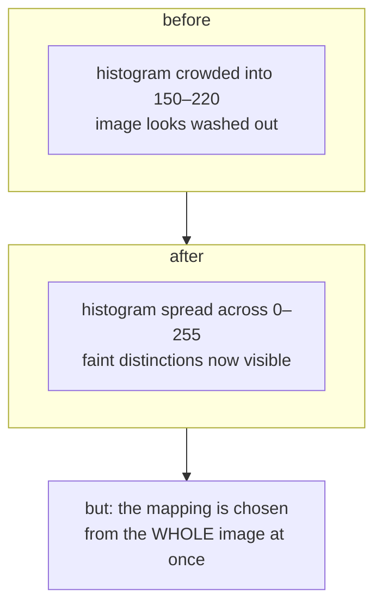

# Histogram equalisation

Spreading an image's intensities out so that all 256 available levels are used
roughly equally — and why this project uses the *local* version instead.

## What it is

Count how many pixels have each intensity value. On a faded scan the counts
cluster: everything sits between, say, 150 and 220, and the values below 150
and above 220 are simply unused. The image looks flat because it is using a
fraction of the available range.

Histogram equalisation builds the **cumulative distribution** of intensities
and uses it as a lookup table. Formally, the new value of a pixel with old
value `v` is:

```
new(v) = 255 × (number of pixels with intensity ≤ v) / (total pixels)
```

An intensity that half the image sits below maps to 127. The result is that
every output level ends up with roughly equal population — the histogram is
"equalised."

It is **monotonic**: if pixel A was darker than pixel B, it still is. Nothing
is reordered, only respaced.

## The picture



That last box is the problem. One lookup table for the entire sheet means a
sheet that is bright on the left and dark on the right gets a compromise
mapping that suits neither. A faint pencil line in the dark corner stays faint,
because globally there are plenty of dark pixels already.

## Where this project uses it

It does not — not the global form. `poggio_webapp/pipeline/preprocess.py`
reaches for the local variant instead:

```python
clahe = cv2.createCLAHE(clipLimit=2.0, tileGridSize=(8, 8))
eq = clahe.apply(flat)
```

[CLAHE](clahe.md) is this algorithm computed independently on each tile of an
8×8 grid, with a cap on how far any one level may be stretched, and the tile
results blended so no seams appear.

The global version is documented here anyway for two reasons: CLAHE is
meaningless without it, and knowing why it was rejected is the useful part.

Note also the **order** in the pipeline. Equalisation runs *after*
[background flattening](homomorphic-illumination-correction.md):

```python
def clean(gray, upscale=2):
    """The recommended pipeline: flatten -> upscale -> CLAHE -> mild sharpen."""
    flat = flatten_background(gray)
    ...
    eq = clahe.apply(flat)
```

Flattening removes the *spatial* variation; equalisation fixes the *tonal*
range that remains. Reversed, equalisation would spend its dynamic range
encoding a lighting gradient that the next step then divides away.

## Why this and not something else

| Alternative | How it works | Why it lost — or won |
|---|---|---|
| **Global histogram equalisation** | One CDF lookup table for the whole image | Rejected. A single mapping cannot serve a sheet whose corners differ in exposure, and archival scans are exactly that. It also amplifies noise aggressively in near-uniform regions — blank paper becomes visibly grainy, and that grain becomes contours later. |
| **[CLAHE](clahe.md)** *(chosen)* | Equalise per tile, clip the histogram, interpolate between tiles | Local adaptation is the point, and the clip limit is what keeps blank paper from exploding into noise. |
| **Linear contrast stretch** | Map [min, max] to [0, 255] linearly | Much gentler and fully predictable — and a single dark speck or bright specular highlight sets the endpoints and neutralises the whole stretch. Percentile-based versions fix that and are a genuinely reasonable choice. |
| **Gamma correction** | `out = 255·(in/255)^γ` | One parameter, smooth, no noise amplification. It cannot *adapt*, so the right γ for one scan is wrong for the next. |
| **Do nothing** | Leave contrast alone | Defensible for a good scan. The driving case here is Trench 23, scanned "well below the 300 DPI the drawing guidelines recommend," where boundary lines are genuinely near the noise floor. |

The deciding argument is the same one that runs through this whole stage: the
inputs are **archival and uncontrolled**. A 1980 pen-and-ink sheet and a 2025
phone photograph cannot share a fixed tonal assumption, so the operation has to
adapt — but bounded, so it cannot invent structure where there is none.

## What it costs

O(n) with a small constant: one pass to build the histogram, one to apply the
lookup. Memory is 256 counters.

The real cost is conceptual. Equalisation **changes what intensity means**. A
pixel value after equalisation is a *rank*, not a measurement, so no downstream
stage may treat it as photometric evidence. Nothing in this pipeline does — the
equalised image feeds human tracing and edge detection, both of which care
about *contrast* rather than absolute level.

## Where else you meet it

- **Medical imaging.** Windowing a CT or X-ray to bring out soft tissue is this
  operation with clinician-controlled parameters.
- **Thermal and night-vision cameras**, which equalise continuously because
  the raw sensor range is far wider than a display can show.
- **Satellite imagery**, where haze compresses the histogram into a narrow band.
- **"Auto-contrast"** in every photo editor.
- **Machine-learning preprocessing**, where it normalises input distributions —
  though modern practice usually prefers per-channel standardisation.

## Related pages

- [CLAHE](clahe.md) — the local, clipped version this project actually uses.
- [Homomorphic illumination correction](homomorphic-illumination-correction.md) —
  runs first, and fixes a different problem.
- [Global thresholding](global-thresholding.md) — the other operation that
  assumes one rule fits the whole image.
- [Prepare the image](../workflows/02-prepare-image.md) — the workflow step.
