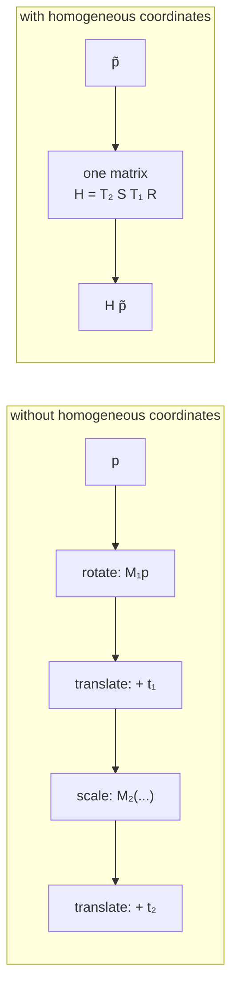

# Homogeneous coordinates

Adding one extra coordinate so that translation becomes a multiplication, and
every transform composes into a single matrix. Present here only inside OpenCV;
the project's own conversions stay explicit, and that is a choice worth
examining.

## What it is

Rotation and scaling are linear: they can be written as a matrix multiplication.
Translation is not — no 2×2 matrix moves the origin.

Homogeneous coordinates fix this by writing a 2D point as a 3-vector with a
trailing 1:

```
(x, y)  →  (x, y, 1)
```

Now a 3×3 matrix can express translation too:

```
[x']   [1  0  tx] [x]
[y'] = [0  1  ty] [y]
[1 ]   [0  0   1] [1]
```

The payoff is **composition**. Any chain of translations, rotations, scales, and
shears multiplies into one matrix, applied once per point. A graphics pipeline
with a dozen nested transforms collapses into a single 3×3.

The extra coordinate `w` also unlocks perspective. When `w ≠ 1`, the point is
recovered by dividing — `(x/w, y/w)` — and that division is exactly what makes
distant things smaller in a projective transform.

## The picture



Four operations per point become one matrix multiply — *provided* the transforms
are composed in advance.

## Where this project uses it

### Inside OpenCV, invisibly

`poggio_webapp/pipeline/preprocess.py`:

```python
M = cv2.getRotationMatrix2D((w / 2, h / 2), angle, 1.0)
rot = cv2.warpAffine(
    gray, M, (w, h), flags=cv2.INTER_CUBIC, borderMode=cv2.BORDER_REPLICATE
)
```

`M` is a 2×3 matrix — the top two rows of a 3×3 homogeneous matrix, with the
implied `[0 0 1]` bottom row omitted because an affine transform never changes
`w`. `warpAffine` treats each pixel as `(x, y, 1)`.

This is a genuine composition: rotating *about the image centre* is three
operations — translate the centre to the origin, rotate, translate back — and
`getRotationMatrix2D` returns their product as one matrix.

### Not used in the project's own conversions

Both coordinate transforms are written out explicitly instead.

`poggio_webapp/pipeline/manual_extraction.py`:

```python
dx, dy = px - self.origin_x, py - self.origin_y
x_m = (dx * self.ux + dy * self.uy) / self.px_per_m
depth_m = (dx * self.vx + dy * self.vy) / self.px_per_m
```

`poggio_webapp/pipeline/convert_coords.py`:

```python
def to_site(x, depth, X0=X0, Y0=Y0, Z0=Z0, sin_t=sin_t, cos_t=cos_t):
    X = X0 + x * sin_t
    Y = Y0 + x * cos_t
    Z = Z0 - depth
    return X, Y, Z
```

Both *could* be a matrix multiply. Neither is, and the reason is that neither
composes with anything. Each is applied once, in one place, and the explicit
form makes the geometry readable: you can see that `Z` is a subtraction because
depth runs downward, and that `sin` is on `X` because the bearing is a
[compass angle](compass-bearings-vs-mathematical-angles.md). Those facts vanish
into a matrix.

## Why this and not something else

| Alternative | How it would work here | Why it lost — or won |
|---|---|---|
| **Homogeneous matrices throughout** | Represent every calibration as a 3×3, compose, apply | The right answer when transforms compose — a graphics pipeline, a robot arm, a nested scene graph. Here the two conversions are separate, applied once each, and never chained. The composition benefit never arrives. |
| **Explicit component arithmetic** *(chosen)* | Write out the multiplications | Every geometric decision stays visible and independently commentable. It also keeps any matrix library out of `convert_coords.py`, whose imports are `csv`, `math`, and two sibling site modules. |
| **A matrix library (NumPy) for the coordinate code** | `np.array` and `@` | Already a dependency for the image work. For 2- and 3-element vectors it is *slower* than plain floats — array allocation dominates — and it would obscure the conventions. |
| **Homogeneous inside OpenCV, explicit outside** *(what happens)* | Let the library use them where it composes; write out the two conversions | Each context gets the representation that suits it. |

There is one place where homogeneous coordinates would become genuinely
necessary: correcting **perspective** from a photograph taken at an angle. That
requires a projective transform, whose defining feature is a non-unit `w` and a
division. It is a known limitation of the current
[similarity transform](similarity-transforms.md) approach and a candidate for
the [roadmap](../project/roadmap.md). If that lands, the `w` division arrives
with it.

## What it costs

One extra number per point, and 9 rather than 6 stored values for an affine
transform — hence OpenCV's 2×3 shortcut, which drops the constant row.

Applying a 3×3 to a point is 9 multiplies and 6 adds, against 4 and 4 for the
explicit affine form. Composing two 3×3 matrices is 27 multiplies. That cost is
paid once and amortised over every point, which is why it wins for large point
counts and long chains, and loses for two points and no chain.

The subtler cost is legibility. A 3×3 matrix of numbers is opaque. This
repository's comments carry real information — the closure-binding note in
`to_site`, the `Z = Z0 − depth` sign convention, the `sin`/`cos` placement — and
none of it survives being folded into a matrix.

## Where else you meet it

- **Every 3D graphics pipeline.** Model, view, and projection matrices are 4×4
  homogeneous, and the perspective divide by `w` is what produces foreshortening.
- **`cv2.findHomography`** and perspective correction in document scanning apps.
- **Robotics**, where a Denavit–Hartenberg chain is a product of 4×4 homogeneous
  transforms.
- **Projective geometry**, where they allow points at infinity to be represented
  finitely (`w = 0`).
- **Camera calibration**, where the intrinsic and extrinsic matrices are both
  homogeneous.

## Related pages

- [Affine transforms](affine-transforms.md) — what OpenCV's 2×3 matrix
  represents.
- [Similarity transforms](similarity-transforms.md) — the restricted family used
  for calibration.
- [Translation, rotation, and scaling](translation-rotation-scaling.md) — the
  operations being composed.
- [Vector projection](vector-projection.md) — the explicit form used instead.
