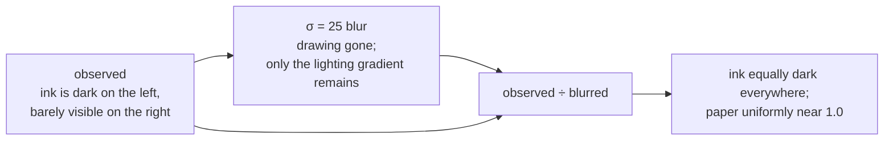

# Homomorphic illumination correction

Blur an image so hard that the drawing vanishes, then divide the original by
the result. What survives is the ink, evenly dark across the whole sheet.

## What it is

A photographed or scanned page is the product of two things:

```
observed = reflectance × illumination
```

*Reflectance* is what you want — the ink and the paper. *Illumination* is the
lamp, the shadow of the photographer's hand, the vignetting of the lens, the
yellowing of forty-year-old paper. Reflectance varies sharply from pixel to
pixel; illumination varies smoothly across the whole frame.

That difference in **spatial frequency** is the entire lever. Blur heavily
enough and all the sharp detail averages away, leaving an estimate of the
illumination alone. Divide it out, and the ink is the same darkness in the
bright corner as in the shadowed one.

The name comes from the classical form, which takes a logarithm first so the
product becomes a sum and the two components can be separated by a linear
filter. Dividing directly is the same idea without the log.

## The picture



Along one row of a badly lit sheet:

| | left | middle | right |
|---|---|---|---|
| paper | 240 | 190 | 130 |
| ink | 120 | 95 | 65 |
| **blurred estimate** | 238 | 188 | 129 |
| **paper ÷ estimate** | 1.008 | 1.011 | 1.008 |
| **ink ÷ estimate** | 0.504 | 0.505 | 0.504 |

Before: ink on the right (65) is *brighter* than paper would be elsewhere, so no
single threshold can separate them. After: ink is 0.50 and paper is 1.01
everywhere, and one threshold works across the whole sheet.

## Where this project uses it

`poggio_webapp/pipeline/preprocess.py`, as the first real operation on every
scan:

```python
def flatten_background(gray):
    """Divide out large-scale illumination/paper tone so faint ink is even."""
    bg = cv2.GaussianBlur(gray, (0, 0), sigmaX=25)
    bg = np.where(bg == 0, 1, bg)
    norm = (gray.astype(np.float32) / bg.astype(np.float32))
    norm = np.clip(norm * 200.0, 0, 255).astype(np.uint8)
    return norm
```

Four lines, each load-bearing:

1. **σ = 25** — wide enough that no drawn feature survives. Too narrow and the
   boundary lines themselves leak into the estimate, and dividing by them
   erases them.
2. **`np.where(bg == 0, 1, bg)`** — a region that blurred to pure black would
   divide by zero.
3. **`float32`** — the ratio is around 0.5 to 1.0 and cannot be represented in
   integers. See [bit depth](bit-depth-and-dynamic-range.md).
4. **`× 200` then clip** — maps the ratio back into 0–255, putting paper near
   200 and leaving headroom above it. The clip is not decoration; casting an
   out-of-range float to `uint8` in NumPy wraps rather than clamps.

It runs before *everything* — before [CLAHE](clahe.md), before the upscale,
before thresholding — because every later stage compares intensities, and
comparing intensities across an uncorrected lighting gradient is meaningless.

Both `clean()` and `high_contrast()` call it first.

## Why this and not something else

The competing approaches all try to solve "one threshold does not fit the whole
page," but at different points in the pipeline.

| Alternative | How it would work here | Why it lost |
|---|---|---|
| **[Adaptive thresholding](adaptive-thresholding.md) alone** | Skip flattening; let each pixel be judged against its own neighbourhood | Solves the same problem *for binarisation only*. Everything that is not a threshold — CLAHE, sharpening, the output image a human reviews and traces on — still sees the gradient. This project needs a corrected **grayscale** image, not just a good binary one. Notably, `detect_markers.py` does exactly this instead, because it only needs the mask. |
| **Global histogram equalisation** | Stretch the whole image's histogram | Redistributes intensities globally, so a dark region stays dark relative to a bright one. Wrong tool: the problem is spatial, not tonal. |
| **Subtract the blur instead of dividing** | `observed − blurred` | This is [unsharp masking](unsharp-masking.md), and it models the illumination as *additive*. Light is multiplicative — a shadow halves the reflected light, it does not subtract a constant — so division is the physically correct operation. |
| **Log, then high-pass filter, then exponentiate** | The textbook homomorphic filter | Mathematically the same thing with more steps. The log lets you shape the frequency response, which is valuable when you want to keep *some* low frequency. Here everything low-frequency is unwanted. |
| **Morphological background estimation** | Grey-scale opening with a kernel bigger than any stroke | A strong alternative, widely used for document images, and it gives a piecewise-flat estimate where the real lighting is smooth. Also slower at radius 25. |
| **Fit a polynomial surface** | Least-squares fit a 2D quadratic to the intensity | Very cheap, explicitly smooth. Assumes the lighting has a simple analytic shape; a hand shadow across the corner is not quadratic. |

The blur estimate makes no assumption about the *shape* of the illumination,
only about its **scale**. That is a much weaker assumption, and it is the right
one for a phone photograph taken on a dig.

## What it costs

One wide separable Gaussian, O(n·σ), plus two full-image `float32` temporaries —
four bytes per pixel each, so around 72 MB of scratch on a 9-megapixel scan.

The parameter σ is the only tuning knob, and it has a clear rule: **larger than
any feature you want to keep, smaller than the illumination variation you want
to remove.** At 25 on a typical scan, boundary lines are a few pixels wide and
lighting varies over hundreds — a comfortable order of magnitude between them.

## Where else you meet it

- **Document scanning apps** — the "whiteboard" and "document" modes in phone
  scanners are doing exactly this.
- **Astrophotography.** Flat-field correction divides by an image of a uniformly
  lit field to remove vignetting and dust shadows. Same equation, measured
  divisor instead of estimated.
- **Microscopy**, where uneven illumination across the field of view is
  corrected the same way before any quantitative measurement.
- **Retinex theory** in vision science, which models human lightness constancy
  as separating reflectance from illumination — the biological version of this
  page.
- **Fingerprint and iris preprocessing**, before minutiae extraction.

## Related pages

- [Gaussian blur](gaussian-blur.md) — the estimator.
- [Adaptive thresholding](adaptive-thresholding.md) — the alternative, used
  elsewhere in this same repository for a narrower job.
- [Unsharp masking](unsharp-masking.md) — the same two ingredients, subtracted
  instead of divided, for the opposite purpose.
- [Bit depth and dynamic range](bit-depth-and-dynamic-range.md) — why the
  float round-trip and the clip are needed.
- [Prepare the image](../workflows/02-prepare-image.md) — the workflow step.
