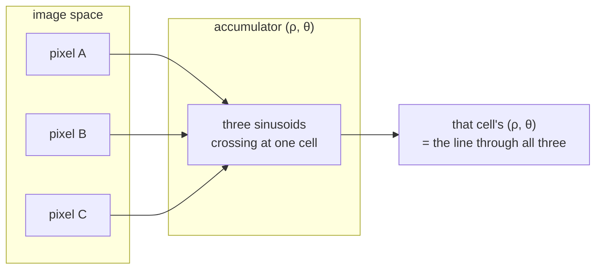

# Hough line transform

Finding straight lines by having every edge pixel vote for every line that could
pass through it, and taking the lines with the most votes. How this project
measures the skew of a scanned drawing.

## What it is

Edge detection gives you a scatter of pixels. Which of them lie on a common
straight line is not obvious, and testing every pair is O(n²).

The Hough transform inverts the question. Instead of searching image space for
lines, it searches **parameter space** for the parameters that many pixels
agree on.

A line is parameterised as

```
ρ = x·cos θ + y·sin θ
```

where θ is the line's angle and ρ its perpendicular distance from the origin.
This polar form is used rather than `y = mx + c` because vertical lines would
need infinite slope.

The algorithm:

1. Make an accumulator array over (ρ, θ), all zeros.
2. For each edge pixel, for each candidate θ, compute ρ and increment that cell.
3. Cells with high counts correspond to lines many pixels agree on.

Each pixel traces a sinusoid through parameter space; where sinusoids intersect,
those pixels are collinear. Voting is what makes it robust: pixels that belong
to no line scatter their votes harmlessly, and a line survives gaps because the
pixels that *are* present still vote for it.

## The picture



Voting is why gaps do not matter:

```
edge pixels:   ██ ██ ·· ██ ██ ·· ██        a dashed or broken line
votes for that (ρ, θ):  five               still a clear peak
```

A method that required contiguity would see three separate short segments.

## Where this project uses it

`poggio_webapp/pipeline/preprocess.py`, to measure how far a scan is rotated:

```python
def deskew(gray):
    """Estimate small skew from near-horizontal strokes and rotate to correct."""
    edges = cv2.Canny(gray, 50, 150)
    lines = cv2.HoughLines(edges, 1, np.pi / 180, threshold=200)
    if lines is None:
        return gray, 0.0
    angles = []
    for rho_theta in lines[:200]:
        theta = rho_theta[0][1]
        deg = np.degrees(theta) - 90.0
        if -15 < deg < 15:
            angles.append(deg)
    if not angles:
        return gray, 0.0
    angle = float(np.median(angles))
    h, w = gray.shape
    M = cv2.getRotationMatrix2D((w / 2, h / 2), angle, 1.0)
    rot = cv2.warpAffine(
        gray, M, (w, h), flags=cv2.INTER_CUBIC, borderMode=cv2.BORDER_REPLICATE
    )
    return rot, angle
```

Every parameter is doing something:

| Parameter | Meaning |
|---|---|
| `1` | ρ resolution, one pixel |
| `np.pi / 180` | θ resolution, one degree — finer would be slower and no more accurate than the skew estimate needs |
| `threshold=200` | at least 200 votes to count as a line; on an upscaled scan a real ruled line easily clears this |
| `lines[:200]` | consider only the 200 strongest, since `HoughLines` returns them sorted by votes |
| `-15 < deg < 15` | keep only near-horizontal lines |

**Two robustness layers sit on top of the transform**, and they matter more than
the transform's own settings:

The **±15° filter** encodes the domain assumption: a scan is *slightly* crooked,
not sideways. Vertical rules, diagonal hatching, and the edge of the desk in a
photograph are all excluded from the estimate rather than averaged into it.

The **[median](median-and-robust-statistics.md)**, not the mean, over the
surviving angles. A handful of diagonal strokes that squeak past the filter
would drag a mean; the median ignores them entirely. This is the single most
important line in the function.

And the two early returns — `lines is None` and `not angles` — mean the honest
outcome of "no evidence of skew" is **0.0 and no rotation**, not a guess. See
[fail-closed design](fail-closed-design.md).

## Why this and not something else

| Alternative | How it would work here | Why it lost |
|---|---|---|
| **Least-squares fit to all edge pixels** | Fit one line to the whole point set | Assumes there *is* one line. A drawing has many, at many angles, so the fit lands on their average — meaningless. |
| **RANSAC** | Randomly sample pairs, count inliers, keep the best | Genuinely robust and finds one dominant line well. It is randomised, so two runs can give different answers, and [determinism](determinism-and-stable-sorting.md) is a requirement in this repository. Hough's accumulator is exact and repeatable. |
| **[Projection profile](mean-and-variance.md)** | Rotate through candidate angles, sum pixels per row, pick the angle with the sharpest peaks | The standard method for deskewing *text*, and excellent there, because text lines produce strong horizontal density peaks. A section drawing has no such regular horizontal structure. |
| **Fourier transform** | The dominant orientation appears as a directional peak in the spectrum | Fast and global, gives one dominant orientation for the whole sheet, and is hard to constrain to "near horizontal only." |
| **Probabilistic Hough (`HoughLinesP`)** | Returns line *segments* with endpoints | Faster and gives segment lengths, and it is randomised, so repeated runs differ. Same objection as RANSAC. |
| **Hough** *(chosen)* | Vote in parameter space, filter, take the median | Deterministic, handles many lines at once, tolerates gaps, and — decisively — returns an **angle per line**, which is exactly the quantity being estimated. |

There is also the option of not deskewing at all, and it is the strongest
alternative: the manual tracing path defines its along-wall axis from the
*drawn* top edge, so a tilted photograph is corrected in
[coordinate space](similarity-transforms.md), exactly and without resampling.
That is why `deskew_flag=False` by default. Deskew exists to make the image
easier for a **human** to trace on, not to make the measurement correct.

## What it costs

O(n_edge × n_θ). With 180 angle bins and, say, 50 000 edge pixels, that is 9
million accumulator increments — fast, but it scales with edge count, which is
why the [Canny](canny-edge-detection.md) thresholds upstream matter for speed as
well as quality.

Memory is the accumulator: ρ bins × θ bins. For a 3000 px image with 1 px and 1°
resolution, roughly 8500 × 180 cells.

The classic weakness is resolution coupling. Too fine a θ and a real line's
votes split across neighbouring bins, weakening the peak; too coarse and the
angle estimate is imprecise. One degree with a median over many lines is a
sensible middle for a correction that only needs to be accurate to a fraction of
a degree.

## Where else you meet it

- **Lane detection** in driver-assistance systems — Canny then Hough is the
  classical pipeline, the same pairing as here.
- **Document deskewing** in scanner software.
- **Barcode localisation**, finding the dominant parallel line family.
- **Hough circle transform**, the same voting idea over (x, y, r) — considered
  and rejected for [marker detection](morphological-opening.md).
- **Generalised Hough transform**, which votes for arbitrary template shapes.
- **Particle physics**, where variants are used to reconstruct tracks from
  detector hits.

## Related pages

- [Canny edge detection](canny-edge-detection.md) — supplies the edge pixels.
- [Median and robust statistics](median-and-robust-statistics.md) — how the
  angle is chosen from many lines.
- [Affine transforms](affine-transforms.md) — the rotation applied afterwards.
- [Bilinear and bicubic interpolation](bilinear-and-bicubic-interpolation.md) —
  resampling during that rotation.
- [Geometric normalization](../concepts/geometric-normalization.md) — the
  concept page.
