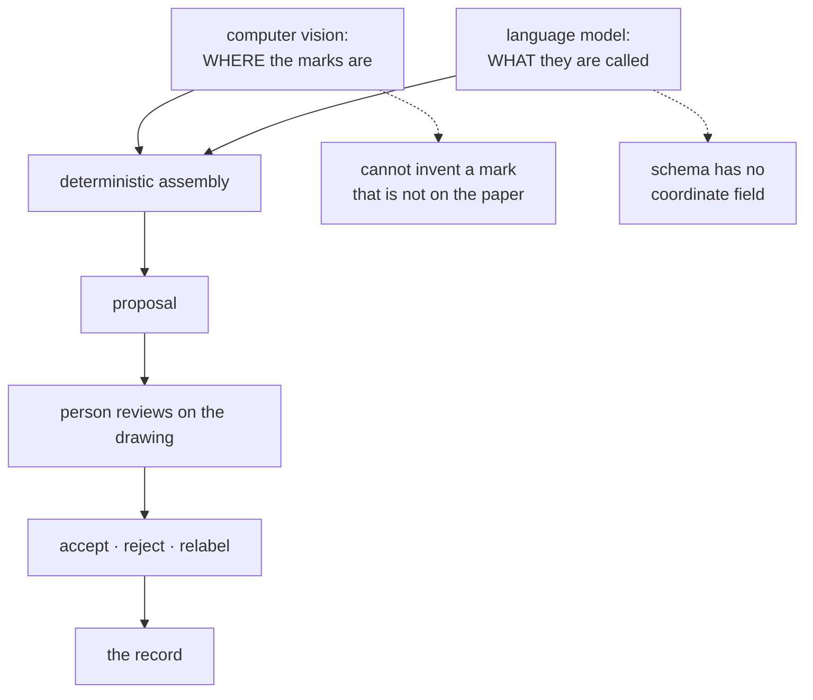

# Human-in-the-loop review

Machine components propose; a person decides. Applied here not as a safety net
bolted on afterwards, but as a constraint that shapes what each component is
allowed to output at all.

## What it is

Automation can be arranged three ways:

**Fully automatic.** The machine decides and acts. Fast, and its mistakes enter
the record unnoticed.

**Advisory.** The machine suggests; a person accepts or rejects each proposal.
Slower, and every machine output is checked by someone who can see the source.

**Assistive.** The machine does part of the task and hands the rest over,
constrained so it cannot do the part it is unsuited to.

This project uses the second and third, and the design work is in **choosing
which part the machine gets**. A component restricted to what it is reliable at
produces errors a person can catch; a component given free rein produces errors
that look like results.

## The picture



## Where this project uses it

### Splitting the task by what each component is good at

`poggio_webapp/pipeline/assign_markers.py`:

```python
"""...
Division of labor, per the note at the bottom of the original tool:
  - the marker COORDINATES come from computer vision and are immutable —
    they pass through this module verbatim, byte for byte
  - Gemini only CLASSIFIES each fixed point (top boundary of locus N /
    final section base / noise) and reads the sheet's labels (loci Munsell
    colors, tie points, metadata) — a task it did fine on even in the runs
    whose geometry was fabricated
The final FieldWallProfile JSON is then assembled deterministically here,
so there is no path by which the model can invent, move, or drop a vertex:
if it misassigns one, the point is on the wrong boundary but still a real
point from the paper, and the validator's spacing checks stay meaningful.
"""
```

The last clause is the design goal: **a mistake must remain detectable.** A
misassigned point is a real point on the wrong line — visible to a reviewer, and
still subject to the [spacing checks](fabrication-detection.md). A *fabricated*
point is undetectable by inspection.

The constraint is enforced by the response schema:

```python
class MarkerAssignment(BaseModel):
    markerId: int
    kind: str
    locusNumber: str | None = None
```

No coordinate field exists. The model cannot supply geometry because there is
nowhere to put it. See [separation of concerns](separation-of-concerns.md).

And the prompt states it again, for the model's benefit:

> These points are REAL and FIXED. You must not invent new points, move points,
> or report coordinates anywhere.

Belt and braces — the schema is the enforcement, the prompt is the instruction.

### Two-phase review, with the network call separated from the commit

```python
# Two-phase API used by the webapp (/markers/assign then /markers/finalize):
#   classify_markers()     network call, returns the proposal for user review
#   finalize_assignments() no network, assembles the reviewed proposal + the
#                          immutable CV coordinates into the extraction JSON
```

The user sees the classification, edits it, and only then is the extraction
built. See [two-phase commit with review](two-phase-commit-with-review.md).

### Proposals, explicitly not conclusions

`poggio_webapp/pipeline/detect_features.py` opens by saying what it is *not*
claiming:

```python
"""Computer-vision proposals for discrete features in trench drawings.

This detector intentionally does not claim that every closed contour is a
stone. It proposes compact, closed shapes that may represent stones, cuts,
lenses, voids, or other discrete features. A person approves, rejects, and
labels each proposal before extraction. The confirmed list is then treated as
the feature inventory for the extraction prompt.
"""
```

and its output carries a review state rather than a verdict:

```python
"suggested_type": suggested_type,
"feature_type": suggested_type,
"status": "pending",
"source": "cv",
```

### Rejected candidates are offered back

`poggio_webapp/pipeline/detect_markers.py` — the detail that shows the review is
taken seriously:

```python
# The route and review UI consume the rejected candidates too (red,
# toggleable dots), so a person can rescue a real vertex the filters
# wrongly dropped. Only NEAR MISSES are worth showing: a reject far
# outside the marker size band ... was never a plausible marker, and
# rendering thousands of them buries the drawing. Shown: diameter within
# [0.5*min_d, 1.5*max_d] and roughly round, capped at the most circular 300.
```

The filter's **false negatives are recoverable**. Most pipelines discard what
they reject; this one ranks the near misses and hands them back, because a
missed vertex is lost evidence while an extra one is one click.

### Suggestions require individual review

`poggio_webapp/pipeline/harris_suggestions.py` generates conservative proposals,
each with a stated reason:

```python
_ORDERING_REASON = "Consecutive source layers share a recorded boundary."
_CORRELATION_REASON = "Matching normalized labels appear in different jobs or faces."
```

Accepting one revalidates the whole graph and refuses if it would break:

```python
report = validate_matrix_graph(reviewed)
if not report["ok"]:
    raise _acceptance_error(suggestion, report)
```

and a decision **survives regeneration**, because the suggestion's ID is
[content-addressed](content-addressed-identifiers.md):

```python
previous = existing_by_id.get(suggestion.id)
if previous is not None:
    suggestion.status = previous.status
```

Reviewing is work; the design makes sure it is not repeated.

## Why this and not something else

| Alternative | How it would extract boundaries | Why it lost |
|---|---|---|
| **Fully automatic LLM extraction** | Ask the model for the geometry | **Tried, and it failed** — twice, on real data, producing evenly spaced points and copy-pasted boundaries. The validator's [fabrication checks](fabrication-detection.md) exist because of it. Still available and labelled `experimental`. |
| **Fully automatic CV** | Detect and commit | CV cannot fabricate, and it does miss and over-detect. Without review, a missed vertex is silently lost evidence. |
| **Manual only** | A person traces everything | The **supported** path, and the slowest. CV assistance is worth having if it cannot corrupt what it assists with. |
| **Machine proposes, human disposes** *(chosen)* | CV finds, model labels, person confirms | Each component does what it is reliable at, and the composition is checked by someone who can see the drawing. |
| **Confidence scores instead of review** | Emit values with uncertainty | Downstream consumes numbers, not caveats. GemPy has no confidence input. |

The generalisable principle: **give the machine the part where its failure mode
is visible.** CV's failures — a missed dot, a stray blob — are obvious on an
overlay. A language model's failure on geometry is a plausible boundary in the
wrong place, which is not.

## What it costs

Review is the slowest part of the workflow, and that is the trade.

The costs:

- **Time.** Every marker, every feature, every suggestion is looked at.
- **Interface work.** A review step needs a good overlay, toggleable rejects, and
  editable labels. Substantial browser code exists only to make review possible.
- **Review fatigue is real.** Hundreds of candidates invite rubber-stamping —
  which is why the candidate list is
  [capped and ranked](bounded-caches-and-eviction.md) rather than exhaustive.
- **It does not scale.** Fine for a research project processing one drawing at a
  time; not for thousands.

## Where else you meet it

- **Medical imaging**, where a detector flags candidates and a radiologist
  decides — the closest analogue.
- **Content moderation**, where automated flagging routes to human review.
- **Machine translation**, where post-editing is standard for anything
  published.
- **Autonomous vehicles**, whose disengagement protocols are this pattern at
  safety-critical scale.
- **Aviation autopilot**, which flies while the pilot retains authority.

## Related pages

- [Separation of concerns](separation-of-concerns.md) — the CV/model boundary.
- [Two-phase commit with review](two-phase-commit-with-review.md) — the propose,
  review, finalize shape.
- [Fabrication detection](fabrication-detection.md) — what happened without it.
- [Provenance and data lineage](provenance-and-data-lineage.md) — recording who
  decided what.
- [Fail-closed design](fail-closed-design.md) — the related refusal principle.
- [Markers and features](../workflows/03-markers-and-features.md) — the workflow.
