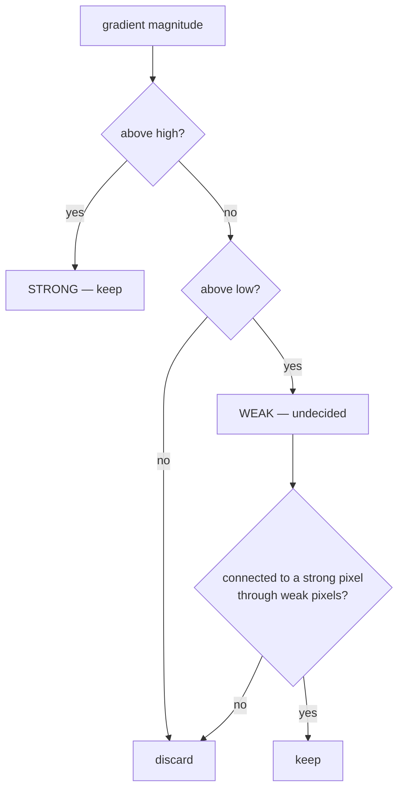

# Hysteresis thresholding

Using two thresholds instead of one, and letting connectivity decide the cases
in between. Stages four and five of [Canny](canny-edge-detection.md), and the
reason a faint but real boundary line survives while a faint speck does not.

## What it is

A single threshold forces one decision for every pixel, and there is no good
place to put it. Set it high and faint edges break into dashes. Set it low and
noise is admitted everywhere.

Hysteresis splits the decision:

- Above the **high** threshold → **strong**. Definitely an edge.
- Below the **low** threshold → discarded. Definitely not.
- Between the two → **weak**. Undecided.

Then the resolving rule:

> A weak pixel is kept **only if it connects, through other weak pixels, to a
> strong one.**

Context decides the ambiguous cases. A faint pixel that is part of a chain
reaching a confident edge is part of that edge. A faint pixel sitting alone in
blank paper is noise.

The name comes from physics: hysteresis is a system whose state depends on its
history, and here a pixel's fate depends on what it is attached to.

## The picture



Two faint runs of pixels, both below the high threshold:

```
case A:  ...strong strong weak weak weak...     → all kept
                                    ↑
                    a real boundary that fades where the pen ran dry

case B:  ...nothing weak weak nothing...        → discarded
                        ↑
                  paper texture, connected to nothing
```

Identical magnitudes, opposite outcomes. No single threshold can distinguish
them, because the difference is not in the pixels — it is in their neighbours.

## Where this project uses it

Inside both `cv2.Canny` calls. The visible part is how the two thresholds are
chosen, and the two call sites do it differently.

### Fixed 1:3 ratio, for deskew

`poggio_webapp/pipeline/preprocess.py`:

```python
edges = cv2.Canny(gray, 50, 150)
```

Low 50, high 150 — the ratio Canny himself recommended. Fixed values are fine
because the consumer is the [Hough transform](hough-line-transform.md), which
votes: extra noise pixels vote for no line in particular, and the
[median](median-and-robust-statistics.md) over detected angles absorbs the rest.

### Median-derived, with four guards

`poggio_webapp/pipeline/detect_features.py`:

```python
median_intensity = float(np.median(gray))
lower_threshold = int(max(20, 0.55 * median_intensity))
upper_threshold = int(
    min(
        255,
        max(lower_threshold + 30, 1.25 * median_intensity),
    )
)
```

Every clause is defending a specific failure:

| Clause | Prevents |
|---|---|
| `0.55 ×` and `1.25 × median` | thresholds that do not scale with paper brightness |
| `max(20, ...)` | a very dark image admitting everything as an edge |
| **`max(lower + 30, ...)`** | **the two thresholds collapsing together** |
| `min(255, ...)` | an upper threshold above the representable range |

The third is the one that protects hysteresis itself. If `high` fell to `low`,
there would be no weak band, no connectivity rule, and Canny would silently
degrade to single-threshold detection — with no error and a plausible-looking
result. A 30-level minimum gap guarantees the mechanism stays engaged.

The [median](median-and-robust-statistics.md) is used rather than the mean
because it estimates the **paper tone**: most of a drawing is blank paper, and
the median is unmoved by a dark legend block or a shadowed corner.

## Why this and not something else

| Alternative | How it would work here | Why it lost |
|---|---|---|
| **Single threshold** | One cut on gradient magnitude | Cannot be set correctly. High breaks faint boundary lines into dashes; low admits paper texture. The choice this project faces — faded 1980 ink alongside crisp modern pencil, sometimes on the same sheet — has no single right value. |
| **[Otsu](otsu-thresholding.md) on the gradient magnitude** | Choose one threshold automatically | Removes the tuning, keeps the single-threshold limitation, and gradient magnitude histograms are heavily skewed rather than bimodal, which is where Otsu is weakest. |
| **Hysteresis** *(chosen)* | Two thresholds plus connectivity | Resolves ambiguity with evidence — the pixel's neighbours — rather than with a number. |
| **[Adaptive thresholding](adaptive-thresholding.md) on the gradient** | A local threshold per neighbourhood | Handles varying edge strength across the sheet, and it has no connectivity notion, so an isolated faint speck in a quiet region is *promoted* rather than rejected. Exactly backwards for this purpose. |
| **Keep everything, filter later by shape** | No threshold; reject bad contours downstream | Shifts the problem to [contour tracing](contour-tracing.md), which would return thousands of texture contours. The shape filter already has to reject a lot; giving it noise as well makes its thresholds do two jobs. |

The generalisable idea is the one this repository applies repeatedly:
**resolve ambiguous cases with structural evidence, not by moving a number.**
The same shape appears in `merge_walls`, where an unconnected wall is identified
by [component membership](connected-components.md) rather than by a distance
cutoff, and in `harris_suggestions`, where a proposal is judged by whether it
introduces a [cycle](cycle-detection.md) rather than by a confidence score.

## What it costs

O(n) for the classification plus a connected-components walk over the weak
pixels — linear overall, one extra pass.

The cost is a second parameter, and worse, one whose **ratio** to the first
matters more than either value. Canny suggested 1:2 to 1:3. `preprocess.py`
uses exactly 1:3; `detect_features.py` computes roughly 1:2.3 from the median,
with a floor to keep them apart.

Hysteresis does not guarantee closed contours — an edge that fades below the
low threshold along its whole width still breaks. Hence
[morphological closing](morphological-closing.md) immediately after.

## Where else you meet it

- **Thermostats.** Turning on at 19°C and off at 21°C rather than both at 20°C
  is hysteresis, preventing rapid cycling.
- **Schmitt triggers** in electronics — the same idea in hardware, for
  debouncing a noisy signal.
- **UI scroll and drag thresholds**, where a gesture must exceed one distance to
  start and fall below a smaller one to stop.
- **Object tracking**, where a track is created at high confidence and
  maintained at lower confidence.
- **Alerting systems**, which fire above one level and clear below another to
  avoid flapping.

## Related pages

- [Canny edge detection](canny-edge-detection.md) — the algorithm this
  completes.
- [Edge thinning](edge-thinning-non-maximum-suppression.md) — the preceding
  stage.
- [Median and robust statistics](median-and-robust-statistics.md) — how the
  thresholds are derived.
- [Global thresholding](global-thresholding.md) and
  [Otsu](otsu-thresholding.md) — the single-threshold alternatives.
- [Connected components](connected-components.md) — the connectivity rule at
  the heart of stage five.
