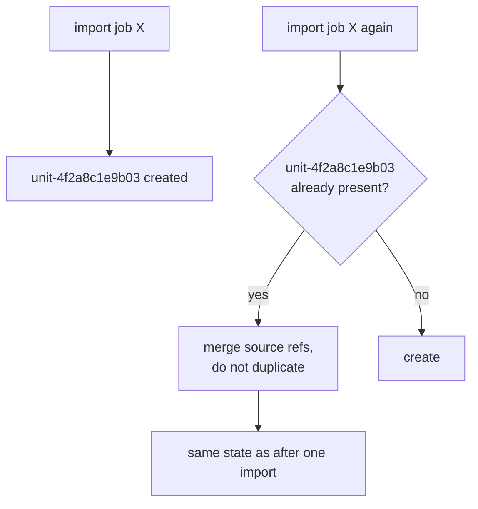

# Idempotency

Doing something twice has the same effect as doing it once. The property that
makes "just run it again" a safe answer to almost any failure.

## What it is

An operation is **idempotent** if applying it repeatedly leaves the same state as
applying it once.

```
idempotent:      set the status to "complete"    ·  create the directory if missing
not idempotent:  append a find                   ·  increment the revision
```

It matters because failure is normal. A request times out, a browser retries, a
user double-clicks, an import is re-run after adding a wall. If the operation is
idempotent, none of those needs special handling. If it is not, every retry path
needs a deduplication mechanism.

The usual way to obtain it is a **stable key**: something that identifies the
intended effect, so a repeat can be recognised. Here that key is a
[content-addressed identifier](content-addressed-identifiers.md).

## The picture



## Where this project uses it

### Importing source jobs

`poggio_webapp/pipeline/harris_import.py`:

```python
def import_source_jobs(
    matrix: HarrisMatrix,
    job_ids: list[str],
    jobs_dir: Path,
) -> tuple[HarrisMatrix, list[dict]]:
    """Return a matrix copy with source units merged idempotently."""
    imported_matrix = matrix.model_copy(deep=True)
    units_by_id = {unit.id: unit for unit in imported_matrix.units}
    ...
    for imported_unit in imported_units:
        existing_unit = units_by_id.get(imported_unit.id)
        if existing_unit is None:
            imported_matrix.units.append(imported_unit)
            units_by_id[imported_unit.id] = imported_unit
            continue
        for source_ref in imported_unit.source_refs:
            if source_ref not in existing_unit.source_refs:
                existing_unit.source_refs.append(source_ref)

    if job_id not in imported_job_ids:
        imported_matrix.source_job_ids.append(job_id)
        imported_job_ids.add(job_id)
```

The docstring says it outright. Three levels of deduplication:

- **Units** by their [content-addressed ID](content-addressed-identifiers.md),
  derived from job, schema, face, and layer index.
- **Source references** by value, so a repeated import adds no duplicate
  provenance.
- **Job IDs**, so the source list does not grow on re-import.

And within a single call:

```python
if job_id in requested_job_ids:
    continue
requested_job_ids.add(job_id)
```

Requesting the same job twice in one request is also a no-op.

The whole thing works because the unit ID is a function of *where the unit came
from*, not of when it was imported. With `uuid4` IDs none of this would be
possible.

### Regenerating suggestions

`poggio_webapp/pipeline/harris_suggestions.py`:

```python
existing_by_id = {
    suggestion.id: suggestion
    for suggestion in matrix.suggestions
}
suggestions_by_id = {
    suggestion.id: suggestion.model_copy(deep=True)
    for suggestion in matrix.suggestions
}
for suggestion in generated:
    previous = existing_by_id.get(suggestion.id)
    if previous is not None:
        suggestion.status = previous.status
    suggestions_by_id[suggestion.id] = suggestion
```

Regeneration is idempotent **and preserves the user's decisions.** A suggestion
the user rejected stays rejected, because the regenerated one carries the same
ID and its `status` is copied across.

Accepting is idempotent too:

```python
if suggestion.status == "accepted":
    return reviewed
```

Accept twice, and the second call returns unchanged rather than adding the
relation again. The relation ID is content-addressed for the same reason:

```python
existing = next(
    (item for item in matrix.relations if item.id == relation.id),
    None,
)
if existing is None:
    matrix.relations.append(relation)
elif existing != relation:
    raise HarrisSuggestionError(...)
```

Present and identical → no-op. Present and *different* → an error, because that
would be an ID collision rather than a repeat.

### Syncing finds

`poggio_webapp/pipeline/editor/finds.py`:

```python
def sync_finds_to_output(job_id: str) -> None:
    """Copy the current artifact finds into an existing finalized output."""
    output_path = storage.JOBS_DIR / job_id / "extraction_output.json"
    if not output_path.exists():
        return

    output = json.loads(output_path.read_text())
    output["finds"] = get_finds(job_id)
    output_path.write_text(json.dumps(output, indent=2))
```

`output["finds"] = ...` **replaces** rather than extends. Running it ten times
gives the same file. The early return when there is no output is the other half —
re-running before finalization is also a no-op.

Contrast `add_find`, which is deliberately **not** idempotent:

```python
stored_find = dict(find)
if "find_id" not in stored_find:
    stored_find["find_id"] = uuid.uuid4().hex[:12]
finds.append(stored_find)
```

Two artefacts recovered from the same locus are two finds. Deduplicating them
would be wrong. Note the escape hatch: a caller *may* supply its own `find_id`,
which is how a retry could be made idempotent if the client generated the ID.

### Directory creation

`poggio_webapp/storage.py`:

```python
def ensure_dirs():
    """Create the writable roots if they are missing."""
    for directory in (JOBS_DIR, TRENCHES_DIR, MATRICES_DIR):
        directory.mkdir(exist_ok=True)
```

`exist_ok=True` is idempotency in one keyword, which is why the function can run
unconditionally at import.

## Why this and not something else

| Alternative | How it would make import safe to repeat | Why it lost |
|---|---|---|
| **An "already imported" flag per job** | Record which jobs were imported, skip them | Coarse: it cannot merge new units if the source job gained a layer. And it is state to keep in sync with reality. |
| **A separate deduplication pass** | Import freely, then remove duplicates | Needs a definition of "duplicate" — which is the content-addressed ID again, arrived at later and applied as cleanup rather than as prevention. |
| **Client-supplied request IDs** | The client sends a token; the server remembers | The standard HTTP answer for non-idempotent operations, and it requires server-side storage of seen tokens with expiry. `add_find` leaves the door open by accepting a caller-supplied `find_id`. |
| **Refuse a second import** | Error on re-import | Makes adding a newly traced wall to an existing matrix impossible. |
| **Content-addressed IDs** *(chosen)* | Identity *is* the deduplication key | No extra state, no cleanup pass, and it composes — units, source refs, and job IDs all deduplicate by the same mechanism. |

The design point: **idempotency is cheapest when it falls out of the identity
scheme.** Choosing content-addressed IDs bought it for free across three levels.
Bolting on a deduplication pass afterwards would have needed the same key,
applied later and less reliably.

## What it costs

A dictionary lookup per item — nothing.

The costs:

- **Identity must be stable.** Change how a unit ID is derived and every stored
  matrix stops recognising its own units. See
  [content-addressed identifiers](content-addressed-identifiers.md).
- **It cannot be universal.** `add_find`, `create_matrix`, and
  `create_editor_session` all genuinely create new things and must not be
  idempotent. The distinction is whether a repeat means "again" or "the same."
- **Idempotent ≠ commutative.** Importing A then B is idempotent in each step
  and can differ from B then A — for instance in which
  [Munsell reading](../archaeology/locus.md) becomes a merged surface's
  display label.
- **Silent no-ops can confuse.** Re-importing a job reports nothing new, which
  looks like a failure. Hence the `warnings` list the import returns alongside.

## Where else you meet it

- **HTTP method semantics.** `GET`, `PUT`, and `DELETE` are specified as
  idempotent; `POST` is not, which is why double-submit protection exists.
- **Payment APIs**, where an idempotency key prevents charging a card twice.
- **Configuration management** — Ansible, Terraform, and Puppet are built
  entirely on declaring desired state rather than actions.
- **Message queues with at-least-once delivery**, where the consumer must be
  idempotent because redelivery is guaranteed.
- **Database `UPSERT`**, and `CREATE TABLE IF NOT EXISTS`.

## Related pages

- [Content-addressed identifiers](content-addressed-identifiers.md) — the
  mechanism.
- [Immutability and defensive copying](immutability-and-defensive-copying.md) —
  the companion discipline in the same modules.
- [Optimistic concurrency control](optimistic-concurrency-control.md) — what
  happens when two idempotent operations still conflict.
- [Retry budgets](retry-budgets.md) — when retrying is safe.
