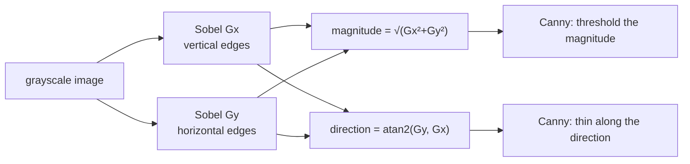

# Image gradients and Sobel

Measuring how fast brightness changes, and in which direction. The first step
inside every edge detector, and the reason blurring has to come before it.

## What it is

An edge is a place where brightness changes quickly. "Quickly" is a derivative,
so edge detection is differentiation.

An image is a grid, not a continuous function, so the derivative is approximated
by a difference between neighbours. The **Sobel operator** does this with a 3×3
[convolution](convolution.md) that differentiates in one direction while
smoothing in the other:

```
Gx = [ -1  0  +1 ]        Gy = [ -1  -2  -1 ]
     [ -2  0  +2 ]             [  0   0   0 ]
     [ -1  0  +1 ]             [ +1  +2  +1 ]
```

`Gx` responds to vertical edges (change along x), `Gy` to horizontal ones. The
`1, 2, 1` weighting is a small [Gaussian](gaussian-blur.md) perpendicular to the
derivative — noise suppression built into the operator.

From the two responses come the two quantities that matter:

```
magnitude = √(Gx² + Gy²)        how strong is the edge
direction = atan2(Gy, Gx)       which way does it face
```

Both kernels sum to zero, so flat regions produce no response at all — see
[convolution](convolution.md).

## The picture

One row crossing a boundary stroke:

```
intensity   240  238  235  110  108  236  239
Gx response   -2   -3 -125  -1  +126  +3   ...
                        ↑         ↑
                   strong negative   strong positive
                   (dark step down)  (bright step up)
```

The stroke produces two gradient peaks, one at each of its edges — which is
exactly why an edge detector on a line drawing finds *two* edges per stroke and
[contour tracing](contour-tracing.md) then returns a closed loop around each
line.



## Where this project uses it

Never called by name — always inside [Canny](canny-edge-detection.md), which
computes Sobel gradients as its first real step.

`poggio_webapp/pipeline/detect_features.py`:

```python
gray = cv2.cvtColor(analysis, cv2.COLOR_BGR2GRAY)
gray = cv2.GaussianBlur(gray, (3, 3), 0)
...
edges = cv2.Canny(gray, lower_threshold, upper_threshold)
```

`poggio_webapp/pipeline/preprocess.py`, inside deskew:

```python
edges = cv2.Canny(gray, 50, 150)
lines = cv2.HoughLines(edges, 1, np.pi / 180, threshold=200)
```

The blur on the line before `Canny` is the detail worth understanding.
**Differentiation amplifies high-frequency noise.** A one-level sensor
fluctuation between neighbouring pixels produces a gradient response of the same
order as a genuine faint edge. Smoothing first suppresses the noise while
leaving real edges — which span several pixels — largely intact.

Sobel's own `1, 2, 1` smoothing helps, and is only one pixel wide. The explicit
Gaussian is what makes the operator usable on a real scan.

The gradient **direction** is used too, invisibly: Canny thins edges by
suppressing pixels that are not maxima *along the gradient direction*. See
[edge thinning](edge-thinning-non-maximum-suppression.md).

## Why this and not something else

| Alternative | Kernel / method | Why it lost — or won |
|---|---|---|
| **Simple difference** | `[-1, +1]` | The minimal derivative. No smoothing at all, so it is extremely noise-sensitive, and it is asymmetric — the response sits half a pixel off-centre. |
| **Central difference** | `[-1, 0, +1]` | Symmetric and correctly centred, still no perpendicular smoothing. This is Sobel's middle row without the neighbour weighting. |
| **Prewitt** | `[1,1,1]` perpendicular weighting | Sobel with uniform rather than `1,2,1` weighting. Very nearly the same; Sobel's Gaussian-like weighting is marginally better behaved on noise. |
| **Scharr** | `[3,10,3]` perpendicular weighting | More rotationally accurate than Sobel — the gradient *direction* is more faithful at diagonal angles. Genuinely better if you depend on the angle. OpenCV offers it as `cv2.Scharr`. |
| **Sobel** *(what Canny uses)* | `[1,2,1]` | The universal default. Cheap, separable, adequate direction accuracy, and it is what `cv2.Canny` uses internally, so choosing it is really choosing Canny. |
| **Laplacian** | Second derivative, `∇²` | Detects edges as zero-crossings rather than peaks, in one kernel instead of two. Far more noise-sensitive (second derivative), and it gives no direction, so the thinning step Canny relies on is impossible. |
| **Learned edge detection (HED and similar)** | A neural edge detector | Substantially better on natural photographs, where "edge" means a semantic boundary. On a line drawing, the edges *are* ink transitions — the classical operator is not merely adequate, it is exactly right, and it is inspectable. |

The last row generalises a decision made repeatedly in this repository: the
drawing conventions are known in advance, so the right operator can be reasoned
about rather than discovered. See [codebase review](../architecture/code-review.md).

Note that `preprocess.deskew` cares about **direction** (the angle of
near-horizontal lines) while `detect_features` cares about **magnitude** (where
outlines are). Both come out of the same operator.

## What it costs

Two 3×3 convolutions, each separable into two 1D passes, so O(n) with a small
constant — around 12 multiply-adds per pixel for both directions.

The real cost is noise amplification, which is why a blur always precedes it,
and which is why the sequence Gaussian → Sobel → threshold appears in every
classical edge detector rather than Sobel alone.

## Where else you meet it

- **Every edge-detection filter** in every image editor.
- **Optical flow and motion estimation**, which compare spatial and temporal
  gradients.
- **SIFT, HOG, and other classical features**, built from gradient orientation
  histograms.
- **Autofocus** in cameras, which maximises total gradient magnitude —
  a sharp image is a high-gradient image.
- **The first layers of a trained CNN**, which reliably learn kernels that look
  very much like Sobel.
- **Terrain analysis**, where the gradient of an elevation model is slope and
  its direction is aspect — the same mathematics this project uses for
  [dip and azimuth](compass-bearings-vs-mathematical-angles.md).

## Related pages

- [Canny edge detection](canny-edge-detection.md) — the algorithm built on this.
- [Edge thinning](edge-thinning-non-maximum-suppression.md) — which uses the
  gradient direction.
- [Convolution](convolution.md) — the mechanism.
- [Gaussian blur](gaussian-blur.md) — the mandatory preceding step.
- [Hough line transform](hough-line-transform.md) — what the edges feed in
  `preprocess.deskew`.
