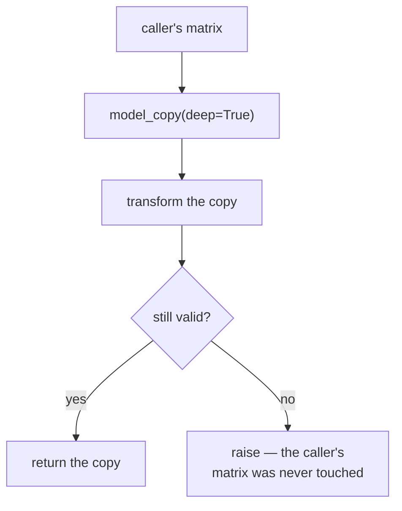

# Immutability and defensive copying

Never modify what you were given. A discipline that removes a whole class of
bugs — and, in the Harris code, makes a failed operation roll back for free.

## What it is

Python passes objects by reference. A function that mutates its argument changes
the caller's data, whether or not the caller expected that.

Two remedies:

**Immutable types.** `frozen=True` dataclasses, `tuple`, `frozenset` — mutation
is impossible, so the question does not arise.

**Defensive copying.** Take a private copy at the boundary and work on that. The
caller's object is untouched, and the copy can be discarded if something goes
wrong.

The second gives an unexpected bonus: if a transform works on a copy and only
the *successful* result is returned, then a failure part-way through leaves the
original intact. **Transactionality falls out of copying.**

## The picture



## Where this project uses it

### Copy at the boundary, in one place, with a comment

`poggio_webapp/pipeline/merge_walls.py`:

```python
def merge_extractions(sheets, correlation=None):
    """...
    Returns (merged, notes) where merged == {'trenchProfiles': [...]}.
    Inputs are never mutated.
    """
    cleaned = _validate_sheets(sheets)
    parsed_correlation = _parse_correlation(correlation)
    notes = []

    # Private deep copies from here on; callers' dicts stay untouched.
    copies = [(label, copy.deepcopy(data)) for label, data in cleaned]
```

One copy, at the top, with the guarantee stated in the docstring. Everything
below is free to mutate — and several helpers do, in place:

```python
def _apply_correlation(label, sheet, parsed, notes):
    """Rename locusNumber values in loci[] and layers[] per the correlation
    map, in place (sheet is already a private deep copy)."""
```

The parenthesis is the important half. Local mutation is fine *because the
ownership boundary is documented one level up*. Without that note, a later
reader would reasonably assume `_apply_correlation` damages its caller's data.

This is the pattern worth copying: **copy once at the entry point, mutate freely
inside, and say so.** Copying at every level would be wasteful and would blur
where ownership actually changes.

### Copy as rollback

`poggio_webapp/pipeline/harris_suggestions.py`:

```python
def review_suggestion(
    matrix: HarrisMatrix,
    suggestion_id: str,
    action: str,
) -> HarrisMatrix:
    """Accept or reject one suggestion without mutating the input matrix."""
    ...
    reviewed = matrix.model_copy(deep=True)
    suggestion = reviewed.suggestions[suggestion_index]

    if action == "reject":
        ...
        suggestion.status = "rejected"
        return reviewed

    if suggestion.suggestion_type == "ordering":
        _accept_ordering(reviewed, suggestion)
    else:
        _accept_correlation(reviewed, suggestion)
    suggestion.status = "accepted"

    report = validate_matrix_graph(reviewed)
    if not report["ok"]:
        raise _acceptance_error(suggestion, report)
    return reviewed
```

Read the last four lines carefully. The suggestion is applied, the **whole graph
is revalidated**, and if accepting it would introduce a
[cycle](cycle-detection.md) the function raises.

Because every change happened on `reviewed`, the caller's matrix is untouched.
There is no undo code, no rollback log, no compensating transaction — the
discarded copy *is* the rollback. That is the cleanest expression of
transactionality available without a database.

`generate_suggestions` follows the same shape:

```python
result = matrix.model_copy(deep=True)
result.suggestions = [...]
return result
```

as does `import_source_jobs`:

```python
imported_matrix = matrix.model_copy(deep=True)
```

### Copying elements, not just containers

`poggio_webapp/pipeline/harris_suggestions.py`:

```python
def _unique_source_refs(source_refs) -> list[SourceRef]:
    refs_by_key = {
        _source_ref_key(source_ref): source_ref
        for source_ref in source_refs
    }
    return [
        refs_by_key[key].model_copy(deep=True)
        for key in sorted(refs_by_key)
    ]
```

A shallow list copy would share the `SourceRef` objects with the input. Copying
each element is what makes the returned list genuinely independent — the
distinction between a shallow and a deep copy, applied deliberately.

### Immutable value objects

`poggio_webapp/pipeline/manual_extraction.py`:

```python
@dataclass(frozen=True)
class Calibration:
    origin_x: float
    origin_y: float
    ux: float
    uy: float
    vx: float
    vy: float
    px_per_m: float
    ref_x: float
    ref_y: float
```

`poggio_webapp/pipeline/detect_markers.py`:

```python
@dataclass(frozen=True)
class SectionCoordinateTransform:
    """Transform image pixels into coordinates on a trench-profile plane."""
```

A [calibration](similarity-transforms.md) is a **fact about one photograph**.
Nothing downstream should be able to adjust it, and `frozen=True` makes that
structural rather than conventional. `frozenset` serves the same purpose for
module-level constants — `_FINISHED` in `tasks.py`, `_FIELD_WALL_FIELDS` in
`harris_import.py`.

## Why this and not something else

| Alternative | How it would protect the caller | Why it lost |
|---|---|---|
| **Mutate in place, document it** | "This function modifies its argument" | Callers forget. Aliasing bugs are found far from their cause, and there is no rollback if a later step fails. |
| **Copy-on-write** | Copy lazily, on first mutation | Efficient for large structures rarely modified. Complex to implement correctly in Python, and these documents are kilobytes. |
| **Persistent data structures** | Structural sharing (like Clojure or Immer) | The principled answer, and it needs a library and reshapes every access pattern. |
| **Fully immutable models** | Every change returns a new object | Pydantic supports frozen models. It would make `_apply_correlation` awkward — every helper would have to thread a new object back out — for no gain over one copy at the boundary. |
| **Deep copy at the entry point** *(chosen)* | One copy, then mutate freely inside | Cheap at this scale, one clear ownership boundary, and it gives rollback for free. |

The pattern this project settles on — **copy at the boundary, mutate within,
return the copy only on success** — is a small transaction system built from one
call and a docstring.

## What it costs

`deepcopy` is O(size). A Harris Matrix is tens of kilobytes, so the copy is
microseconds and happens once per operation.

It would matter for a very large document, and neither the extraction JSON nor
the matrix approaches that. The
[lithology volume](binary-serialisation.md), which *is* large, is never copied —
it is written straight to disk.

The costs:

- **Deep versus shallow is easy to confuse.** `copy.copy` on a nested dict
  shares the inner objects. `_unique_source_refs` copies elements explicitly for
  exactly this reason.
- **`frozen=True` is shallow.** A frozen dataclass holding a list still permits
  the list to be mutated. Every field on the frozen classes here is a `float`.
- **Copying is not free at scale**, so the boundary must be chosen deliberately
  rather than applied everywhere.
- **It is a convention, not a guarantee** for the dict-based paths — nothing
  stops a future helper mutating a caller's dict. The docstrings are the
  enforcement, which is why they say "Inputs are never mutated" explicitly.

## Where else you meet it

- **React and Redux**, where state updates must be immutable for change
  detection to work.
- **Functional languages** — Haskell, Elm, and Clojure make it the default.
- **Java's `Collections.unmodifiableList`** and `record` types.
- **Rust's ownership system**, which enforces at compile time what this achieves
  by discipline.
- **Database transactions**, where a rollback restores a pre-image — the same
  idea with the copy kept by the engine.

## Related pages

- [Idempotency](idempotency.md) — the companion property in the same modules.
- [Race conditions](race-conditions.md) — what shared mutable state causes.
- [Optimistic concurrency control](optimistic-concurrency-control.md) — the
  transaction this copying completes.
- [Pure functions and testability](pure-functions-and-testability.md) — why
  no-mutation functions are easy to test.
