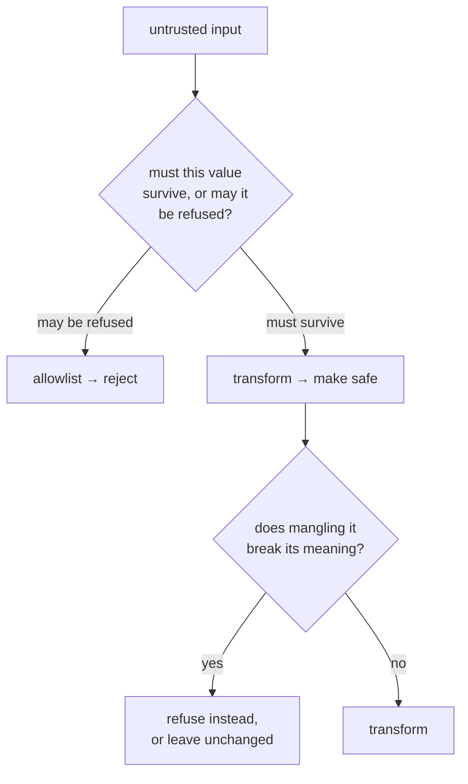

# Input sanitisation

Cleaning untrusted input before it is used. The important distinction is between
**rejecting** what is not allowed and **transforming** it into something safe.
Which of the two is right depends entirely on what the value is for.

## What it is

Three strategies, in decreasing order of safety:

**Allowlist**: accept only what matches a known-good set. Anything unexpected
is refused. The safest, because it fails closed on inputs nobody anticipated.

**Transform**: convert the input into a safe form. Useful when the value must
survive rather than be rejected, and it changes what the user supplied.

**Denylist**: reject known-bad patterns. The weakest, because the list is never
complete.

The trap is applying a transform where a rejection belongs, or vice versa. A
mangled identifier that silently no longer matches its record is worse than a
refusal.

## The picture



## Where this project uses it

### Allowlist: file extensions

`poggio_webapp/backend/config.py`:

```python
ALLOWED_SCAN_EXT = {
    ".png",
    ".jpg",
    ".jpeg",
    ".pdf",
    ".tif",
    ".tiff",
}
```

`poggio_webapp/backend/routes/scans.py`:

```python
ext = os.path.splitext(file.filename)[1].lower()
if ext not in ALLOWED_SCAN_EXT:
    abort(400, description=f"unsupported file type {ext}")
```

A [set](sets-and-membership.md) literal is the clearest statement of "these and
nothing else." `.lower()` normalises before comparing, so `.PNG` is accepted.

The same shape appears for schema types:

```python
ALLOWED_SCHEMA_TYPES = {"ArchaeologicalDiagram", "FieldWallProfile"}
```

and for sheet types:

```python
if sheet_type not in ("illustrator", "fieldwall"):
    abort(400, description="sheet_type must be 'illustrator' or 'fieldwall'")
```

### Transform: the uploaded filename

```python
# The uploaded name is client-supplied and is joined onto a storage root.
# secure_filename strips directory components and anything else that is not
# a safe path component; an ordinary name like "field-wall.png" survives
# unchanged. A name that reduces to nothing keeps the extension we already
# validated, so the file is still recognisable downstream.
filename = secure_filename(file.filename) or f"scan{ext}"
scan_path = d / "01_scan" / filename
file.save(scan_path)
```

A transform is right here because the filename is **cosmetic**: it is a label
on an archival copy, not an identifier anything looks up. Mangling it costs
nothing. Rejecting an upload because its name contains a space would be
obstructive.

The `or f"scan{ext}"` fallback matters: `secure_filename` can return an empty
string for a name that is entirely unsafe characters, and joining an empty
string onto a directory would write to the directory itself.

### Transform, but only when recognised

`poggio_webapp/naming.py`:

```python
def canonical_trench(value) -> str:
    """A trench label in the site's required form: ``T104``, never ``T-104``.
    ...
    Only a label that actually looks like an identifier is rewritten. Anything
    else comes back merely stripped, because a label this function does not
    recognise is more likely to be something it should not be mangling than a
    misspelt trench.
    """
    label = clean_label(value)
    match = _TRENCH_SHAPE.match(label)
    if not match:
        return label
    letters, digits = match.groups()
    return f"{letters.upper()}{digits}"
```

This is the most careful of the three. A transform that mangles what it does not
understand would corrupt a legitimate label it had never seen. The rule
(**transform only what matches the expected shape, otherwise pass through**) is
the safe default for a canonicaliser.

The docstring even declines a tempting further transform:

> Digits are preserved exactly. ``T007`` does not become ``T7``: no trench at
> this site is written with a leading zero, so collapsing them would only ever
> change a label nobody meant to write that way.

### Transform for a different reason: output encoding

`poggio_webapp/pipeline/harris_render.py`:

```python
def _xml_text(value) -> str:
    """Return text containing only characters allowed in XML 1.0."""
    return "".join(
        character
        if (
            character in "\t\n\r"
            or 0x20 <= ord(character) <= 0xD7FF
            or 0xE000 <= ord(character) <= 0xFFFD
            or 0x10000 <= ord(character) <= 0x10FFFF
        )
        else "\ufffd"
        for character in str(value)
    )
```

This is **output** sanitisation, not input. A unit label containing a control
character would produce an SVG no parser could read. Replacing with U+FFFD keeps
the document valid and makes the substitution visible.

`ElementTree` handles the *structural* escaping (`<`, `&`, quotes),
so this is not hand-rolled HTML escaping. It handles only what the library
cannot: characters XML 1.0 forbids outright.

### And where sanitisation is deliberately absent

The extraction schemas transcribe the sheet **verbatim**. From
`assign_markers.build_prompt`:

> PART 1. Transcribe the sheet's text, verbatim ... gridTiePoints: the
> coordinate labels along the top edge, rawText exactly as written

`convert_coords.make_starter_config`:

```python
# The sheet's own tie-in labels are the likeliest source of these
# numbers. Grid labels like "190E/53S" now have a defined reading --
# site_grid.label_to_grid applies the site's sign rule -- so any that
# parse are offered alongside the raw text. They are still offered,
# not applied: which end of a face a label marks is a site-records
# question this module cannot answer.
```

Transcription and interpretation are separated rather than merged. The label is
*parsed* (`site_grid.label_to_grid` reads `190E/53S` as `(190, -53)` by the
site's own sign rule), but `rawText` is kept beside the parse, and neither is
applied to a face.

Transcribed text is **evidence**. Cleaning it in place would destroy what was
recorded.
The safety comes from never using it as a path, an identifier, or executable
content. See [path traversal](path-traversal-and-containment.md).

## Why this and not something else

| Alternative | How it would handle the upload | Why it lost, or won |
|---|---|---|
| **No sanitisation** | Join the client's name onto a path | The name is attacker-controlled and joined onto a storage root. |
| **Denylist** | Reject names containing `..` or `/` | Incomplete by nature: encodings, Unicode look-alikes, platform quirks. |
| **Allowlist the extension** *(chosen)* | Reject unknown types | Cheap, complete for the question it answers, and it fails closed. |
| **Transform the name** *(chosen)* | `secure_filename` | Right because the name is cosmetic. Rejecting a file for having a space in its name would be obstructive. |
| **Discard the name entirely** | Store as `scan.png` | Safest, and it loses information a person may want. The original name is a small piece of provenance. |
| **Content sniffing** | Verify the file really is a PNG | Stronger than trusting the extension, and OpenCV already fails on a non-image, so the extension check is a fast reject rather than the only guard. |

The judgement running through all of these is **what the value is for**:

- an **identifier** that must match a record → validate strictly, never mangle
- a **path component** → transform or reject; never trust
- a **label** for display → tidy, do not mangle
- **transcribed evidence** → do not touch at all

## What it costs

Microseconds.

The costs:

- A transform changes what the user gave you. Acceptable for a filename,
  unacceptable for an identifier, hence `canonical_trench` returning unmatched
  input unchanged.
- Allowlists must be maintained. Supporting a new image format means editing
  `ALLOWED_SCAN_EXT`. That is the intended friction.
- Sanitisation is not validation. A file with a `.png` extension may not be a
  PNG. The extension check is a fast reject; the decoder is the real test.
- Verbatim data needs discipline downstream. Transcribed text is safe only
  because nothing uses it as a path or a key.

## Where else you meet it

- SQL injection, prevented properly by parameterised queries (a form of
  never mixing data with code), rather than by escaping.
- Cross-site scripting, prevented by output encoding, the same distinction
  `_xml_text` draws.
- Command injection, prevented by passing argument lists rather than shell
  strings.
- Email and URL validation, the canonical example of a transform that
  mangles legitimate input if done carelessly.
- Unicode normalisation, where two visually identical strings compare
  unequal until normalised.

## Related pages

- [Path traversal and containment](path-traversal-and-containment.md): the
  filesystem case.
- [Sets and membership](sets-and-membership.md): allowlists as sets.
- [Regular expressions](regular-expressions.md): shape validation.
- [Validation at trust boundaries](validation-at-trust-boundaries.md): where
  these run.
- [Provenance and data lineage](provenance-and-data-lineage.md): why some data
  is left untouched.
