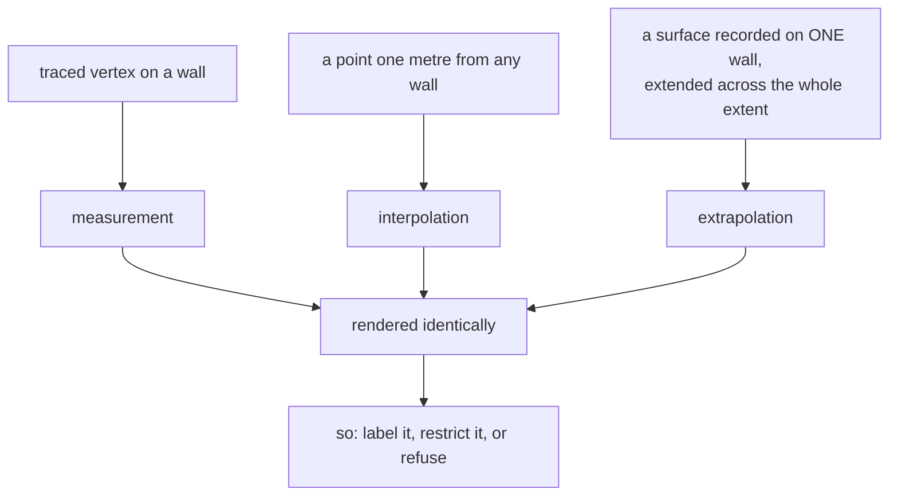

# Interpolation versus measurement

A recorded value and an estimated one look identical once they are numbers. This
project treats keeping them distinguishable as a first-class requirement, and
several design decisions exist only to serve it.

## What it is

**A measurement** is a value someone obtained from the thing itself — a traced
vertex, a surveyed coordinate, a Munsell reading.

**An interpolation** is a value computed from measurements. The 3D model's
surface a metre from any wall was never observed; it is the interpolator's best
estimate given what was.

Both are floating-point numbers in the same file, rendered by the same viewer,
in the same colour. Nothing about the *value* says which it is.

That matters because the outputs are archaeological claims. A model that shows a
deposit extending under an unexcavated area is making an assertion, and a reader
has to be able to tell that assertion from the evidence supporting it.

Three responses are possible: **label**, **restrict**, or **refuse**. This
project uses all three.

## The picture



## Where this project uses it

### Label: ship the evidence alongside the model

`poggio_webapp/pipeline/build_gempy.py`:

```python
def wall_traces(points):
    """One polyline per (face, surface): the points actually traced on that
    wall, in along-wall order.

    A viewer can draw these over the interpolated surfaces so a reader can
    tell data from interpolation -- everything away from a trace is the
    interpolator's guess. ...
    """
```

The recorded points travel into the viewer manifest as `wallTraces`, so the
model can be drawn **with the evidence on top of it**. That is the clearest
answer available: do not try to make the interpolation trustworthy, make the
distinction visible.

### Label: name what was extrapolated

```python
coverage = points.groupby("surface")["face"].unique()
single_face = {surf: faces[0] for surf, faces in coverage.items() if len(faces) == 1}
single_face_note = None
if single_face:
    single_face_note = (
        "These surfaces have points from only ONE face and will still be "
        "interpolated across the whole model extent: " +
        ", ".join(f"{surf!r} (only on {face})" for surf, face in single_face.items())
    )
    log("NOTE: " + single_face_note)
```

A surface recorded on one wall and extended across a whole trench is
extrapolation, not interpolation — a much weaker claim. It is named, and the note
travels into the manifest so it reaches whoever opens the model rather than only
whoever ran the build.

`merge_walls` warns about the same thing at the ordering stage:

```python
notes.append(
    f"surface {name!r} has layers on only one wall "
    f"({faces_by_surface[name][0]}); it is ordered from fewer "
    "constraints and will still be interpolated across the "
    "whole model extent")
```

### Restrict: bound the extent to the data

```python
def infer_extent(points, pad_xy, pad_z):
    ...
    def pad(lo, hi, minimum):
        span = hi - lo
        p = max(span * 0.1, minimum)
        return lo - p, hi + p
```

10% of the data's own span, with a floor. The model does not extend arbitrarily
beyond where anything was recorded.

### Restrict: claim the least between measurements

Within a boundary, the interpolation is **linear** — see
[linear interpolation](linear-interpolation.md). A spline would be smoother and
would claim excursions nobody recorded. Straight lines reproduce exactly what the
recorder drew.

And [piecewise-linear evaluation](piecewise-linear-functions.md) **clamps**
outside the recorded range rather than extrapolating:

```python
if x <= pts[0][0]:
    return pts[0][1]
if x >= pts[-1][0]:
    return pts[-1][1]
```

"Beyond where we looked, assume the last observation" rather than "the trend
continues."

### Refuse: emit nothing rather than a plausible estimate

`poggio_webapp/pipeline/true_dip.py`:

```python
Where a solve is not available -- a surface drawn on one wall, or two walls too
nearly parallel to condition it -- nothing is emitted and a note says so. A
plausible-looking invented orientation would be worse than the apparent dips
already in the CSV, because it would look like an improvement.
```

"Because it would look like an improvement" is the sentence that separates this
project from one that would average the two apparent dips and move on. An
estimate that appears more refined than its evidence is worse than a known-crude
one. See [fail-closed design](fail-closed-design.md).

### Label at the level of the individual point

Every traced point carries its origin:

```python
"confidence": "human-traced",
"sourcePixel": [pixel_x, pixel_y],
```

so provenance survives every downstream transformation — see
[provenance and data lineage](provenance-and-data-lineage.md).

And a value that could not be read is `null` with a reason, never zero:

```python
if (x is None or y is None) and not conf:
    report.err(f"{where}[{i}]",
               "null coordinate with no confidence note explaining why")
```

A missing measurement must not become a measurement of zero.

### Say it in the documentation, too

The README does not hedge:

> The model **interpolates** between your recorded points. It is a hypothesis
> shaped by evidence, not a measurement.

and [capability status](../project/capability-status.md) labels the model build
`experimental`.

## Why this and not something else

| Alternative | How it would present the model | Why it lost |
|---|---|---|
| **Present the model as a result** | Render it and stop | The commonest failure of visualisation. A rendered surface is a claim, and an unmarked one is an unattributed claim. |
| **Confidence values per point** | Attach uncertainty to every model value | The rigorous answer, and GemPy has no uncertainty output and the CSV has no column for it. Downstream consumes numbers, not caveats. |
| **Only render where data exists** | Draw the traces, not the surfaces | Honest, and it discards the interpolation entirely — which is the reason for building a model at all. |
| **Label, restrict, refuse** *(chosen)* | Traces drawn over surfaces, extent bounded, unsolvable cases omitted | Keeps the model useful while keeping the distinction visible, and refuses only where an estimate would masquerade as an improvement. |

The reasoning turns on **what the consumer can act on**. A confidence column
GemPy ignores changes nothing. A polyline drawn over the surface changes what a
person sees. So the effort went into the visible mechanism rather than the
formally correct one.

## What it costs

`wallTraces` adds every recorded point to the manifest — kilobytes.

The costs:

- **Nothing enforces the distinction downstream.** A user who exports the mesh
  and drops the traces has a surface with no provenance attached.
- **Refusing means less output.** A merged trench with two nearly parallel walls
  gets no true-dip correction at all.
- **Labels can be ignored.** `single_face_note` is a string in a manifest. It
  reaches the viewer, and nothing forces a reader to act on it.
- **The distinction is not binary.** A point interpolated 5 cm from a trace is
  far better supported than one 5 m away, and the model expresses neither.

## Where else you meet it

- **Weather forecasting**, which shows model output with explicit uncertainty
  cones — and is routinely read as prediction anyway.
- **Medical imaging**, where reconstructed slices are interpolated from
  projections and radiologists are trained to know it.
- **Cartography**, where contour lines are interpolated from spot heights and
  the spot heights are shown too — the direct analogue of `wallTraces`.
- **Machine-learning outputs**, where a confident prediction outside the training
  distribution is the same failure.
- **Statistical graphics**, where a regression line drawn beyond the data is the
  canonical misleading chart.

## Related pages

- [Spatial interpolation and kriging](spatial-interpolation-and-kriging.md) —
  what produces the model.
- [Linear interpolation](linear-interpolation.md) — the minimal claim between
  points.
- [Provenance and data lineage](provenance-and-data-lineage.md) — carrying
  origin with the value.
- [Fail-closed design](fail-closed-design.md) — refusing rather than estimating.
- [Fabrication detection](fabrication-detection.md) — catching an estimate that
  entered as a measurement.
- [Accuracy and provenance](../concepts/accuracy-and-provenance.md) — the concept
  page.
