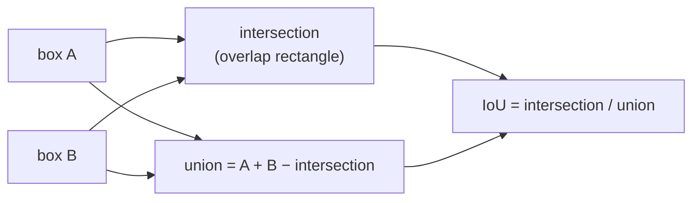

# Intersection over union

One number for how much two regions overlap: the area they share divided by the
area they cover together. The measure that decides whether two feature
candidates are the same stone.

## What it is

```
IoU = area(A ∩ B) / area(A ∪ B)
```

- **1.0** — identical regions.
- **0.5** — substantial overlap.
- **0.0** — no overlap at all.

Also called the *Jaccard index*.

What makes it the right measure rather than raw intersection area is that it is
**normalised by size**. Two large boxes sharing 100 px² barely overlap; two tiny
boxes sharing 100 px² are the same object. Raw intersection cannot tell those
apart; IoU can.

For axis-aligned [bounding boxes](bounding-boxes.md) it is four `min`/`max`
operations, and the union comes free from inclusion–exclusion:

```
union = area(A) + area(B) − intersection
```

## The picture



```
identical boxes                    IoU = 1.00
boxes offset by 20% of their width IoU ≈ 0.67
boxes sharing one corner           IoU ≈ 0.14
disjoint boxes                     IoU = 0.00
```

## Where this project uses it

`poggio_webapp/pipeline/detect_features.py`, to remove duplicate candidates:

```python
def _iou(a: dict[str, Any], b: dict[str, Any]) -> float:
    """Calculate intersection-over-union for two feature bounding boxes."""
    ax1 = float(a["x"]); ay1 = float(a["y"])
    ax2 = ax1 + float(a["width"]); ay2 = ay1 + float(a["height"])
    bx1 = float(b["x"]); by1 = float(b["y"])
    bx2 = bx1 + float(b["width"]); by2 = by1 + float(b["height"])

    intersection_x1 = max(ax1, bx1)
    intersection_y1 = max(ay1, by1)
    intersection_x2 = min(ax2, bx2)
    intersection_y2 = min(ay2, by2)

    intersection_width = max(0.0, intersection_x2 - intersection_x1)
    intersection_height = max(0.0, intersection_y2 - intersection_y1)
    intersection = intersection_width * intersection_height

    if intersection <= 0:
        return 0.0

    area_a = float(a["width"]) * float(a["height"])
    area_b = float(b["width"]) * float(b["height"])
    union = area_a + area_b - intersection

    return intersection / union if union > 0 else 0.0
```

Two guards worth noting: `max(0.0, ...)` on each dimension handles disjoint
boxes, where the naive subtraction would give a negative width and a spurious
positive area; and `if union > 0` handles degenerate zero-area boxes.

The interesting part is how the threshold is applied — not as one cut, but two:

```python
center_threshold = 0.18 * min(
    float(candidate["width"]) + float(candidate["height"]),
    float(existing["width"]) + float(existing["height"]),
)

overlap = _iou(candidate, existing)
close_centers = center_distance < center_threshold

if overlap >= 0.68 or (close_centers and overlap >= 0.35):
    duplicate = True
    break
```

**High overlap alone (≥ 0.68)** is enough — clearly the same object.

**Moderate overlap (≥ 0.35) plus concentric centres** is also enough. This is the
nested-contour case: [Canny](canny-edge-detection.md) reports both sides of a
drawn stroke, so one stone outline produces an outer and an inner contour. They
are concentric, and their IoU can be well below 0.68 if the stroke is thick
relative to the stone. The centre test catches what IoU alone would miss. See
[contour hierarchy](contour-hierarchy.md), which is the alternative way of
handling exactly this.

The centre threshold is itself scale-relative — 18% of the *smaller* candidate's
size — so it means the same thing for a pebble and for a boulder.

## Why this and not something else

| Alternative | How it would work here | Why it lost |
|---|---|---|
| **Raw intersection area** | Overlap in px² | Not normalised: the same absolute overlap means "identical" for small boxes and "barely touching" for large ones. No single threshold works. |
| **Centre distance alone** | Merge if centres are close | Used here *in conjunction*, not alone. Two genuinely different concentric objects — a stone inside a lens — would be merged, and two boxes with the same centre but very different sizes are not the same object. |
| **Intersection over minimum** | `∩ / min(A, B)` | Reports 1.0 whenever one box is entirely inside another, so a small stone drawn inside a large feature is always a duplicate. That is sometimes wanted; here it would delete real nested features. |
| **Mask IoU** (pixel-exact) | Overlap of the actual traced polygons | More accurate for irregular shapes, and it requires rasterising or clipping two polygons per comparison, against four `min`/`max` calls. With up to 250 candidates that is ~31 000 comparisons. |
| **[Contour hierarchy](contour-hierarchy.md)** | Use the parent/child links to drop nested duplicates | Structurally exact for *nested* duplicates, and blind to non-nested near-duplicates that [morphological closing](morphological-closing.md) can produce from one wobbly stroke. IoU handles both with one mechanism. |
| **Box IoU + centre test** *(chosen)* | Two cheap tests in disjunction | Covers both the high-overlap and the concentric case, at four arithmetic operations per comparison. |

The design pattern is **cheap approximate geometry over exact geometry**, chosen
because the consumer is a human reviewer:

> This detector intentionally does not claim that every closed contour is a
> stone. … A person approves, rejects, and labels each proposal before
> extraction.

An over-merged pair is visible in the review overlay and correctable. Exactness
would buy little.

## What it costs

O(1) per comparison — four `min`/`max`, three multiplications, one division.

[Deduplication](non-maximum-suppression.md) is O(k²) in candidate count: each
new candidate is compared against everything already kept. With
`MAX_CANDIDATES = 250` that is at most ~31 000 comparisons, microseconds. A
spatial index would be needed at ten thousand candidates, which the size and
shape filters ensure never occurs.

The accuracy cost is that boxes are a coarse proxy for shapes. Two diagonal
slivers crossing at right angles have nearly identical boxes and IoU ≈ 1.0
despite sharing almost no pixels. Here the [aspect-ratio](aspect-ratio.md) and
[extent](extent-and-fill-ratio.md) filters have already removed slivers, so the
surviving candidates are blob-like and their boxes are decent proxies.

## Where else you meet it

- **Object detection.** IoU is *the* metric — it defines what counts as a
  correct detection (typically IoU ≥ 0.5 against ground truth) and drives
  [non-maximum suppression](non-maximum-suppression.md) in every detector from
  R-CNN to YOLO.
- **Semantic segmentation**, where mean IoU is the standard benchmark score.
- **Object tracking**, associating detections across frames.
- **Text similarity**, where the Jaccard index over word sets is the same
  formula.
- **Recommender systems and deduplication**, comparing sets of attributes.

## Related pages

- [Non-maximum suppression](non-maximum-suppression.md) — what IoU feeds.
- [Bounding boxes](bounding-boxes.md) — the geometry it is computed on.
- [Contour hierarchy](contour-hierarchy.md) — the alternative way of handling
  nested duplicates.
- [Greedy algorithms](greedy-algorithms.md) — the strategy the suppression uses.
- [Sets and membership](sets-and-membership.md) — the Jaccard index in its set-theoretic form.
