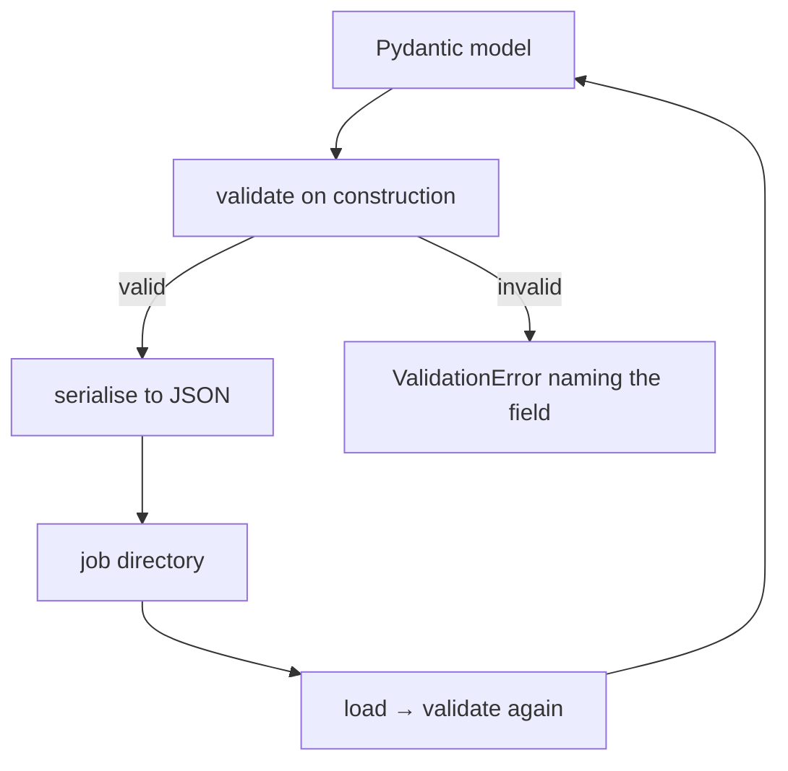

# JSON and schema design

The shape of the data is a set of decisions about what can be recorded, what is
optional, and what a missing value means. In an archaeological pipeline those
decisions are epistemology, not formatting.

## What it is

JSON gives objects, arrays, strings, numbers, booleans, and null. A *schema*
constrains which of those may appear where.

This project uses **Pydantic** models as the schema: Python classes that
validate on construction and serialise to JSON. The models are the contract.

Three design questions recur, and how they are answered decides what the data
can say:

**Optional or required?** A required field forces a value to exist. An optional
one permits "not recorded" — which is different from "recorded as absent."

**Null or omitted?** In this project `null` consistently means *not recorded*,
and that is load-bearing: a boundary point with a null coordinate is a point the
recorder could not read, not a point at zero.

**Strict or permissive?** `extra="forbid"` rejects unknown keys; the default
silently drops them.

## The picture



## Where this project uses it

### Optionality that carries meaning

`poggio_webapp/pipeline/extract_fieldwall.py` and its sibling define the two
extraction shapes. Nearly every field is `| None`, and that is deliberate: an
archival sheet may not record a date, an illustrator, or a north arrow, and a
schema that demanded them would force fabrication.

The exception proves the rule — in `harris_matrix.py`, a
[relation](graphs-and-terminology.md) requires its evidence:

```python
class HarrisRelation(_HarrisModel):
    id: RelationId
    younger_id: UnitId
    older_id: UnitId
    kind: RelationKind
    evidence: HumanText  # ← required
    source: RelationSource
    notes: HumanText | None  # ← optional
```

`evidence` is not optional. A chronological assertion without a reason is not
something this schema will store. `notes` is optional, because commentary is.

### Rejecting unknown keys

```python
class _HarrisModel(BaseModel):
    model_config = ConfigDict(extra="forbid")
```

Every Harris model inherits this. A typo'd key — `younger_unit` for
`younger_id` — becomes an error instead of a silently ignored field alongside a
missing required one. `extract_text._ContractModel` does the same.

### Constrained types instead of bare strings

```python
MatrixId = Annotated[str, StringConstraints(pattern=r"^[0-9a-f]{12}$")]
UnitId = Annotated[str, StringConstraints(pattern=r"^unit-[0-9a-f]{12}$")]
UnitLabel = Annotated[str, StringConstraints(strip_whitespace=True, min_length=1)]
NonNegativeInteger = Annotated[int, Field(strict=True, ge=0)]
```

The ID format is enforced by the type, so no function has to check it. `strict=True`
on the integer refuses `"3"` — JSON's habit of stringifying numbers cannot
sneak past.

`Literal` types make the vocabulary part of the schema:

```python
UnitType = Literal[
    "deposit",
    "cut",
    "structure",
    "interface",
    "natural",
    "unknown",
]
RelationKind = Literal["above", "cuts", "fills", "precedes", "other"]
```

An invalid unit type is a validation error at the boundary, not a surprise three
stages later.

### Cross-field rules a type cannot express

```python
class HarrisSuggestion(_HarrisModel):
    ...

    @model_validator(mode="after")
    def enforce_suggestion_shape(self):
        if self.suggestion_type == "ordering":
            if (
                self.younger_id is None
                or self.older_id is None
                or self.relation_kind is None
            ):
                raise ValueError(
                    "An ordering suggestion requires younger_id, older_id, "
                    "and relation_kind."
                )
            if self.correlation_unit_ids:
                raise ValueError(
                    "An ordering suggestion must have no correlation unit IDs."
                )
            return self
        ...
```

This is a **tagged union** expressed as one model with a discriminator. Ordering
suggestions and correlation suggestions carry different fields, and the
validator makes the invalid combinations unrepresentable in stored data.

### Bounded numeric types

`poggio_webapp/pipeline/extract_text.py`:

```python
BoundingBox = Annotated[
    list[Annotated[int, Field(strict=True, ge=0, le=1000)]],
    Field(min_length=4, max_length=4),
    AfterValidator(_validate_bbox_order),
]
```

Four integers, each 0–1000, with an `AfterValidator` enforcing
`xMin < xMax`. The range is a normalised coordinate space, so the schema states
the convention rather than leaving it to a docstring.

### Two shapes, one downstream path

The pipeline carries two extraction schemas and converts one into the other
rather than branching everywhere:

```python
def is_field_wall(data):
    """True for a FieldWallProfile extraction (T104-style field sheet)."""
    return "trenchProfiles" not in data and ("loci" in data or "layers" in data)
```

Structural detection — no `schemaType` discriminator in the payload. That
tolerates documents produced before any version field existed. See
[schema versioning](schema-versioning.md).

## Why this and not something else

| Alternative | How it would define the shape | Why it lost |
|---|---|---|
| **Plain dicts, no schema** | Duck typing | The pipeline crosses a language boundary and a model boundary. Errors would surface as `KeyError` three stages downstream instead of at the point of entry. |
| **JSON Schema documents** | A `.json` schema file per shape | Language-neutral, and the browser could validate against the same file — a real advantage. Pydantic gives Python types *and* validation from one definition, and it can also emit JSON Schema, which is exactly how the extraction models are handed to Gemini as `response_schema`. |
| **`dataclasses`** | Type hints only | No runtime validation. Type hints are not checked at runtime, so malformed JSON would populate the object happily. |
| **A relational database** | Tables and constraints | Stronger integrity, and it makes a job directory no longer a self-contained, copyable, inspectable artefact. |
| **Protocol Buffers** | A `.proto` schema | Efficient and strongly versioned, and binary, so a job directory stops being human-readable. |
| **Pydantic models over JSON files** *(chosen)* | Python classes, JSON on disk | Validation at every boundary, readable files, and the same models drive the structured-output request to Gemini. |

The decisive property is that **a job directory stays inspectable**. Someone can
open `extraction_output.json` in a text editor five years from now and read it.
That is an archival requirement, not a developer convenience — see
[accuracy and provenance](../concepts/accuracy-and-provenance.md).

## What it costs

Validation is microseconds per document. JSON is larger and slower than binary,
which is why the [lithology volume](binary-serialisation.md) is *not* JSON.

The costs that matter:

- **A schema is a commitment.** Adding a required field breaks every stored
  document. Hence the near-universal optionality and the
  [versioning](schema-versioning.md) on the models that have it.
- **`extra="forbid"` is strict both ways.** A document from a *newer* version
  with an added field is rejected by an older reader. That is the intended
  trade — silent data loss is worse — and it means schema changes need
  migration thought.
- **JSON has no date, no decimal, and no comment.** Dates are strings here;
  `AwareDatetime` on the Harris models forces a timezone so "2024-06-01T09:00"
  cannot be ambiguous.
- **Nulls are load-bearing.** `null` means *not recorded*. Any code treating
  null as zero would convert an unreadable coordinate into a measurement — which
  is why `validator.check_boundary` reports a null coordinate with no
  explanation as an **error**.

## Where else you meet it

- **Every web API**, where request and response schemas are the contract.
- **OpenAPI and GraphQL**, which are schema languages for exactly this.
- **Configuration files**, where a schema turns a typo into an error.
- **Database migrations**, which are schema evolution under another name.
- **LLM structured output** — this project passes its Pydantic models directly
  as `response_schema`, so the schema constrains the model's generation.

## Related pages

- [Schema versioning](schema-versioning.md) — evolving a shape over time.
- [Validation at trust boundaries](validation-at-trust-boundaries.md) — where
  the models are enforced.
- [Structural versus schema validation](structural-vs-schema-validation.md) —
  the checks that run *before* Pydantic.
- [Regular expressions](regular-expressions.md) — the ID constraints.
- [Data schemas](../reference/data-schemas.md) — the two extraction formats in
  full.
