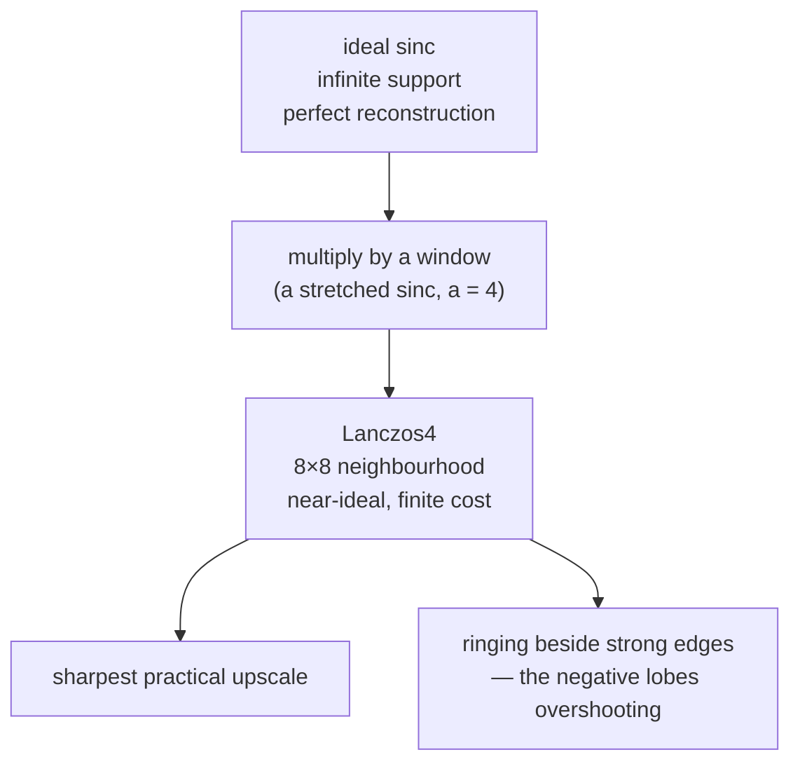

# Lanczos resampling

The sharpest practical way to enlarge an image, using a windowed approximation
of the theoretically perfect reconstruction filter.

## What it is

Sampling theory says that a properly sampled signal can be reconstructed
*exactly* by interpolating with the **sinc** function, `sin(πx)/(πx)`. That is
the ideal answer.

The catch is that sinc extends infinitely in both directions, so an exact
reconstruction would need every pixel in the image to compute one output pixel.
Lanczos truncates it by multiplying by a *window* — another sinc, stretched over
`a` lobes:

```
L(x) = sinc(x) · sinc(x/a)     for |x| < a,   0 otherwise
```

`a = 3` is common; OpenCV's `INTER_LANCZOS4` uses `a = 4`, an 8×8 neighbourhood.

The reason it is sharper than [bicubic](bilinear-and-bicubic-interpolation.md)
is that sinc's negative side lobes actively *counteract* the softening that any
averaging introduces. That same property produces its characteristic
artefact — **ringing**, faint alternating light and dark bands beside a strong
edge.

## The picture



Across a boundary line, an upscale by 2:

```
source          240   110   238
bilinear    →   240 175 110 174 238        soft: the stroke has spread
bicubic     →   243 168  110 167 241        sharper, slight overshoot
Lanczos4    →   246 160  108 159 245        sharpest, strongest overshoot
                 ↑                    ↑
                 ringing: brighter than any source pixel
```

The stroke stays narrow and dark under Lanczos. Under bilinear it has widened
and lightened — and a widened, lightened stroke is exactly what a low-DPI
archival scan cannot afford to lose more of.

## Where this project uses it

For upscaling, in both preprocessing variants.
`poggio_webapp/pipeline/preprocess.py`:

```python
def clean(gray, upscale=2):
    """The recommended pipeline: flatten -> upscale -> CLAHE -> mild sharpen."""
    flat = flatten_background(gray)
    if upscale and upscale != 1:
        flat = cv2.resize(
            flat, None, fx=upscale, fy=upscale, interpolation=cv2.INTER_LANCZOS4
        )
```

The purpose of the upscale is stated in `recommend_upscale()`:

> preprocessing's upscale exists to keep thin boundary lines from vanishing on
> LOW-DPI scans

That is the whole justification for choosing the sharpest available filter. The
enlargement is not there to make the image bigger; it is there to give a
one-pixel-wide stroke enough pixels to survive [CLAHE](clahe.md), sharpening,
and a human's eye. A resampler that softened while enlarging would defeat the
purpose.

The upscale factor is itself reasoned about rather than fixed:

```python
def recommend_upscale(width, height, target_dim=3000):
    max_dim = max(width, height) or 1
    factor = target_dim / max_dim
    factor = max(1.0, min(4.0, factor))
    factor = round(factor * 2) / 2
```

Clamped to [1.0, 4.0] and rounded to the nearest 0.5, targeting ~3000 px because
extraction caps the longest side at 3072 anyway — so preprocessing never does
work a later stage immediately undoes. And it never goes below 1.0:

> preprocess.py never recommends downscaling below 1x here, even though
> cv2.resize would technically support it, since shrinking is not this stage's
> job.

## Why this and not something else

| Alternative | How it would work here | Why it lost |
|---|---|---|
| **Nearest neighbour** | Duplicate pixels | Free, and it produces hard blocky steps. A 2× nearest upscale of a diagonal boundary line is a staircase, which then generates false corners for [contour tracing](contour-tracing.md). |
| **[Bilinear](bilinear-and-bicubic-interpolation.md)** | 4-sample blend | Cheap and soft. Softening while enlarging is directly opposed to the goal. |
| **[Bicubic](bilinear-and-bicubic-interpolation.md)** | 16-sample cubic | The reasonable middle. Genuinely close to Lanczos in quality, and this is a once-per-scan operation, so the 4× sample cost buys real sharpness at no practical price. |
| **Lanczos4** *(chosen)* | 64-sample windowed sinc | Sharpest available. Ringing is acceptable on a grayscale document — and the following [CLAHE](clahe.md) and sharpening steps operate on contrast rather than absolute level, so a faint halo does not mislead them. |
| **Learned super-resolution (ESRGAN and similar)** | A neural upscaler trained on image pairs | Visually spectacular, and it **synthesises plausible detail that was never recorded**. On a drawing whose entire evidential value is where the ink actually is, invented strokes are worse than a soft image. Ruled out by the same principle that keeps a language model away from geometry in `assign_markers.py` — see [interpolation versus measurement](interpolation-vs-measurement.md). |
| **Do not upscale** | Work at native resolution | Correct for a good 300 DPI scan, and `recommend_upscale` says exactly that: "already high-resolution — little upscale needed." The factor is a recommendation the user can override, not a mandate. |

The last two rows together are the real design: **upscale only when the scan is
genuinely poor, and never by inventing content.** Lanczos redistributes
information that was recorded. A generative upscaler adds information that was
not.

## What it costs

| Method | Samples per output pixel |
|---|---|
| Nearest | 1 |
| Bilinear | 4 |
| Bicubic | 16 |
| **Lanczos4** | **64** |

Plus the output-size cost: a 2× upscale quadruples the pixel count, so every
subsequent stage does four times the work. That compounding is why
`recommend_upscale` caps at 4.0 and targets a specific dimension rather than
simply maximising.

Ringing is the quality cost, and it is bounded — the overshoot is a few percent
of the edge contrast, not a structural artefact.

## Where else you meet it

- **`ffmpeg`'s default scaler** for high-quality video resizing.
- **ImageMagick and GIMP**, where Lanczos is the usual "best quality" option.
- **Print workflows**, enlarging for large-format output.
- **Astronomy and remote sensing**, where preserving point sources through a
  resample matters more than avoiding ringing.
- **Audio sample-rate conversion** uses windowed sinc for the identical reason,
  in one dimension.

## Related pages

- [Bilinear and bicubic interpolation](bilinear-and-bicubic-interpolation.md) —
  the cheaper alternatives, and what rotation uses here.
- [Area-averaging downsampling](area-averaging-downsampling.md) — the opposite
  direction, and why it needs a different filter.
- [Convolution](convolution.md) — resampling is a convolution with a
  position-dependent kernel.
- [Prepare the image](../workflows/02-prepare-image.md) — the workflow step.
- [Drawing guidelines](../reference/drawing-guidelines.md) — the DPI
  recommendation this exists to compensate for.
