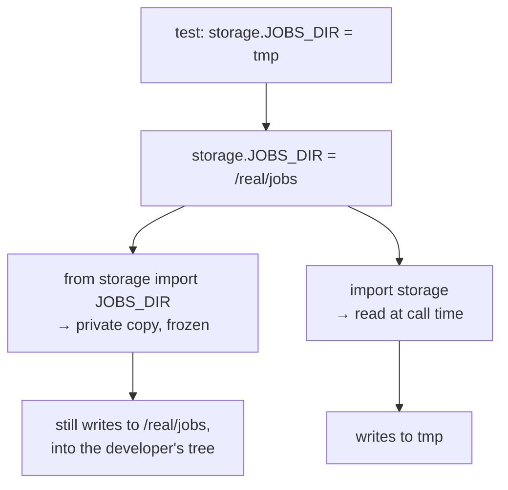

# Late binding versus import-time binding

`import storage` and `from storage import JOBS_DIR` are not the same thing. One
reads the value when it is used; the other copies it when the module loads. The
difference decides whether a test can redirect where files are written.

## What it is

In Python, `from module import name` **copies the reference** into the importing
module's namespace at import time. Rebinding `module.name` afterwards does not
change the copy.

```python
# storage.py
JOBS_DIR = Path("/real/jobs")

# consumer_a.py
from storage import JOBS_DIR  # a private copy, bound now

# consumer_b.py
import storage  # a reference to the module

storage.JOBS_DIR  # read at call time

# a test
storage.JOBS_DIR = tmp_path  # consumer_b follows; consumer_a does not
```

Same source, two different behaviours. The `from` form is **import-time
binding**; the module-attribute form is **late binding**.

For a constant that never changes, the difference is invisible. For anything a
test needs to redirect, it decides whether redirection is possible at all.

## The picture



## Where this project uses it

`poggio_webapp/storage.py` states the rule and the history:

```python
"""The single definition of where this app keeps things on disk.

A leaf module: it imports nothing from ``backend`` or ``pipeline``, so both
layers can depend on it without inverting the dependency direction.

Read these through the module (``storage.JOBS_DIR``), never
``from storage import JOBS_DIR``. The ``from`` form binds the value at import
time, which is what previously left four modules holding private copies that a
test could not redirect. Reading the attribute at call time means one
assignment moves every consumer at once, which is exactly what the test
fixtures rely on.
"""
```

Every consumer obeys it. `backend/jobs.py`:

```python
"""Job directories, metadata, and safe file paths.

All paths resolve through ``storage.JOBS_DIR``, read at call time so a single
assignment redirects every consumer.
"""

...


def job_dir(job_id):
    d = storage.JOBS_DIR / job_id
```

`backend/harris_store.py`:

```python
def _matrices_root() -> Path:
    return storage.MATRICES_DIR
```

A function rather than a module-level constant, so the read happens per call.

`pipeline/editor/session.py`:

```python
session_dir = storage.JOBS_DIR / job_id
```

### The module that exists to *not* re-export

`poggio_webapp/backend/config.py`:

```python
"""Web-layer configuration.

Filesystem roots live in the top-level ``storage`` module, which ``pipeline``
also depends on. Import that directly rather than re-exporting the paths here:
a re-export would rebind them and reintroduce the stale-copy problem.
"""

ALLOWED_SCAN_EXT = {...}
```

A re-export is a `from` import wearing a different hat:

```python
from storage import JOBS_DIR  # ← would reintroduce the problem
```

The docstring exists to stop a well-meant tidy-up from doing that.

### What it buys the tests

`tests/conftest.py`:

```python
@pytest.fixture(autouse=True)
def storage_dirs(tmp_path, monkeypatch):
    """Redirect every on-disk storage root at a fresh tmp_path.

    One assignment per root reaches every consumer, because they all read
    ``storage.<ROOT>`` at call time rather than binding it at import. Before
    Phase 2 this took eight monkeypatches across five modules.

    Autouse: no test may write to the real ``poggio_webapp/jobs``. A test that
    patched the wrong target used to pass while quietly writing into the
    developer's working tree, which is a worse failure than a red test.
    """
    for name in ("JOBS_DIR", "TRENCHES_DIR", "MATRICES_DIR"):
        directory = tmp_path / name.split("_")[0].lower()
        directory.mkdir()
        monkeypatch.setattr(storage, name, directory)
```

Three sentences of history in a fixture docstring:

**"Eight monkeypatches across five modules"**: the cost of import-time binding.
Each module holding a private copy needed patching individually, and a new
consumer meant a ninth patch nobody remembered.

**`autouse=True`**: every test is redirected, whether it asks or not.

**The failure mode being prevented** is the sharp part: a test patching the
wrong target *passed*, while writing into the developer's working tree. Not a
red test: a green one with a side effect. Late binding is what makes the single
patch sufficient, and `autouse` is what makes forgetting impossible.

## Why this and not something else

| Alternative | How a test would redirect the jobs directory | Why it lost |
|---|---|---|
| **`from storage import JOBS_DIR`** | Patch every consumer module | Eight patches across five modules, growing with every new consumer, and a missed one fails silently by writing to the real tree. |
| **Late binding via the module** *(chosen)* | One `monkeypatch.setattr(storage, ...)` | One assignment reaches every consumer. The cost is a naming convention every consumer must follow. |
| **An environment variable** | `JOBS_DIR=/tmp/x pytest` | Configuration from outside, and awkward per-test, and it makes the value a string that must be parsed. |
| **Pass paths as parameters** | Every function takes a `jobs_dir` | The most explicit and testable design, and it threads a parameter through dozens of call sites for a value that is constant in production. `harris_import` and `harris_suggestions` **do** take `jobs_dir`, because they are pure pipeline functions where the argument is natural. |
| **A settings object or DI container** | Inject configuration | Heavier machinery for three paths. |

The interesting row is the fourth. This codebase uses **both** strategies:
parameters where a function is pure and the path is genuinely an input, module
attributes where the alternative is threading a parameter through a whole layer.

The general lesson is that `from x import y` is not merely stylistic. For an
immutable constant it is fine; for anything that might need to vary (in tests,
in configuration, at runtime), it silently forecloses that.

## What it costs

`storage.JOBS_DIR` is one attribute lookup more than `JOBS_DIR`. Immeasurable.

The costs:

- It is a convention, not an enforcement. Nothing prevents
  `from storage import JOBS_DIR`. The docstrings in `storage.py` and
  `config.py` are the guard, and both exist because it happened.
- Slightly more verbose at every use site.
- `monkeypatch` reaches into another module's namespace, which is a testing
  smell in general, mitigated here by being confined to one fixture with a
  documented reason.
- Autouse fixtures are invisible. A reader of one test file does not see
  that storage is redirected. The alternative, a test writing into the working
  tree and passing, is worse.

## Where else you meet it

- Python's `datetime.now` patching problem, where `from datetime import
  datetime` makes mocking harder than `import datetime`.
- Circular import errors, which often disappear when a `from` import becomes
  a module import read at call time.
- JavaScript ES modules, where imports are live bindings: the opposite
  default, and one that removes this class of problem.
- Configuration reloading, where late binding is what allows a value to
  change without a restart.
- Feature flags, which must be read at evaluation time, never cached at
  import.

## Related pages

- [Dependency direction and leaf modules](dependency-direction-and-leaf-modules.md):
  why `storage` is a leaf.
- [Closure late-binding capture](closure-late-binding-capture.md): the same
  word, a different trap.
- [Application factory](application-factory.md): the equivalent fix for the
  Flask app.
- [Pure functions and testability](pure-functions-and-testability.md): the
  parameter-passing alternative.
- [Running the tests](../reference/running-the-tests.md): the fixtures in
  practice.
