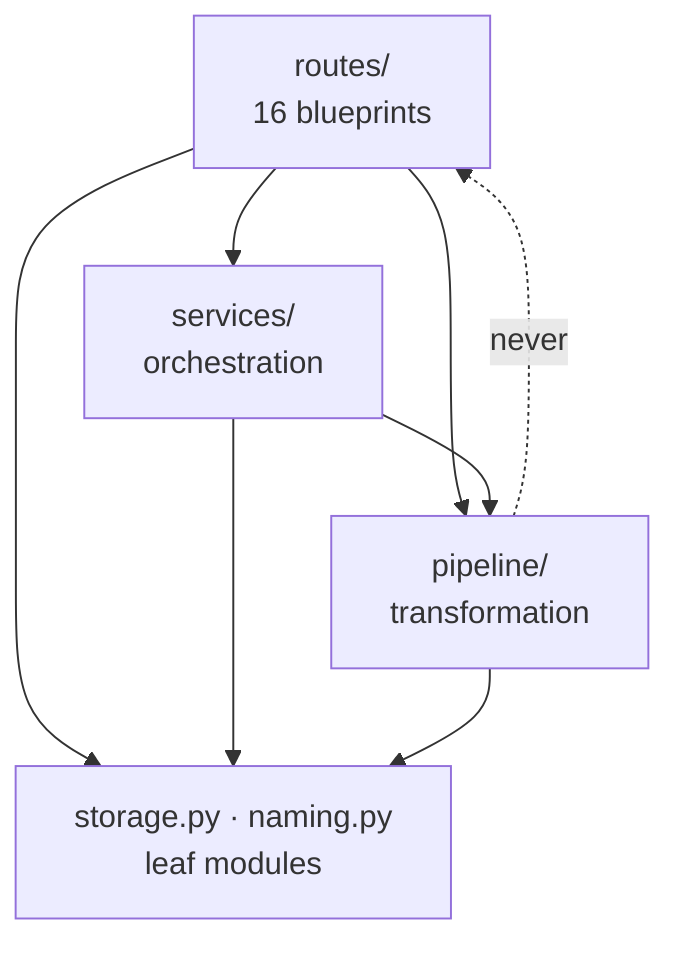

# Layered architecture

Separating request handling from orchestration from transformation, and letting
dependencies point one way only. Here the payoff is concrete: the rules that
refuse a bad build can be tested without an HTTP request.

## What it is

Code is grouped into layers, each depending only on those below it:

```
routes/     HTTP parsing, status codes, serialisation
services/   orchestration — chaining several stages, transactions
pipeline/   transformation — pure domain logic
storage.py  leaf modules — no dependencies of their own
```

The rule is **acyclic dependencies**: a lower layer never imports an upper one.
That is what lets the lower layers be understood, tested, and reused
independently.

The test that reveals whether the separation is real: **can the domain logic run
without the web framework?** If `pipeline/` imports Flask, the answer is no,
whatever the directory names suggest.

## The picture



## Where this project uses it

### The rule, enforced

No module under `pipeline/` imports Flask. That is the whole separation, and it
is what everything below depends on.

### Errors as the layer boundary

`poggio_webapp/backend/services/trench_builder.py`:

```python
class TrenchBuildError(Exception):
    """A refusal the operator can act on. The message is user-facing."""
```

with the reasoning in the module docstring:

> Refusals raise ``TrenchBuildError`` rather than calling ``abort``. The route
> maps that to a 400; keeping Flask out of here is what lets the rules be tested
> without an app, and what stopped this from being another 110-line view
> function.

The route does the translation and nothing else —
`poggio_webapp/backend/routes/trenches.py`:

```python
@bp.route("/api/trenches/<label>/build", methods=["POST"])
def build_trench(label):
    body = request.get_json(force=True, silent=True) or {}
    try:
        return jsonify(build(label, body))
    except GempyUnavailableError as error:
        return jsonify({"error": str(error)}), 400
    except TrenchBuildError as error:
        abort(400, description=str(error))
```

Six lines. Parse, delegate, map errors to status codes. Every archaeological
rule — placeholder registration, wall label clashes, contradictory stratigraphy,
[locus numbering epochs](../archaeology/index.md) — lives in the service, where
a test can call it directly.

The module header states the whole file's job:

> The grouping and build rules live in backend/services/trench_builder.py. This
> module parses requests, maps TrenchBuildError to a 400, and serializes.

### Domain logic extracted from a route

`poggio_webapp/pipeline/manual_extraction.py` was moved out of a route module,
and the docstring records why:

> This was the bulk of backend/routes/manual.py. It is domain logic, not an HTTP
> concern: it holds no Flask imports and can be unit-tested without an app,
> which is how tests/test_manual_routes.py and
> tests/test_locus_top_boundaries.py had been using it all along -- by importing
> a route module to get at it.

The tests were already treating it as domain logic; the move made the structure
match the reality.

The route that remains is a thin adapter:

```python
try:
    calib = make_calibration(payload)
    fieldwall = meta.get("sheet_type") == "fieldwall"
    ...
    if fieldwall:
        data, warnings = build_fieldwall(payload, calib, source_path)
        filename = "field_wall_manual.json"
    else:
        data, warnings = build_illustrator(payload, calib, source_path)
        filename = "illustrator_manual.json"
except ValueError as error:
    return jsonify({"error": str(error)}), 400
```

`ValueError` from the pipeline becomes a 400 at the boundary.

### Services for what spans stages

`poggio_webapp/backend/services/editor_pipeline.py`:

> Drives a finalized editor session through the model-building pipeline.
>
> Moved verbatim out of app.py during the modularization refactor. The chain is
> normalize -> validate -> convert coordinates -> build (async), with meta.json
> updated at each step so a browser polling /api/jobs/<id>/status sees progress
> even across a server restart.

A service exists because the *sequence* is the thing worth naming — four
pipeline stages plus persistence plus a background task. `harris_workspace.py`
gives the same reason:

> What was still inside the view functions was the *sequence*: load at an
> expected revision, transform, save at that same revision. Both flows are
> optimistic-concurrency transactions, and both were spelled out inline where
> they could not be exercised without an HTTP request.

### Leaf modules, to keep the graph acyclic

`poggio_webapp/storage.py`:

> A leaf module: it imports nothing from ``backend`` or ``pipeline``, so both
> layers can depend on it without inverting the dependency direction.

`poggio_webapp/naming.py` and the newer `pipeline/site_vocab.py` are leaves for
the same reason. See
[dependency direction and leaf modules](dependency-direction-and-leaf-modules.md).

## Why this and not something else

| Alternative | How it would organise the trench build | Why it lost |
|---|---|---|
| **Everything in the route** | One 110-line view function | Named in the docstring as what was escaped. The rules could only be exercised through an HTTP request, so testing a refusal meant building a request context. |
| **Two layers — routes and pipeline** | No service tier | Where does "load, transform, save at the same revision" live? Duplicated across routes, or pushed into the pipeline, which would then need `storage` and threading. |
| **Layers by feature** | `trenches/{routes,logic,storage}` | Vertical slicing keeps related code together and is a genuine alternative. Here several features share the same pipeline stages, so a horizontal split matches the actual reuse. |
| **Hexagonal / ports and adapters** | Interfaces at every boundary | Stronger decoupling, and the indirection is heavy for an application with one delivery mechanism and one storage backend. |
| **Routes → services → pipeline → leaves** *(chosen)* | Four layers, one direction | Each layer is testable alone, and the framework is confined to one of them. |

The payoff is measurable: **707 tests run in under three seconds**, because most
of them call pipeline and service functions directly rather than going through
an application.

## What it costs

More files, and one more hop to follow when reading.

The costs:

- **Indirection.** A trench build touches a route, a service, three pipeline
  modules, and two leaves. The [algorithm index](../architecture/algorithm-index.md)
  exists partly to make that navigable.
- **Layer boundaries need judgement.** `viewer_files.py` is a *service* rather
  than a pipeline module, and the docstring justifies it: "It lives in services
  rather than pipeline because it builds /api/jobs/<id>/file URLs, which is a
  web concern."
- **Nothing enforces the rule mechanically.** No import linter forbids
  `from flask import ...` in `pipeline/`. It holds by review and by the fact
  that tests would need an app context.
- **Thin routes can look pointless** until you try to test the rules without
  them.

## Where else you meet it

- **The OSI network model**, the canonical layering.
- **MVC and its descendants**, separating presentation from domain.
- **Domain-driven design**, whose application/domain/infrastructure split this
  closely resembles.
- **Operating systems**, layering user space over kernel over hardware.
- **Clean and hexagonal architecture**, which push the same idea further with
  dependency inversion at every boundary.

## Related pages

- [Dependency direction and leaf modules](dependency-direction-and-leaf-modules.md) —
  keeping the graph acyclic.
- [Separation of concerns](separation-of-concerns.md) — the principle beneath.
- [Application factory](application-factory.md) — how the web layer is
  assembled.
- [Pure functions and testability](pure-functions-and-testability.md) — the
  payoff.
- [Backend architecture](../architecture/backend.md) — the layers in this
  project.
