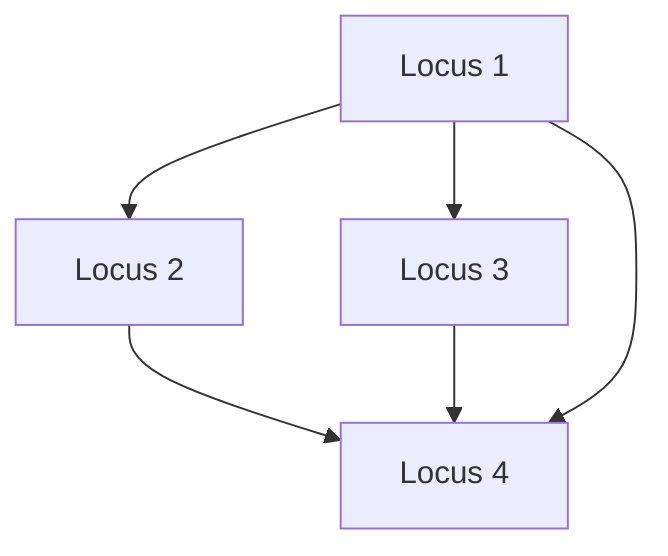

# Layered graph drawing

Placing the nodes of a DAG in horizontal rows so every edge points downward.
The layout method behind a Harris Matrix — and the reason this project renders
one deterministically, with no layout library at all.

## What it is

The **Sugiyama framework** is the standard approach to drawing a directed graph
readably, in four phases:

1. **Cycle removal** — reverse edges until the graph is acyclic. *(Not needed
   here: a chronology with a [cycle](cycle-detection.md) is an error, so the
   graph is already a DAG.)*
2. **Layer assignment** — give each node a rank, so every edge goes from a lower
   rank to a higher one.
3. **Crossing reduction** — order nodes within each rank to minimise edge
   crossings.
4. **Coordinate assignment** — give each node an x position.

Phase 2 has two natural choices, and they are not equivalent:

- **Shortest path from a root** — the [BFS](breadth-first-search.md) levelling.
- **Longest path** — each node sits one below its *deepest* predecessor.

For a Harris Matrix only the second is correct, and the difference is
archaeological rather than aesthetic.

## The picture



Locus 4 is reachable from Locus 1 in one step (direct) and in two (via 2 or 3).

```
shortest-path levelling:  rank(4) = 1   → drawn LEVEL WITH Locus 2 and 3
longest-path levelling:   rank(4) = 2   → drawn BELOW them
```

The first draws Locus 4 alongside units it is known to be older than. The
diagram would be chronologically false while looking perfectly tidy.

## Where this project uses it

`poggio_webapp/pipeline/harris_render.py` implements phases 2 and 4 and handles
phase 3 by fiat.

### Layer assignment — longest path

```python
def _longest_path_ranks(order, edges):
    adjacent = defaultdict(list)
    for younger_id, older_id in edges:
        adjacent[younger_id].append(older_id)
    for children in adjacent.values():
        children.sort()

    ranks = {node_id: 0 for node_id in order}
    for younger_id in order:
        for older_id in adjacent[younger_id]:
            ranks[older_id] = max(
                ranks[older_id],
                ranks[younger_id] + 1,
            )
    return ranks
```

Five lines, and correct because of one precondition: `order` is the
[topological order](topological-sorting.md). Iterating in that order guarantees
every predecessor's rank is final before its successors are examined, so a
single pass suffices — no iteration to convergence.

`max(...)` is what makes it longest-path rather than first-wins. Locus 4 above
gets rank 1 from the direct edge and rank 2 from the two-step path, and keeps 2.

The result: **every edge points strictly downward**, so the diagram cannot draw
a unit level with or above one it is younger than.

### Ordering within a rank — determinism over optimality

```python
def _ranked_nodes(nodes):
    ranks = defaultdict(list)
    for node in nodes:
        ranks[node.rank].append(node)
    return {
        rank: sorted(
            rank_nodes,
            key=lambda node: (
                _normalized_label(node.label),
                node.representative_id,
            ),
        )
        for rank, rank_nodes in sorted(ranks.items())
    }
```

Phase 3 of Sugiyama is crossing minimisation, which is **NP-hard** and normally
attacked with iterative heuristics such as barycentre or median ordering.

This does none of that. It sorts by normalised label, with the representative ID
as a tie-break to make the order total.

That is a deliberate trade: **more edge crossings, in exchange for a diagram
that is byte-identical for the same matrix every time.** A heuristic layout can
reorder the whole diagram in response to one added relation, making two saves
impossible to compare. Sorting by label means a reader can find a locus where
they expect it.

### Coordinate assignment

```python
positions = {}
for rank, rank_nodes in nodes_by_rank.items():
    rank_width = _rank_width(rank_nodes)
    x = (width - rank_width) / 2
    y = _HEADER_HEIGHT + rank * (_NODE_HEIGHT + _RANK_GAP)
    for node in rank_nodes:
        positions[node.representative_id] = (x, y, node.width)
        x += node.width + _NODE_GAP
```

Each rank centred, nodes laid left to right. Node widths come from an estimate,
since there is no font metrics engine:

```python
def _estimated_text_width(text: str, *, size=14) -> int:
    return max(1, round(len(text) * size * 0.62))
```

0.62 em per character is an approximation for a proportional font — good enough
that labels fit, and deterministic, which a real measurement in a browser would
not be.

### And a hard cap

```python
_MAX_UNITS = 250
...
if len(matrix.units) > _MAX_UNITS:
    raise HarrisRenderError(
        "Harris Matrix SVG rendering supports at most "
        f"{_MAX_UNITS} units; this matrix contains {len(matrix.units)}.")
```

A stated limit with a clear message, rather than an unreadable diagram.

## Why this and not something else

| Alternative | How it would lay out | Why it lost |
|---|---|---|
| **Graphviz `dot`** | The reference implementation of Sugiyama | Excellent layouts, and it is an external binary dependency, its output can change between versions, and its crossing-reduction heuristics make the layout unstable under small data changes. This project needs a diagram that is reproducible and diffable — see the CI step that regenerates every diagram and fails on any difference. |
| **A JavaScript layout library (d3-dag, elkjs)** | Layout in the browser | Would need a build step, which this project deliberately does not have, and it would put the canonical rendering in the client rather than in a testable server function. |
| **Force-directed layout** | Physics simulation | Produces organic, non-deterministic layouts with no notion of rank. Completely wrong for a diagram whose entire meaning is vertical order. |
| **Shortest-path levelling** | BFS from roots | Cheaper, and it draws units level with ones they are younger than. Chronologically false. |
| **Proper crossing minimisation** | Barycentre or median heuristics, iterated | Fewer crossings, and the layout becomes unstable: adding one relation can reshuffle the whole diagram. |
| **Longest-path ranks + sorted ranks** *(chosen)* | One pass, sorted within rank | Every edge points down, the output is byte-identical for the same input, and the whole renderer is ~440 lines with no dependency beyond `xml.etree`. |

The through-line is **determinism over optimality**, the same trade made in
[Union-Find's representative choice](union-find.md) and in
[Kahn's heap](topological-sorting.md). The diagram is an archaeological
document; being stable and comparable matters more than being pretty.

## What it costs

Rank assignment is O(V + E) in one pass. Sorting within ranks is O(V log V).
Rendering is O(V + E) element writes. The whole render is milliseconds at 250
units.

The costs:

- **More edge crossings** than a heuristic layout would produce. Accepted
  deliberately.
- **Longest-path ranking makes tall diagrams.** A node one step from a root but
  many steps down another path is pushed to the bottom, stretching the drawing.
  The alternative — a shorter, wrong diagram — is not a trade worth making.
- **Text width is estimated**, so an unusually wide glyph run can overflow its
  box slightly.
- **No edge routing.** Edges are straight lines between node centres and can pass
  through intervening boxes. Sugiyama's full treatment inserts dummy nodes for
  long edges; that is a real gap, and a candidate improvement.

The renderer also does the accessibility work that a generic layout tool would
not:

```python
root = _svg_element(
    "svg",
    {
        ...
        "role": "img",
        "aria-labelledby": "harris-svg-title harris-svg-description",
    },
)
```

plus a `<title>`, a `<desc>` stating that younger units are at the top, and a
`<title>` on every edge naming its direction.

## Where else you meet it

- **Graphviz `dot`**, the canonical implementation, used for everything from
  compiler passes to org charts.
- **UML class diagrams** and entity-relationship diagrams.
- **Git history visualisers**, laying out the commit DAG.
- **Build and CI pipeline views** — Jenkins, GitLab, Airflow.
- **Metro and transit maps**, which are hand-drawn layered layouts.
- **Family trees**, where generational rank is the layer.

## Related pages

- [Topological sorting](topological-sorting.md) — the precondition that makes
  one-pass ranking correct.
- [Transitive reduction](transitive-reduction.md) — which edges are drawn.
- [Breadth-first search](breadth-first-search.md) — the levelling that would be
  wrong here.
- [Directed acyclic graphs](directed-acyclic-graphs.md) — why phase 1 is
  unnecessary.
- [Union-Find](union-find.md) — how correlated units become one box.
- [Build a Harris Matrix](../workflows/harris-matrix.md) — the workflow.
