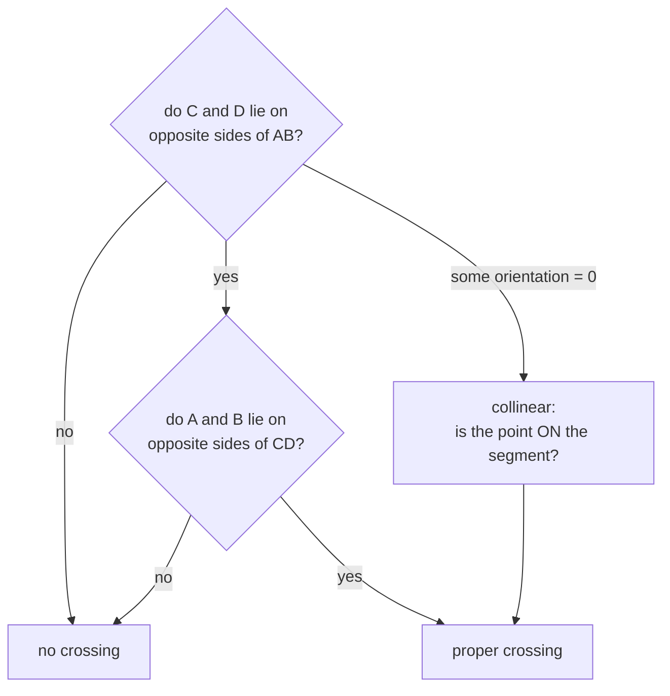

# Line segment intersection

Deciding whether two finite line segments cross, without computing where. Four
[orientation tests](signed-area-and-orientation-test.md) and a handful of
collinear special cases.

## What it is

Two segments AB and CD cross when each **straddles** the other's line: C and D
are on opposite sides of AB, *and* A and B are on opposite sides of CD.

Both conditions are needed. One alone only says the segments' infinite lines
cross, which they may do far beyond either segment's ends.

```
d₁ = orientation(A, B, C)
d₂ = orientation(A, B, D)
d₃ = orientation(C, D, A)
d₄ = orientation(C, D, B)

proper crossing  ⟺  d₁ and d₂ have opposite signs
                AND d₃ and d₄ have opposite signs
```

That covers the general case. The **collinear** cases — where some `dᵢ` is zero,
meaning a point lies on the other segment's line — need separate handling: a
zero means "on the line," and whether it is also *on the segment* requires a
bounding-box check.

Those degenerate cases are where implementations go wrong, and both of this
repository's implementations handle them explicitly.

## The picture



```
proper crossing            straddles both ways        ✓
                ╲ ╱
                 ╳
                ╱ ╲

lines cross, segments do not    straddles only one    ✗
       ────────
              ╲
               ╲

collinear overlap          all orientations zero      ✓ (via the bbox check)
       ──────────
          ──────────
```

## Where this project uses it

### Editor polygon validation

`poggio_webapp/pipeline/editor/geometry.py`:

```python
def _segments_intersect(first_start, first_end, second_start, second_end):
    first_direction = _direction(first_start, first_end, second_start)
    second_direction = _direction(first_start, first_end, second_end)
    third_direction = _direction(second_start, second_end, first_start)
    fourth_direction = _direction(second_start, second_end, first_end)

    if (
        first_direction > 0 > second_direction or first_direction < 0 < second_direction
    ) and (
        third_direction > 0 > fourth_direction or third_direction < 0 < fourth_direction
    ):
        return True

    return (
        first_direction == 0
        and _point_on_segment(second_start, first_start, first_end)
        or second_direction == 0
        and _point_on_segment(second_end, first_start, first_end)
        or third_direction == 0
        and _point_on_segment(first_start, second_start, second_end)
        or fourth_direction == 0
        and _point_on_segment(first_end, second_start, second_end)
    )
```

The structure is textbook: the proper-crossing test first, then four collinear
cases, one per endpoint. `first_direction > 0 > second_direction` is Python's
chained comparison expressing "opposite signs" compactly.

The `== 0` comparisons are **exact**, which is safe here because
[the orientation test involves no division](signed-area-and-orientation-test.md)
and the inputs are user-clicked coordinates that have not been through any
arithmetic.

### Browser layer-fill validation

`poggio_webapp/static/visualizer/layer-fill.mjs`:

```javascript
function segmentsIntersect(a, b, c, d) {
  const abC = orientation(a, b, c);
  const abD = orientation(a, b, d);
  const cdA = orientation(c, d, a);
  const cdB = orientation(c, d, b);
  if (
    ((abC > EPSILON && abD < -EPSILON) || (abC < -EPSILON && abD > EPSILON))
    && ((cdA > EPSILON && cdB < -EPSILON) || (cdA < -EPSILON && cdB > EPSILON))
  ) {
    return true;
  }
  return (
    onSegment(a, b, c)
    || onSegment(a, b, d)
    || onSegment(c, d, a)
    || onSegment(c, d, b)
  );
}
```

Same structure, **epsilon-tolerant** — and the difference is principled. These
coordinates have been through [interpolation](linear-interpolation.md) during
[polyline clipping](polyline-clipping.md), so they carry accumulated rounding.
Exact zero would rarely occur even where the geometry is genuinely collinear.

Two implementations, two tolerance policies, each correct for its own input.
See [epsilon comparison](epsilon-comparison.md).

### Canvas drawing validation

`poggio_webapp/static/canvas/grid.mjs` carries a third copy, guarding the
polygons a user draws in the browser editor before they can be saved.

In all three cases the caller is
[polygon self-intersection](polygon-self-intersection.md) — the reason this
predicate exists here at all.

## Why this and not something else

| Alternative | How it would work | Why it lost |
|---|---|---|
| **Solve for the intersection point** | Parametric equations, solve for `t` and `u`, check both in `[0,1]` | Gives you *where*, which nothing here needs. It requires a **division** by the cross product, which is zero for parallel segments — so it needs its own degenerate branch anyway, and the division introduces rounding that the orientation-only test avoids. |
| **Slope comparison** | `y = mx + c` for each, solve | Vertical segments have infinite slope. Every implementation needs a special case, and the special case is where the bugs are. |
| **Bounding-box overlap only** | Cheap rejection test | Necessary but not sufficient — two segments can have overlapping boxes without crossing. Useful as a pre-filter, not as an answer. |
| **A geometry library (Shapely, JTS)** | `a.intersects(b)` | Robust, well-tested, and a heavyweight dependency for one predicate — in the browser especially, where this must run client-side with no build step. |
| **Four orientation tests** *(chosen)* | Straddle test plus collinear cases | No division, no special case for vertical or parallel, exact on exact input, and it answers precisely the question asked. |

The design point: **the predicate answers exactly the question, and nothing
more.** Computing the intersection point would be strictly more work to produce
information nobody uses, and the extra work is where the numerical fragility
lives.

## What it costs

Four orientation tests plus up to four bounding-box checks — O(1), around 16
multiplies in the worst case.

The consumer is what drives the total cost:
[polygon self-intersection](polygon-self-intersection.md) calls it O(n²) times
for an n-vertex polygon. For hand-drawn polygons of tens of vertices that is
fine; the Bentley–Ottmann sweep-line algorithm would be O((n + k) log n) if it
were not.

The subtle costs:

- **Collinear overlap is easy to get wrong.** All four orientations are zero and
  the segments may or may not overlap; only the bounding-box check resolves it.
  Both implementations here handle it.
- **Shared endpoints count as intersections** under this predicate. That is
  correct in general and wrong for *adjacent* polygon edges, which necessarily
  share a vertex — so the caller must skip adjacent pairs, and both callers do.

## Where else you meet it

- **Polygon clipping** in graphics and GIS — Sutherland–Hodgman,
  Weiler–Atherton, and the boolean operations behind every "intersect layers"
  tool.
- **Collision detection** in 2D games.
- **Path planning**, testing whether a proposed route crosses an obstacle edge.
- **CAD**, validating that a profile is a simple closed curve before extrusion.
- **Map rendering**, deciding whether a label's leader line crosses a feature.
- **Ray casting** for point-in-polygon, which counts crossings of a test ray.

## Related pages

- [Signed area and the orientation test](signed-area-and-orientation-test.md) —
  the primitive.
- [Polygon self-intersection](polygon-self-intersection.md) — the caller.
- [Epsilon comparison](epsilon-comparison.md) — why one implementation is exact
  and the other is not.
- [Point in polygon](point-in-polygon.md) — a related predicate, considered and
  not used here.
- [Polyline clipping](polyline-clipping.md) — where the tolerant version's
  inputs come from.
