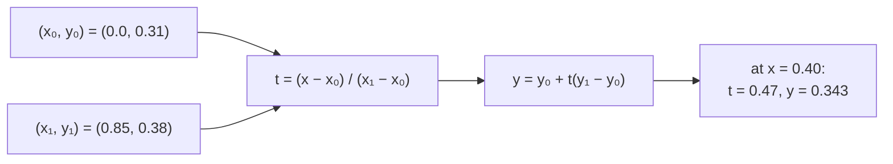

# Linear interpolation

Estimating a value between two known ones by assuming a straight line joins
them. The simplest possible model of "what happens in between," and the only one
this project is willing to claim.

## What it is

Given two points `(x₀, y₀)` and `(x₁, y₁)` and an `x` between them:

```
t = (x − x₀) / (x₁ − x₀)          how far along, 0 to 1
y = y₀ + t·(y₁ − y₀)
```

`t` is the fraction of the way across; `y` is the same fraction of the way up.
At `t = 0` you get `y₀`, at `t = 1` you get `y₁`, and in between a straight
line.

Two properties matter here:

- **It never overshoots.** The result always lies between `y₀` and `y₁`. Higher
  order methods do not guarantee this.
- **It requires `x₁ ≠ x₀`.** A vertical segment divides by zero, and every
  implementation in this repository guards it.

## The picture



Why not something smoother:

```
recorded depths:   0.31        0.38        0.36

linear:            straight lines between the marks —
                   claims nothing beyond "it went from here to there"

cubic spline:      a smooth curve that dips to 0.29 between
                   the first two points — a claim that the
                   boundary rose where nobody recorded it
```

## Where this project uses it

### Comparing two boundaries at an arbitrary x

`poggio_webapp/pipeline/validator.py`:

```python
def depth_at_x(boundary_pairs, x):
    if not boundary_pairs:
        return None
    pts = sorted(boundary_pairs)
    if x <= pts[0][0]:
        return pts[0][1]
    if x >= pts[-1][0]:
        return pts[-1][1]
    for (x0, y0), (x1, y1) in zip(pts, pts[1:]):
        if x0 <= x <= x1:
            if x1 == x0:
                return y0
            t = (x - x0) / (x1 - x0)
            return y0 + t * (y1 - y0)
    return None
```

Two boundaries almost never share x stations, so checking whether one crosses
another requires evaluating one at the other's points. This is how the validator
detects layers crossing:

```python
if above is not None and y < above - monotonic_tolerance_m:
    report.err(
        where,
        f"bottom at x={x} (depth {y:.2f}) is ABOVE "
        f"{prev_name}'s bottom (depth {above:.2f}) — layers cross")
```

Note the **clamping** outside the recorded range — `x <= pts[0][0]` returns the
first point's depth rather than extrapolating. Extrapolation would invent a
boundary beyond where it was traced. See
[piecewise-linear functions](piecewise-linear-functions.md).

### Assigning a feature to a layer

`poggio_webapp/pipeline/manual_extraction.py` carries a near-identical function,
with one difference:

```python
if abs(x2 - x1) < 1e-9:
    return (y1 + y2) / 2
```

A tolerance-based zero check and a **midpoint** for a vertical segment, rather
than the validator's exact `x1 == x0` and first-value choice. The inputs differ:
the validator reads extraction JSON where coordinates are as recorded, while
this path handles freshly converted floats. See
[epsilon comparison](epsilon-comparison.md).

### Clipping a polyline

`poggio_webapp/static/visualizer/layer-fill.mjs`:

```javascript
function interpolate(a, b, along) {
  const span = b.along - a.along;
  if (Math.abs(span) <= EPSILON) return { ...a };
  const ratio = (along - a.along) / span;
  return {
    x: a.x + ((b.x - a.x) * ratio),
    y: a.y + ((b.y - a.y) * ratio),
    along,
  };
}
```

Here **both** coordinates are interpolated by the same ratio, producing a point
on the segment at a chosen position along the axis. This is what
[polyline clipping](polyline-clipping.md) uses to place a cut endpoint exactly
on the overlap bound.

Three implementations, in two languages, each with its own degenerate-input
guard.

## Why this and not something else

| Alternative | What it claims between points | Why it lost |
|---|---|---|
| **Nearest neighbour (step)** | The value jumps at the midpoint | Discontinuous. A boundary would be a staircase, and comparing two staircases for crossing produces spurious errors at every step. |
| **Cubic spline** | A smooth curve through all points | Visually pleasing, and it **overshoots**: a spline through three recorded depths can dip above or below all of them, claiming the boundary went somewhere nobody recorded. On a project whose validator hunts for [fabricated geometry](coefficient-of-variation.md), an interpolator that invents excursions is exactly wrong. |
| **Monotone cubic (PCHIP)** | Smooth, no overshoot | Genuinely better on both counts — smooth *and* shape-preserving. It is more code, needs derivative estimates at each point, and would have to be duplicated in Python and JavaScript and kept in step. The gain over straight lines, on boundaries recorded at a handful of vertices, is aesthetic. |
| **Polynomial fit through all points** | A single high-order curve | Runge's phenomenon: high-order polynomials oscillate wildly between points. Worse than splines on the same axis. |
| **Linear** *(chosen)* | A straight line, nothing more | Never overshoots, is trivially correct, identical in every language, and matches what the recorder actually claimed — that the boundary ran from this mark to that one. |

The deciding argument is **epistemic**. A boundary is recorded as a set of
marked vertices. What happened between two marks is genuinely unknown; the
recorder drew a line because a line is the minimal claim. Interpolating linearly
reproduces exactly that claim. Any smoother interpolation adds structure the
evidence does not support — and would look *more* authoritative for it.

The same reasoning appears in `build_gempy`'s `single_face_note`, which flags
surfaces extrapolated across the whole model extent rather than presenting them
as measured.

## What it costs

One subtraction, one division, one multiply, one add. O(1) given the bracketing
segment; finding that segment is O(n) by scan here, or O(log n) by binary search
if it mattered — it does not, since boundaries have tens of points.

The costs:

- **Division by zero** on a vertical segment. All three implementations guard
  it, with a documented choice of what to return.
- **Not smooth.** The result has corners at every recorded vertex. For
  measurement that is honest; for rendering it means a traced boundary looks
  faceted, which is correct — it *is* faceted, because that is what was
  recorded.
- **The bracketing scan must be on sorted points.** `depth_at_x` sorts
  defensively on every call rather than trusting the caller.

## Where else you meet it

- **Animation.** Every "lerp" between keyframes; `mix()` in shader languages.
- **Colour gradients**, in CSS and in every design tool.
- **Image resampling** — [bilinear interpolation](bilinear-and-bicubic-interpolation.md)
  is this applied twice.
- **Lookup tables** in embedded systems, interpolating between calibration
  points.
- **Financial mathematics**, interpolating a yield curve between quoted
  maturities.
- **Sensor calibration**, mapping a raw reading to a physical value between
  known reference points.

## Related pages

- [Piecewise-linear functions](piecewise-linear-functions.md) — what a whole
  boundary is, as a function.
- [Polyline clipping](polyline-clipping.md) — where the two-coordinate version
  is used.
- [Bilinear and bicubic interpolation](bilinear-and-bicubic-interpolation.md) —
  the 2D image version.
- [Spatial interpolation and kriging](spatial-interpolation-and-kriging.md) —
  what happens between *walls*, and why it needs a different method.
- [Epsilon comparison](epsilon-comparison.md) — the zero-span guards.
