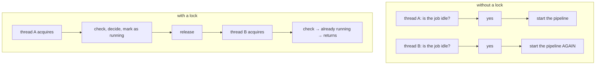

# Locks and critical sections

Making a sequence of operations behave as if it were one. The GIL makes each
individual dictionary operation atomic — a *sequence* of them is not, and that
gap is exactly what the locks here cover.

## What it is

A **critical section** is a stretch of code that must not be interleaved with
another thread's execution of the same stretch. A **lock** enforces that: only
one thread may hold it at a time.

The distinction that governs where locks are needed in Python:

| Operation | Atomic under the GIL? |
|---|---|
| `d[k] = v` | yes |
| `lst.append(x)` | yes |
| `d[k] += 1` | **no** — read, add, write |
| `if k not in d: d[k] = v` | **no** — check, then act |
| read a file, decide, write it back | **no** |

Anything that *reads state and then acts on what it read* is a critical section,
because another thread can change the state in between.

## The picture



## Where this project uses it

### Guarding eviction

`poggio_webapp/backend/tasks.py`:

```python
# TASKS is read by request threads and written by worker threads. CPython makes
# each individual dict operation atomic, but eviction is a read-decide-delete
# sequence, which is not.
_TASKS_LOCK = threading.Lock()
```

```python
with _TASKS_LOCK:
    TASKS[task_id] = {"status": "running", "result": None, "error": None,
                      "log": [], "started_at": time.time()}
    _evict_finished()
```

The comment states the rule exactly. `TASKS[task_id] = {...}` alone would need
no lock. `_evict_finished` iterates, tests, and deletes:

```python
def _evict_finished():
    for task_id in list(TASKS):
        if len(TASKS) <= MAX_RETAINED_TASKS:
            return
        if TASKS[task_id]["status"] in _FINISHED:
            del TASKS[task_id]
```

Two threads running that concurrently could both read the same length, both
decide to evict, and both delete — raising `KeyError` on the second, or evicting
below the ceiling.

Note what is **not** locked: the worker thread's `TASKS[task_id]["log"].append(...)`
and its status writes. Both are single atomic operations, so the GIL suffices,
and a lock there would serialise every log line against every poll for no gain.

### Preventing a double pipeline start

`poggio_webapp/backend/services/editor_pipeline.py`:

```python
# Serializes the read-decide-write on meta.json in finalize_editor, so two
# concurrent finalize requests cannot both decide the job is idle and start
# the pipeline twice.
FINALIZATION_LOCK = threading.Lock()
META_LOCK = threading.Lock()
```

Two locks, two resources. `FINALIZATION_LOCK` guards the decision to start;
`META_LOCK` guards `meta.json`, which both the request thread and the worker
thread write.

The worker's completion path is a read-modify-write on a file:

```python
with META_LOCK:
    meta = read_meta(job_directory)
    meta.update({
        "status": "complete",
        "stage": "complete",
        "message": STATUS_MESSAGES["complete"],
    })
    if isinstance(result, dict) and isinstance(result.get("outputs"), dict):
        meta["model_outputs"] = result["outputs"]
    meta.pop("pipeline_error", None)
    write_meta(job_directory, meta)
```

Read, mutate, write. Without the lock, a request thread writing progress at the
same moment would have its update overwritten — a **lost update**, the classic
symptom.

The same pattern brackets task registration:

```python
with META_LOCK:
    task_id = start_task(
        run_editor_build, job_directory, build_gempy.run_build,
        meta["points_csv"], meta["orientations_csv"], output_prefix,
    )
    meta = read_meta(job_directory)
    meta.update({"task_id": task_id, "gempy_task_id": task_id})
    write_meta(job_directory, meta)
```

`read_meta` is called **again inside the lock** rather than reusing the `meta`
variable from earlier in the function. That is deliberate: the earlier copy may
be stale, and writing it back would undo whatever happened in between.

## Why this and not something else

| Alternative | How it would prevent the double start | Why it lost |
|---|---|---|
| **No lock** | Rely on the GIL | The GIL makes individual operations atomic, not sequences. Every case here is a sequence. |
| **A lock around everything** | One coarse global lock | Correct and it would serialise log appends against status polls, so a build's logging would contend with the browser's polling. The two fine-grained locks cover exactly the compound operations. |
| **`threading.RLock`** | Reentrant | Needed only if a lock-holder re-acquires the same lock. Nothing here does, and a plain `Lock` makes accidental recursion a visible deadlock rather than a silent success. |
| **A file lock (`flock`)** | Lock `meta.json` itself | Would protect against *other processes* too. This is a single-process application, and file locking is platform-dependent and awkward to get right. |
| **[Optimistic concurrency](optimistic-concurrency-control.md)** | Version the record, retry on conflict | What `harris_store` does for matrices, correctly — that state is user-edited across long sessions. Task and job metadata are written by the machine in short bursts, where a lock is simpler than a retry loop. |
| **Two fine-grained locks** *(chosen)* | Guard the read-decide-write sequences | Minimal contention, and each lock has a comment naming the sequence it protects. |

The instructive contrast is the last two rows. This codebase uses **both**
strategies, chosen by who is writing: locks where threads inside one process
race over machine-written state, and optimistic concurrency where *users* edit
shared state over minutes.

## What it costs

An uncontended lock is tens of nanoseconds. Contended, a thread blocks — but
every critical section here is a few microseconds of dictionary work or one
small file write.

The costs that matter:

- **Deadlock** if two locks are ever acquired in different orders. This code
  never holds both at once, which is why plain `Lock` is safe.
- **Locks do not compose.** Holding `META_LOCK` while calling something that
  also takes it would hang. `start_task` is called *inside* `META_LOCK` and takes
  `_TASKS_LOCK` — a nested acquisition of two *different* locks, always in the
  same order.
- **They protect only within one process.** Two servers on the same job
  directory would corrupt it. Not a scenario this application supports.
- **`with` is not optional.** A manual `acquire()` without `try/finally` leaks
  the lock on an exception. Every site here uses the context manager.

## Where else you meet it

- **Database transactions**, which are critical sections with durability.
- **`synchronized`** in Java and `Mutex` in Rust — where the type system ties
  the data to its lock.
- **Operating system kernels**, whose scheduler and memory manager are built
  from them.
- **Distributed locks** (ZooKeeper, etcd), the same idea across machines.
- **Redux and similar state containers**, which avoid locks by making updates
  single-threaded and immutable instead.

## Related pages

- [Race conditions](race-conditions.md) — the failures being prevented.
- [Threads and the GIL](threads-and-the-gil.md) — what is atomic without a lock.
- [Optimistic concurrency control](optimistic-concurrency-control.md) — the
  other strategy used here.
- [Bounded caches and eviction](bounded-caches-and-eviction.md) — the sequence
  `_TASKS_LOCK` protects.
