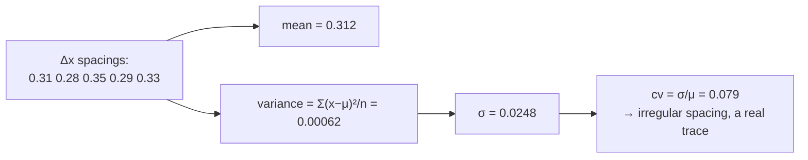

# Mean and variance

The centre of a set of numbers and how spread out they are. Two statistics that
appear throughout this pipeline — and one place where the mean was deliberately
rejected in favour of the [median](median-and-robust-statistics.md).

## What it is

**Mean** — the arithmetic average:

```
μ = (Σ xᵢ) / n
```

**Variance** — the average squared distance from the mean:

```
σ² = Σ(xᵢ − μ)² / n
```

**Standard deviation** — `σ = √(σ²)`, which is back in the original units and
therefore interpretable.

Why squared distances rather than absolute ones: squaring makes the algebra
differentiable, which is what lets [least squares](ordinary-least-squares.md)
have a closed-form solution. It also weights large deviations heavily — a single
outlier at 10× the typical distance contributes 100× the typical term.

That sensitivity is the mean's defining weakness, and the reason this repository
uses the median where inputs may contain outliers.

A note on `n` versus `n−1`: dividing by `n` gives the *population* variance,
by `n−1` the unbiased *sample* estimate. This project divides by `n` throughout,
which is correct because the points are the whole population of interest — every
vertex that was recorded — not a sample drawn from a larger set.

## The picture



Mean versus median, with one outlier:

```
values:   3.1  3.0  3.2  2.9  47.0     ← one bad reading

mean   = 11.84    ← dragged far from every real value
median =  3.10    ← unmoved
```

## Where this project uses it

### Detecting fabricated boundary spacing

`poggio_webapp/pipeline/validator.py` computes both by hand:

```python
def check_uniform_spacing(points, where, report):
    """Warn when boundary vertices sit on a perfectly regular x interval."""
    pts = _pairs(points)
    if len(pts) < 5:
        return
    xs = [x for x, _ in pts]
    dx = [b - a for a, b in zip(xs, xs[1:])]
    mean = sum(dx) / len(dx)
    if mean <= 0:
        return
    var = sum((d - mean) ** 2 for d in dx) / len(dx)
    cv = (var ** 0.5) / mean
    if cv < UNIFORM_SPACING_CV:
        report.warn(where, ...)
```

Three guards before any statistic is trusted: `_pairs` keeps only points whose
x and depth are numbers, at least five must survive (a variance over three gaps
is meaningless), and `mean <= 0` is checked before dividing by it. The
ratio `σ/μ` is the [coefficient of variation](coefficient-of-variation.md).

### Ordering loci by mean depth

`poggio_webapp/pipeline/assign_markers.py`:

```python
# Vertical order of loci = mean depth of their named top boundaries.
order = sorted(
    tops,
    key=lambda n: sum(m["depth_m"] for m in tops[n]) / len(tops[n]),
)
```

Here the mean is exactly right. Every point on a locus's top boundary is a real
recorded vertex; there are no outliers to guard against, and the average depth is
a fair summary of where the boundary sits. The alternative — ordering by a single
point — would depend on which point.

`manual_extraction._average_depth` does the same for the manual path.

### Inside least squares

`poggio_webapp/pipeline/convert_coords.py`:

```python
def least_squares_slope(xs, ds):
    n = len(xs)
    mean_x = sum(xs) / n
    mean_d = sum(ds) / n
    num = sum((x - mean_x) * (d - mean_d) for x, d in zip(xs, ds))
    den = sum((x - mean_x) ** 2 for x in xs)
    if den == 0:
        return 0.0
    return num / den
```

The denominator is `n` times the variance of `xs`; the numerator is `n` times
the covariance. The `den == 0` guard is the degenerate case where every point
shares an x — no spread, so no slope is determinable. `true_dip._wall_direction`
carries the same computation with the same guard.

### And where the mean was rejected

`poggio_webapp/pipeline/preprocess.py`:

```python
angle = float(np.median(angles))
```

`poggio_webapp/pipeline/detect_features.py`:

```python
median_intensity = float(np.median(gray))
```

Both inputs are contaminated by construction. The deskew angles include
whatever diagonal strokes squeaked past the ±15° filter; the intensity
histogram includes a dark legend block and any shadowed corner. A mean would be
dragged; the median is not. See
[median and robust statistics](median-and-robust-statistics.md).

Four uses of the mean, two deliberate refusals of it. The rule the code follows
is consistent: **use the mean when every input is trustworthy, the median when
some are not.**

## Why this and not something else

| Alternative | What it measures | Why it lost — or won |
|---|---|---|
| **[Median](median-and-robust-statistics.md)** | The middle value | More robust, and it discards information: the mean uses every value, the median uses one or two. Where all inputs are real recorded vertices, the mean is a better summary. |
| **Trimmed mean** | Mean after dropping the extremes | A reasonable middle ground, and it needs a trim fraction — another parameter to justify. |
| **Mean absolute deviation** | `Σ|x−μ|/n` instead of variance | More robust than variance and more interpretable. It is not differentiable at zero, so it has no closed-form least-squares solution, and the [coefficient of variation](coefficient-of-variation.md) is conventionally defined with σ. |
| **Range** (`max − min`) | Simplest spread measure | Determined entirely by the two extreme values, so one bad vertex sets it. Used here only where that is acceptable — `spread = max(diffs) - min(diffs)` in the parallel-layer check, where a *small* range is the suspicious signal. |
| **Mean and variance** *(chosen where inputs are clean)* | Centre and spread using every value | Uses all the data, has closed-form solutions, and the ratio σ/μ is a standard, dimensionless, well-understood statistic. |

## What it costs

O(n), one or two passes. The two-pass form used here — compute the mean, then
the squared deviations — is slightly slower than the one-pass "sum of squares"
identity and **numerically far better**: the one-pass form subtracts two large
nearly-equal numbers and can produce a negative variance. See
[floating-point representation](floating-point-representation.md).

The costs that matter:

- **Outlier sensitivity.** One bad value moves the mean by `outlier/n` and the
  variance by far more. The repository's answer is to use the median where
  contamination is expected.
- **Small samples are unreliable.** Hence `if len(pts) < 5: return` before the
  spacing statistic.
- **Both assume a meaningful centre.** For a bimodal distribution the mean sits
  where no data is. Nothing here is bimodal, but it is why the median-based
  [Canny thresholds](canny-edge-detection.md) work — the intensity histogram of
  a drawing *is* bimodal, and the median finds the paper peak rather than an
  average of paper and ink.

## Where else you meet it

- **Every summary statistic** in every report.
- **[Otsu's method](otsu-thresholding.md)**, which maximises between-class
  variance.
- **Principal component analysis**, which finds the directions of greatest
  variance.
- **Signal processing**, where variance is power and the mean is the DC
  component.
- **Quality control**, where control charts are drawn at μ ± 3σ.
- **Machine learning**, where features are standardised by subtracting the mean
  and dividing by σ.

## Related pages

- [Coefficient of variation](coefficient-of-variation.md) — the ratio σ/μ, and
  what it detects here.
- [Median and robust statistics](median-and-robust-statistics.md) — the
  alternative, and where it wins.
- [Ordinary least squares](ordinary-least-squares.md) — built on variance and
  covariance.
- [Otsu's method](otsu-thresholding.md) — a variance-maximising threshold,
  considered and not used.
- [Floating-point representation](floating-point-representation.md) — why the
  two-pass variance is preferred.
