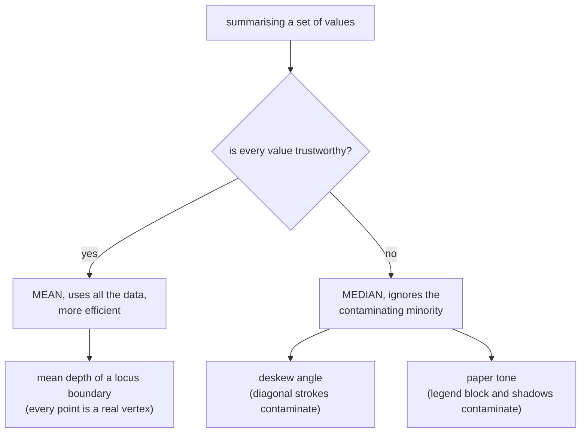

# Median and robust statistics

The middle value, unmoved by however extreme the extremes are. Chosen over the
mean in the two places where this pipeline's inputs are known to be
contaminated.

## What it is

The **median** is the value with half the data below it and half above. Sort and
take the middle.

Its defining property is a **breakdown point of 50%**: up to half the data can
be arbitrarily corrupted before the median moves outside the range of the good
values. The mean's breakdown point is 0%: one bad value can move it anywhere.

```
values:   3.1  3.0  3.2  2.9  47.0

mean   = 11.84    ← one outlier dragged it past every real value
median =  3.10    ← unmoved
```

*Robust statistics* is the family of estimators built for data you cannot fully
trust. The median is the simplest and most important member; the median absolute
deviation, trimmed means, and RANSAC are relatives.

The trade is that robustness costs efficiency: on clean, normally distributed
data, the median is about 64% as statistically efficient as the mean. It uses
one or two values where the mean uses all of them.

So the question is never "which is better" but **"do I trust every input?"**

## The picture



## Where this project uses it

### Estimating the deskew angle

`poggio_webapp/pipeline/preprocess.py`:

```python
def deskew(gray):
    """Estimate small skew from near-horizontal strokes and rotate to correct."""
    edges = cv2.Canny(gray, 50, 150)
    lines = cv2.HoughLines(edges, 1, np.pi / 180, threshold=200)
    if lines is None:
        return gray, 0.0
    angles = []
    for rho_theta in lines[:200]:
        theta = rho_theta[0][1]
        deg = np.degrees(theta) - 90.0
        if -15 < deg < 15:
            angles.append(deg)
    if not angles:
        return gray, 0.0
    angle = float(np.median(angles))
```

The input is contaminated **by construction**. [Hough](hough-line-transform.md)
returns every strong line: the sheet border, ruled grid lines, layer boundaries,
hatching, the edge of the table the photograph was taken on. The ±15° filter
removes the obviously wrong ones and cannot remove a diagonal stroke at 12°.

A mean over that set would be dragged by every survivor. The median needs more
than half the surviving lines to be wrong before it moves, and on a section
drawing, most near-horizontal strong lines really are the horizontal features of
the sheet.

Note the two early returns. `lines is None` and `not angles` both give **0.0 and
no rotation**: the honest answer when there is no evidence, rather than a guess
from a single line. See [fail-closed design](fail-closed-design.md).

### Deriving Canny thresholds from paper tone

`poggio_webapp/pipeline/detect_features.py`:

```python
# Canny identifies ink boundaries while avoiding most paper-background
# variation. Closing repairs small gaps in hand-drawn feature outlines.
median_intensity = float(np.median(gray))
lower_threshold = int(max(20, 0.55 * median_intensity))
upper_threshold = int(
    min(
        255,
        max(lower_threshold + 30, 1.25 * median_intensity),
    )
)
```

The intensity distribution of a drawing is strongly **bimodal** (a large peak
at paper tone and a small one at ink), and often skewed further by a dark legend
block or a shadowed corner.

The mean of that distribution sits between the peaks, where nothing is. The
median sits **in the paper peak**, because most of a drawing is blank paper.
That is what makes it the right estimator of "how bright is this sheet," which
is what the thresholds need to scale against.

This is the case where the median is not merely more robust but measuring a
*different and correct* quantity.

### And where the mean is used instead

`poggio_webapp/pipeline/assign_markers.py`:

```python
# Vertical order of loci = mean depth of their named top boundaries.
order = sorted(
    tops,
    key=lambda n: sum(m["depth_m"] for m in tops[n]) / len(tops[n]),
)
```

Here every input is a real recorded vertex on that locus's boundary. There is no
contaminating minority, so the mean's use of all the data is an advantage.

The same choice appears in
[least squares](ordinary-least-squares.md), which is mean-based and used for
slope fitting because boundary points are trusted.

Two medians, several means, and a consistent rule: **the median where a minority
of inputs are known to be wrong, the mean where all of them are real
measurements.**

## Why this and not something else

| Alternative | Breakdown point | Why it lost, or won |
|---|---|---|
| **Mean** | 0% | Uses all the data and is more efficient on clean input. One diagonal stroke or one dark legend block moves it. Used here where inputs are trusted. |
| **Median** *(chosen for contaminated input)* | 50% | Ignores up to half the data being wrong. Costs a sort and some statistical efficiency. |
| **Trimmed mean** | tunable | Drop the top and bottom k%, average the rest. A reasonable middle ground, and it needs a trim fraction chosen and justified. |
| **Mode** | n/a | The most common value. For the paper-tone problem it is arguably *more* correct than the median, and it needs binning, and the bin width becomes a parameter. The median approximates it well on a strongly unimodal-plus-tail distribution. |
| **RANSAC** | very high | Randomly sample, count inliers, keep the best consensus. Handles far worse contamination and is **randomised**, so two runs can differ, and [determinism](determinism-and-stable-sorting.md) is a design requirement in this repository. |
| **Weighted mean by Hough vote count** | 0% | Would weight stronger lines more, which sounds principled. A long diagonal has many votes, so it would weight the contamination *up*. |

The generalisable rule: **choose the estimator by how you expect the input to
fail, not by which is more sophisticated.** Both places using the median have a
one-line justification available ("these values include lines that are not the
sheet's horizontal," "most of the sheet is paper"), and that justification is
what makes the choice reviewable.

## What it costs

O(n log n) for a full sort, or O(n) with quickselect, which NumPy's
`np.median` uses. On 200 Hough angles or a 4-megapixel histogram, negligible.

The costs:

- Statistical efficiency: about 64% of the mean's on clean normal data. The
  deskew estimate is slightly noisier than a mean over uncontaminated angles
  would be, and there is no uncontaminated set to average.
- It ignores most of the data. Where every value carries information, that
  is waste.
- Not differentiable, so it cannot be used inside a closed-form fit. That is
  why [least squares](ordinary-least-squares.md) is mean-based, and why a robust
  regression would need an iterative method.
- Angles need care. Median over circular quantities is ill-defined near the
  wraparound. This code avoids the issue entirely by filtering to ±15° first, so
  all values are on one branch.

## Where else you meet it

- Median filtering in image processing, which removes salt-and-pepper noise
  while preserving edges: the same robustness, applied spatially.
- Reporting incomes and house prices, where the median is quoted precisely
  because the mean is dragged by a few very large values.
- Latency monitoring, where p50 and p99 are reported instead of a mean,
  because one 30-second request would dominate it.
- Sensor fusion, where a median over redundant sensors survives one failing.
- Robust regression (RANSAC, Theil–Sen, least median of squares): the
  regression analogues of this page.
- Benchmarking, where the median run time is reported to discount one
  unlucky scheduling hiccup.

## Related pages

- [Mean and variance](mean-and-variance.md): the non-robust alternative, and
  where it is correct here.
- [Hough line transform](hough-line-transform.md): the contaminated input the
  median cleans up.
- [Canny edge detection](canny-edge-detection.md): the thresholds derived from
  the median.
- [Ordinary least squares](ordinary-least-squares.md): a mean-based fit, and
  why it is acceptable there.
- [Coefficient of variation](coefficient-of-variation.md): another statistic
  used against untrusted input.
