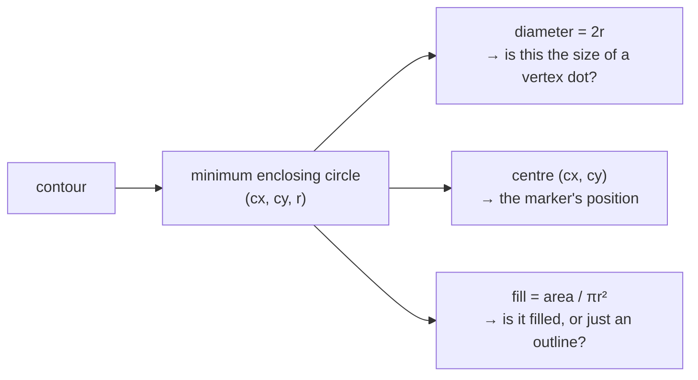

# Minimum enclosing circle

The smallest circle containing every point of a shape. In this project it
supplies both the marker's diameter and the denominator of the fill test that
separates a filled dot from a drawn ring.

## What it is

Given a set of points, find the circle of least radius containing them all. The
answer is unique, and it is determined by at most three of the points — either
two forming a diameter, or three on the circumference.

Welzl's algorithm solves it in expected **O(n)** by randomised incremental
construction. OpenCV's `cv2.minEnclosingCircle` returns `((cx, cy), radius)`.

Unlike a [bounding box](bounding-boxes.md), it is **rotation-invariant**:
rotating the shape rotates the circle's centre but never changes its radius.
For a target that is supposed to *be* a circle, that is exactly the right
primitive.

## The picture



The fill ratio is the discriminator that matters:

```
filled pencil dot     area ≈ πr²        fill ≈ 0.95
drawn stone outline   area ≈ 0.1·πr²    fill ≈ 0.10   ← rejected
hatch tick            area ≈ 0.05·πr²   fill ≈ 0.05   ← rejected
```

A ring and a disk of the same size have the same enclosing circle and
[circularity](circularity.md) close to each other. Only the ratio of *enclosed
area* to *circle area* tells them apart.

## Where this project uses it

`poggio_webapp/pipeline/detect_markers.py`, once per candidate contour, feeding
three separate decisions:

```python
(cx, cy), radius = cv2.minEnclosingCircle(contour)
diameter = radius * 2

entry = {
    "cx": float(cx),
    "cy": float(cy),
    "diam": float(diameter),
}
...
fill = area / (math.pi * radius * radius) if radius > 0 else 0

if (
    min_d <= diameter <= max_d
    and circularity >= min_circularity
    and solidity >= min_solidity
    and fill >= 0.5
):
    cand.append(entry)
```

**Diameter** is tested against a band expressed in millimetres of paper:

```python
min_d = min_marker_paper_mm * mm_px  # default 0.5 mm
max_d = max_marker_paper_mm * mm_px  # default 2.5 mm
```

**Centre** becomes the marker's recorded position, and is the coordinate that
[survives into the extraction verbatim](../architecture/pipeline-walkthrough.md):

```python
x_m, depth_m = pixel_to_section_coordinates(
    pixel_x=entry["cx"], pixel_y=entry["cy"], transform=section_transform
)
```

**Fill** is the ring-versus-disk test, and it is the one measure the module's
docstring calls out by name:

> solidity/fill filters + dedupe: dots are small **FILLED** disks; stone
> outlines and nested contour duplicates are not

The centre is reused a third time, in
[deduplication](non-maximum-suppression.md), where candidates whose centres are
closer than half the minimum diameter are treated as the same mark.

## Why this and not something else

| Alternative | How it would work here | Why it lost |
|---|---|---|
| **[Bounding box](bounding-boxes.md)** | Use `max(w, h)` as the size | Cheaper, and rotation-dependent: a diagonal elongated blob has a large box while its enclosing circle reflects its true extent. `detect_features.py` uses boxes because stones are arbitrary shapes; `detect_markers.py` uses circles because dots are round. |
| **Centroid + mean radius** | Average distance from the centroid | Cheap and not a *bound* — half the shape lies outside it, so it does not measure the mark's true size. |
| **Equivalent-area diameter** | `2√(A/π)` | Free, given area. It measures how much ink there is, not how far it spreads — a ring and a disk of the same ink area would report the same diameter, which is the distinction being tested. |
| **[Convex hull](convex-hull.md) extent** | Diameter of the hull | Also computed here, for [solidity](solidity.md). It is a polygon, so it does not give one number for size. |
| **Ellipse fitting (`fitEllipse`)** | Fit a best-fit ellipse | Richer: major axis, minor axis, orientation. It needs at least five points, is sensitive to noise on small contours, and gives two size numbers where the filter wants one. A vertex dot at 2 mm may only have a few dozen boundary pixels. |
| **[Hough circle transform](hough-line-transform.md)** | Search parameter space for circles | Purpose-built for circles, and it finds circle *outlines* — including every drawn stone. It also has four coupled parameters. The filter here wants **filled** disks, which is a fill and [solidity](solidity.md) test, and those need a contour. |
| **Minimum enclosing circle** *(chosen)* | Welzl, expected O(n) | Rotation-invariant, one number for size, one point for position, and its area is exactly the denominator the fill test needs. |

The elegance is that a single call answers three different questions —
how big, where, and how solid — each of which would otherwise need its own
primitive.

## What it costs

Expected O(n) in the vertex count, worst case O(n³) for the naive algorithm but
effectively linear with Welzl's randomisation. Vertex counts here are small,
since `CHAIN_APPROX_SIMPLE` already collapsed straight runs.

It is computed **after** the cheap filters and the box test, in the same
cheapest-first ordering that keeps the detector fast on thousands of contours.

The known bias: on a digitised shape, the enclosing circle is driven by extreme
pixels, so a single stray pixel from
[thresholding](adaptive-thresholding.md) inflates the radius and deflates the
fill ratio. [Morphological opening](morphological-opening.md) beforehand is
part of the defence, and the `fill >= 0.5` threshold is deliberately far from
1.0 for the same reason.

## Where else you meet it

- **Facility location** — the "smallest enclosing circle" is the classic
  1-centre problem: where to put a transmitter to cover every customer.
- **Collision detection**, where bounding spheres are the standard broad-phase
  primitive.
- **Robotics**, computing a robot's swept footprint.
- **Cluster analysis**, measuring how tightly a cluster is contained.
- **Circularity inspection** in manufacturing, checking that a machined hole is
  round.

## Related pages

- [Bounding boxes](bounding-boxes.md) — the axis-aligned alternative, used in
  the other detector.
- [Extent and fill ratio](extent-and-fill-ratio.md) — the ratio this supplies a
  denominator for.
- [Circularity](circularity.md) and [solidity](solidity.md) — the other two
  shape tests applied alongside.
- [Convex hull](convex-hull.md) — solidity's denominator.
- [Structuring elements](structuring-elements.md) — how the diameter band is
  converted from paper millimetres.
