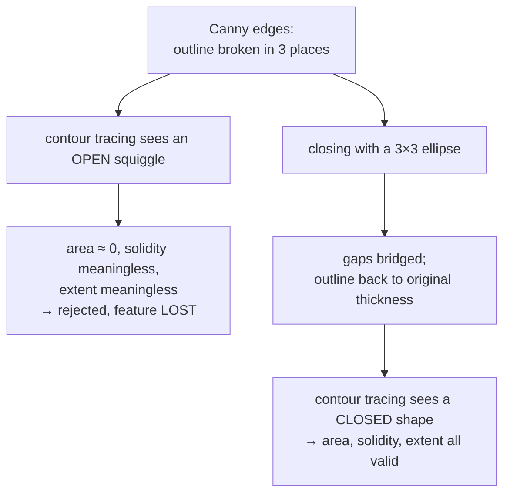

# Morphological closing

Dilation followed by erosion: bridge every gap narrower than the probe, then
restore the original thickness. The operation that turns a hand-drawn outline
the pen did not quite close into a shape that can be measured.

## What it is

```
closing(A, B) = erode(dilate(A, B), B)
```

[Dilation](dilation.md) grows the foreground, bridging gaps and filling small
holes — and thickening everything. [Erosion](erosion.md) by the *same* element
takes the thickness back off, but the bridges survive, because they are now part
of a connected region rather than a gap.

The net effect is a **size filter on gaps**: openings narrower than the element
are filled, everything else is unchanged.

Its properties mirror [opening](morphological-opening.md)'s:

- **Idempotent** — closing twice changes nothing after the first pass.
- **Extensive** — the result is always a superset of the input. Closing can only
  add, never remove.

Opening and closing are duals: closing the foreground is opening the background.

## The picture

A stone drawn by hand, whose outline the pen skipped in three places:



One row through a 2-pixel gap:

```
input     ████████..████████       gap the pen skipped
dilate    ██████████████████       bridged — and 1px fatter on every edge
erode     ████████████████         bridge kept, thickness restored
```

## Where this project uses it

`poggio_webapp/pipeline/detect_features.py`, immediately after edge detection:

```python
edges = cv2.Canny(gray, lower_threshold, upper_threshold)

closing_kernel = cv2.getStructuringElement(
    cv2.MORPH_ELLIPSE,
    (3, 3),
)

edges = cv2.morphologyEx(
    edges,
    cv2.MORPH_CLOSE,
    closing_kernel,
    iterations=1,
)

contours, _ = cv2.findContours(
    edges,
    cv2.RETR_LIST,
    cv2.CHAIN_APPROX_SIMPLE,
)
```

The comment above it states both halves of the reasoning:

> Canny identifies ink boundaries while avoiding most paper-background
> variation. **Closing repairs small gaps in hand-drawn feature outlines.**

Why it is necessary is visible in what comes next. Every measure the candidate
filter uses assumes a closed shape:

```python
area = abs(float(cv2.contourArea(contour)))
...
solidity = area / hull_area if hull_area > 0 else 0.0
extent = area / float(width * height)
circularity = 4.0 * math.pi * area / (perimeter * perimeter)

if solidity < 0.34 or extent < 0.09:
    continue
```

[Contour area](contour-area-and-perimeter.md) of an open curve is near zero, so
[solidity](solidity.md), [extent](extent-and-fill-ratio.md), and
[circularity](circularity.md) all collapse. A stone whose outline has a 2-pixel
break is not merely measured badly; it is measured as nothing.

**`iterations=1`** is deliberate restraint. One pass bridges a 2–3 pixel gap —
a pen skip. More would begin merging genuinely separate stones into a single
candidate.

**3×3 fixed**, rather than derived from physical scale as in
`detect_markers.py`, because the input is already at a normalised scale: the
analysis copy is capped at 2200 px by
[area-averaging downsampling](area-averaging-downsampling.md), so a pixel means
roughly the same thing on every input. Two modules, two sizing strategies, each
matched to whether the operation's meaning is physical or pixel-local.

## Why this and not something else

| Alternative | How it would work here | Why it lost |
|---|---|---|
| **[Dilation](dilation.md) alone** | Grow until the gaps close | Bridges the gaps and leaves every outline permanently thicker, which inflates area and distorts [extent](extent-and-fill-ratio.md) and [aspect ratio](aspect-ratio.md) — and affects small features proportionally more than large ones. |
| **[Closing](morphological-closing.md)** *(chosen)* | Dilate, then erode by the same element | Bridges survive, thickness restored, measures stay meaningful. |
| **Lower the [Canny](canny-edge-detection.md) thresholds** | Detect weaker edges so fewer breaks appear | Treats the cause, not the symptom — and admits paper texture and graph-paper ruling. The thresholds are already derived from the image median precisely to balance this. |
| **Edge linking** | Detect open endpoints, join nearby pairs following the local direction | More surgical: it joins only where an edge genuinely stops, instead of thickening the whole image. It needs endpoint detection, a proximity threshold, and a direction threshold — three new parameters to close a 2-pixel gap. Worth it if the gaps were large; they are not. |
| **Active contours (snakes)** | Fit a deformable closed curve per blob | Handles far worse breakage, at the price of per-object initialisation and iterative optimisation. |
| **Morphological gradient or watershed** | Segment regions rather than trace edges | A different formulation of the whole problem. Watershed is strong on touching objects and needs markers, which is the problem being solved. |
| **`RETR_EXTERNAL` and accept open contours** | Change how contours are retrieved | Does not help — retrieval mode does not close a curve. |

The judgement running through this module is that a 3×3 kernel is a **blunt**
instrument and bluntness is acceptable, because nothing here is a conclusion:

> This detector intentionally does not claim that every closed contour is a
> stone. It proposes compact, closed shapes that may represent stones, cuts,
> lenses, voids, or other discrete features. A person approves, rejects, and
> labels each proposal before extraction.

A blunt tool feeding a human reviewer is a reasonable design. The same bluntness
would be unacceptable in `detect_markers.py`, whose output becomes coordinates —
and indeed that module sizes its kernel from the physical scale of the paper
instead.

## What it costs

Two morphological passes, O(n·k²) each. At 3×3 this is among the cheapest steps
in the detector.

The correctness cost is **merging**: two objects closer together than k become
one. Two stones drawn nearly touching may be proposed as a single feature. Since
proposals are reviewed and the reviewer sees the outline drawn on the original
image, that error is visible and correctable rather than silent.

Closing also fills small genuine holes — a stone drawn with a hollow centre
comes out solid. Here that is harmless, since [solidity](solidity.md) is used to
*select* compact shapes anyway.

## Where else you meet it

- **Document image cleanup**, reconnecting broken character strokes before OCR.
- **Medical imaging**, closing gaps in vessel or airway segmentations before
  measuring length.
- **Satellite imagery**, repairing road networks broken by tree cover.
- **3D printing slicers**, closing small gaps in a mesh cross-section so a layer
  is a valid fillable region.
- **Photoshop's "Refine Edge"**, which offers exactly this as a smoothing
  control.

## Related pages

- [Dilation](dilation.md) and [erosion](erosion.md) — the two halves.
- [Morphological opening](morphological-opening.md) — the dual, used in the
  marker detector.
- [Structuring elements](structuring-elements.md) — the probe.
- [Canny edge detection](canny-edge-detection.md) — the step that produces the
  broken outlines.
- [Contour area and perimeter](contour-area-and-perimeter.md) — the measures
  that require closure.
