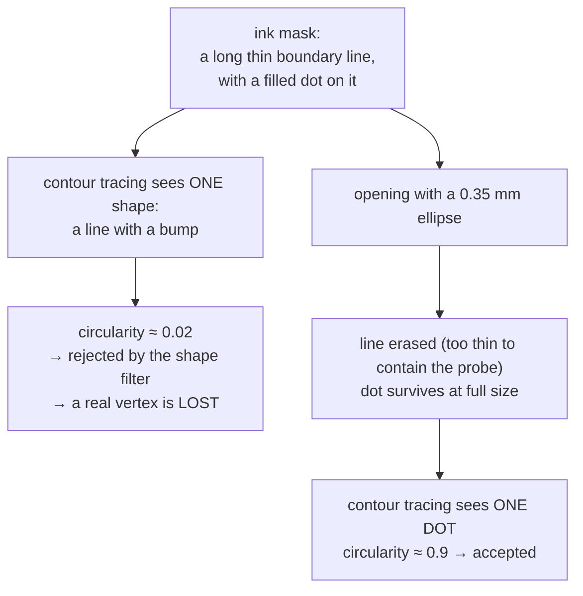

# Morphological opening

Erosion followed by dilation: delete everything thinner than the probe, and
restore the size of everything that survived. The operation that lets this
project find a pencil dot sitting on top of the line it marks.

## What it is

```
opening(A, B) = dilate(erode(A, B), B)
```

[Erosion](erosion.md) removes anything the structuring element cannot fit
inside: thin lines, small specks, narrow bridges. It also shrinks whatever
survives. [Dilation](dilation.md) by the *same* element grows the survivors
back to roughly their original size.

The net effect is a **size filter on thickness**: structures narrower than the
element are gone, structures wider than it are unchanged.

Two properties make it well behaved:

- Idempotent: opening an already-opened image changes nothing. There is no
  "apply it twice for more effect."
- Anti-extensive: the result is always a subset of the input. Opening can
  only remove, never add, so it cannot invent structure.

That second property matters in a pipeline that elsewhere spends real effort
detecting [fabricated geometry](fabrication-detection.md). Opening is incapable of
manufacturing a marker.

## The picture

The problem it solves, on a field sheet where a vertex dot sits on its boundary
line:



One row of pixels through that region:

```
input     ─────────────████████──────────────      line (2px) + dot (8px)
erode     ..............██████..................    line gone, dot narrowed
dilate    ............████████................      dot restored
```

## Where this project uses it

`poggio_webapp/pipeline/detect_markers.py`, between building the ink mask and
hunting for circles:

```python
ink = _ink_mask(img, block_px=max(11, int(2.0 * mm_px) | 1))

k = max(3, int(line_kill_paper_mm * mm_px) | 1)

opened = cv2.morphologyEx(
    ink,
    cv2.MORPH_OPEN,
    cv2.getStructuringElement(cv2.MORPH_ELLIPSE, (k, k)),
)
```

The module docstring lists this as one of four deliberate changes from the
earlier CLI tool:

> morphological **OPENING** before the circle hunt, so vertex dots that touch
> their boundary line survive as blobs instead of merging into one big
> non-circular contour and being lost

That sentence is the whole justification. Without opening, the discriminating
measures ([circularity](circularity.md), [solidity](solidity.md),
[fill ratio](extent-and-fill-ratio.md)) are computed on the wrong object,
because [contour tracing](contour-tracing.md) has no notion of "the round part
of this shape." Opening turns one bad contour into one good one.

The kernel is `line_kill_paper_mm = 0.35` mm, converted through the
calibration, so it is 0.35 mm of paper regardless of camera resolution. See
[structuring elements](structuring-elements.md) for the conversion, and note
the deliberately narrow margin: wider than any drawn line, narrower than any
dot.

## Why this and not something else

| Alternative | How it would work here | Why it lost |
|---|---|---|
| **[Erosion](erosion.md) alone** | Erode and use the result | Removes the lines and leaves every dot k pixels smaller. The next filter is a **diameter band in paper millimetres**, so uniformly shrunken dots fail their own size test. |
| **Filter contours by shape, no morphology** | Reject non-circular contours after tracing | Does not work: the dot and its line are a *single* contour, so the dot never appears as a candidate. There is nothing to filter. |
| **[Hough circle transform](hough-line-transform.md)** | Search parameter space for circles directly | Purpose-built for circles and would find the dot even while attached. It has four coupled parameters, is sensitive to all of them, and, decisively, finds *outlines* of circles. This filter specifically wants **filled disks**, since a drawn stone's outline is round and must be rejected. That is a [solidity](solidity.md) test, which needs a contour. |
| **Distance transform + local maxima** | Peaks of the distance transform mark blob centres | Elegant for touching round objects, and a whole extra pipeline with its own thresholds where a 3-pixel kernel suffices. |
| **Skeletonisation, then junction analysis** | Thin everything, find where a blob meets a line | Destroys exactly the property being measured: whether the mark is filled. Solidity and fill ratio are meaningless on a skeleton. |
| **Top-hat transform** | `input − opening(input)`, i.e. keep what opening removed | The complement of what is wanted. Useful if you wanted the *lines*, which is a genuinely interesting future direction for tracing boundaries directly. |

Opening wins because the discriminating property is purely **thickness**, and
opening is precisely a thickness filter. Every alternative either solves a
harder problem than necessary or measures the wrong thing.

## What it costs

Two morphological passes, O(n·k²) each. At k ≈ 3–7 pixels this is one of the
cheapest steps in the detector.

The information cost is real and acknowledged: any dot **thinner than k** is
deleted and cannot be recovered by the dilation. The margin between "thinner
than any dot" and "thicker than any line" is narrow, which is why the default
sits at the cautious end and why the module keeps its rejects for review:

```python
# The route and review UI consume the rejected candidates too (red,
# toggleable dots), so a person can rescue a real vertex the filters
# wrongly dropped.
```

The filter's mistakes stay visible to a person. See
[human-in-the-loop review](human-in-the-loop-review.md).

## Where else you meet it

- Scanned document cleanup, removing speckle and dust before OCR.
- Fingerprint processing, isolating ridge structures.
- Astronomy, separating point sources from diffuse nebulosity: an opening
  with a small element keeps stars and removes the background structure, or the
  reverse via the top-hat.
- Materials science, measuring grain and pore size distributions by opening
  at a sequence of element sizes (granulometry).
- Road and vessel extraction in aerial and medical imaging, where linear
  structures are separated from blobs by exactly this contrast.

## Related pages

- [Erosion](erosion.md) and [dilation](dilation.md): the two halves.
- [Morphological closing](morphological-closing.md): the dual operation, used
  elsewhere in this repository.
- [Structuring elements](structuring-elements.md): the probe, and why its size
  is in millimetres of paper.
- [Circularity](circularity.md), [solidity](solidity.md): the measures this
  makes computable.
- [Markers and features](../workflows/03-markers-and-features.md): the
  workflow step.
