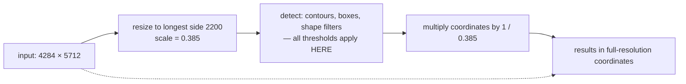

# Multi-scale analysis

Doing the work on a small copy and reporting the answer at full resolution. The
technique that makes a detector's thresholds mean the same thing on a 12-megapixel
photo and a 40-megapixel one.

## What it is

Detection thresholds are usually written in pixels — minimum area, minimum
width, kernel size. Pixels are a property of the **camera**, not of the subject.
The same drawing photographed at two resolutions gives two different answers
from the same code.

Multi-scale analysis breaks that coupling:

1. Resize the input to a fixed working resolution, recording the scale factor.
2. Do all the detection there.
3. Multiply every coordinate by the inverse scale to report at full resolution.

The thresholds now apply to a canonical image. Output precision is limited by
the working resolution — which is a real cost, and one to be weighed
deliberately per detector.

## The picture



The problem it removes:

| | 12 MP photo | 40 MP photo |
|---|---|---|
| a stone, in mm | 20 mm | 20 mm |
| a stone, in pixels | ~90 px | ~165 px |
| `min_area = 300 px²` | passes | passes |
| `width < 10 px` reject | fine | fine |
| a hatch tick, in pixels | ~8 px | ~15 px ← **now passes the filter** |

Fixed pixel thresholds silently change meaning with resolution. That is the bug
this prevents.

## Where this project uses it

### The feature detector — normalise, detect, scale back

`poggio_webapp/pipeline/detect_features.py`:

```python
MAX_ANALYSIS_DIM = 2200

def _analysis_copy(img):
    """Return a resized analysis image and its scale relative to the original."""
    height, width = img.shape[:2]
    longest_side = max(width, height)

    if longest_side <= MAX_ANALYSIS_DIM:
        return img.copy(), 1.0

    scale = MAX_ANALYSIS_DIM / longest_side
    resized = cv2.resize(
        img,
        (max(1, round(width * scale)), max(1, round(height * scale))),
        interpolation=cv2.INTER_AREA,
    )
    return resized, scale
```

The `1.0` early return is important: an image already small enough is untouched,
so no unnecessary resampling loss is introduced.
[`INTER_AREA`](area-averaging-downsampling.md) is the correct filter for
shrinking.

Every threshold then applies to the analysis image, and area limits are
expressed as *fractions* of it:

```python
image_area = float(analysis_width * analysis_height)
min_area = max(55.0, image_area * float(min_area_fraction))   # 0.000018
max_area = image_area * float(max_area_fraction)              # 0.035
...
if width > 0.34 * analysis_width:
    continue
```

And every output coordinate is mapped back:

```python
inverse_scale = 1.0 / scale

points = [
    [round(float(point[0][0]) * inverse_scale, 1),
     round(float(point[0][1]) * inverse_scale, 1)]
    for point in approximated_contour[:80]
]

raw_candidates.append({
    "x": round(x * inverse_scale, 1),
    "y": round(y * inverse_scale, 1),
    "width": round(width * inverse_scale, 1),
    "height": round(height * inverse_scale, 1),
    "area_px": round(area * inverse_scale * inverse_scale, 1),
    ...
})
```

Note `area_px` is scaled by `inverse_scale` **squared** — area is a
two-dimensional quantity. Getting that wrong is a classic and quiet bug.

Debug overlays are drawn on the **original**, so what the reviewer sees is
full-resolution:

```python
debug_image = original.copy()
```

### The extraction modules — a different reason, same mechanism

`poggio_webapp/pipeline/extract_illustrator.py`:

```python
MAX_SEND_DIMENSION = 3072

def _cap_for_sending(img, max_dim=MAX_SEND_DIMENSION):
    w, h = img.size
    if max(w, h) <= max_dim:
        return img
    scale = max_dim / max(w, h)
    ...
```

Here the motive is request size, not threshold stability:

> Sending that whole thing as base64 makes the request slow to the point of
> looking hung, with no accuracy benefit. Cap the longest side right before
> sending, independent of whatever upscale preprocessing used.

And `preprocess.recommend_upscale` is aware of it, targeting ~3000 px
specifically so the two stages do not fight:

> Landing near that same target means preprocessing's upscale doesn't do work
> that just gets undone again a step later.

### And where it is refused

`detect_markers.py` works at **full resolution** and refuses when the input
cannot support the precision:

```python
if mm_px < 2:
    raise RuntimeError(
        "photo resolution too low for marker detection "
        f"({mm_px:.1f} px per paper mm) — retake closer or "
        "at higher resolution")
```

Its coordinates become measurements that pass through the pipeline verbatim, so
a half-pixel of round-trip error is not acceptable. It achieves
resolution-independence the other way — by expressing every threshold in
**paper millimetres** converted through the calibration. See
[structuring elements](structuring-elements.md).

Two detectors, two strategies, chosen by whether the output is a proposal or a
measurement.

## Why this and not something else

| Alternative | How it would work here | Why it lost |
|---|---|---|
| **Full resolution, fixed pixel thresholds** | Detect on the original | Thresholds silently change meaning with camera resolution. A filter tuned on one phone rejects real features on another. |
| **Full resolution, thresholds in physical units** | Convert millimetres through a calibration | What `detect_markers.py` does, and it is *better* where a calibration exists. Feature detection runs before any calibration is required, so there is no conversion available. |
| **Downscale + scale back** *(chosen)* | Fixed working resolution | Thresholds are stable, runtime is bounded, and the sub-pixel error is acceptable for reviewed proposals. |
| **Image pyramid, detect at every level** | Run detection at several scales, merge results | The classical approach for objects of unknown size, and it multiplies runtime and requires cross-scale [NMS](non-maximum-suppression.md). Here the size range of interest is already bounded by the area fractions. |
| **Ask the user for the resolution** | Take DPI as an input | Users do not reliably know it, and EXIF DPI on a phone photo is meaningless. |

The generalisable rule is the one running through this whole subsystem:
**express thresholds in units of the subject, not units of the sensor.** There
are two ways to obey it — normalise the image, or convert the threshold — and
this repository uses each where it fits.

## What it costs

The resize is O(source pixels), one pass — cheaper than most later stages, and
it makes everything downstream ~3.8× faster on a 4284 px input.

The cost is precision. A detection located on the 2200 px grid carries up to
half a small-pixel of error, which maps back to a bit over one full-resolution
pixel. For proposals a human adjusts, immaterial. For coordinates that become
metres, unacceptable — hence the split between the two detectors.

The second cost is a discipline requirement: **every** coordinate leaving the
analysis stage must be scaled, and areas must be scaled squared. Missing one
produces output that is wrong by a constant factor and looks entirely plausible.

## Where else you meet it

- **Image pyramids** in SIFT, SURF, and Viola–Jones face detection.
- **Mipmapping** in graphics, which is a pyramid built for the same reason.
- **Wavelet analysis**, decomposing a signal at multiple scales at once.
- **Web mapping**, where tiles are pre-rendered at fixed zoom levels.
- **Machine-learning inference**, where inputs are resized to a fixed
  network resolution and boxes are scaled back — the identical pattern.

## Related pages

- [Area-averaging downsampling](area-averaging-downsampling.md) — the correct
  filter for the shrink.
- [Structuring elements](structuring-elements.md) — the other way to achieve
  resolution independence.
- [Bounding boxes](bounding-boxes.md) — the coordinates that get scaled back.
- [Ramer–Douglas–Peucker](ramer-douglas-peucker.md) — the polygon that gets
  scaled back.
- [Raster images and pixels](raster-images-and-pixels.md) — why pixels are not
  measurements.
