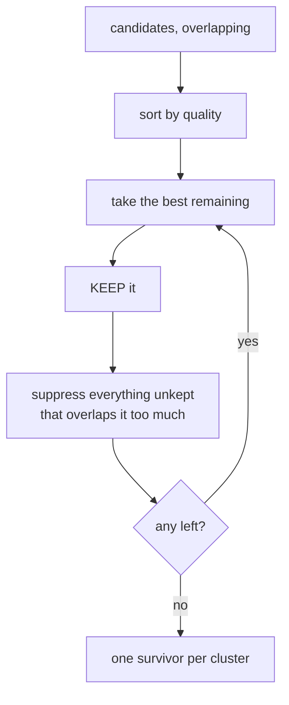

# Non-maximum suppression

When several detections describe the same object, keep the best one and suppress
the rest. Both detectors do this, ranked by different criteria, using different
notions of "the same."

## What it is

Detectors produce redundant output. One object generates several candidates,
because [contour tracing](contour-tracing.md) returns both sides of a stroke,
because [morphology](morphological-closing.md) can split or merge a shape, and
because thresholds land differently on nearly identical contours.

Non-maximum suppression removes the redundancy with a
[greedy](greedy-algorithms.md) rule:

1. Sort every candidate by quality, best first.
2. Take the best remaining candidate and keep it.
3. Suppress every unkept candidate that overlaps it too much.
4. Repeat.

The result is that each cluster of overlapping detections contributes exactly
one survivor — its best member.

Two decisions define an NMS: **what "best" means**, and **what "too much
overlap" means.** This repository answers both differently in its two detectors,
and each answer follows from what the detector is looking for.

## The picture



```
before:  [A .87] [B .84] [C .81]   three boxes on one stone
                 (heavily overlapping)
after:   [A .87]                   the best survives
```

## Where this project uses it

### Marker detection — ranked by size, "same" means close centres

`poggio_webapp/pipeline/detect_markers.py`:

```python
# Remove nested-contour duplicates. Keep the largest contour from each
# group whose centers are closer than half the minimum marker diameter.
cand.sort(
    key=lambda entry: -entry["diam"]
)

kept = []

for entry in cand:
    is_separate = all(
        (
            (entry["cx"] - existing["cx"]) ** 2
            + (entry["cy"] - existing["cy"]) ** 2
        )
        > (0.5 * min_d) ** 2
        for existing in kept
    )

    if is_separate:
        kept.append(entry)
```

**Ranked by diameter, largest first.** For nested contours from one pencil dot,
the outer boundary is the true extent of the mark, so bigger is better.

**"Same" means centres within half the minimum marker diameter.** Since a
[minimum enclosing circle](minimum-enclosing-circle.md) is already computed, a
centre-distance test is the natural measure — and the threshold is expressed in
terms of `min_d`, which itself came from paper millimetres, so it is
scale-relative.

Note the comparison is on **squared** distance against a squared threshold, so
no square root is taken. See [vectors and magnitude](vectors-and-magnitude.md).

### Feature detection — ranked by score, "same" means IoU

`poggio_webapp/pipeline/detect_features.py`:

```python
def _dedupe(candidates):
    """Suppress nested or overlapping contours representing the same object."""
    ordered = sorted(
        candidates,
        key=lambda candidate: (
            float(candidate["score"]),
            float(candidate["area_px"]),
        ),
        reverse=True,
    )

    kept = []
    for candidate in ordered:
        ...
        overlap = _iou(candidate, existing)
        close_centers = center_distance < center_threshold

        if overlap >= 0.68 or (close_centers and overlap >= 0.35):
            duplicate = True
            break

        if not duplicate:
            kept.append(candidate)

        if len(kept) >= MAX_CANDIDATES:
            break
```

**Ranked by shape score, with area as a tie-break.** A feature has no
"correct" size, so the better *shape* wins rather than the bigger one. The
tie-break on area makes the order total, so the result is
[deterministic](determinism-and-stable-sorting.md) rather than dependent on input ordering.

**"Same" is a two-part test** — high [IoU](intersection-over-union.md), or
moderate IoU with concentric centres. The second clause exists for the
nested-contour case, where a thick stroke around a small stone gives two
concentric boxes whose IoU is well below 0.68.

**`MAX_CANDIDATES = 250`** bounds the output. On a densely hatched drawing the
review interface would otherwise be unusable.

## Why this and not something else

| Alternative | How it would work here | Why it lost |
|---|---|---|
| **Keep everything** | No suppression | The review list fills with the same stone three times. The reviewer does the deduplication by hand, on every drawing. |
| **[Contour hierarchy](contour-hierarchy.md)** | Use parent/child links to drop nested contours | Exact for *nested* duplicates, blind to non-nested near-duplicates, and it has no notion of quality — it would keep the parent whether or not the parent is the better shape. |
| **Clustering (DBSCAN, mean-shift)** | Group candidates, emit one representative per cluster | Handles chains of overlaps more principledly than greedy suppression. It adds parameters, is not obviously deterministic, and produces a *synthetic* representative — an averaged box that corresponds to no traced contour. This project keeps real measurements. |
| **Soft-NMS** | Decay competing scores instead of removing them | Better for detectors whose scores are calibrated probabilities and whose consumer is a ranking metric. Here the consumer is a human list; a decayed duplicate is still a duplicate on screen. |
| **Greedy NMS** *(chosen)* | Sort, keep, suppress | Deterministic given a total order, one parameter, and every survivor is a real measured candidate rather than an average. |

The known weakness of greedy NMS is **chaining**: if A overlaps B and B overlaps
C but A does not overlap C, then keeping A suppresses B, and C survives even
though it is arguably in the same cluster. Two candidates remain where one might
be right.

That is acceptable here, and for a stated reason — both detectors produce
*proposals*, not conclusions:

> This detector intentionally does not claim that every closed contour is a
> stone. … A person approves, rejects, and labels each proposal before
> extraction.

An extra proposal costs a reviewer one click. A missed one costs evidence. The
suppression is deliberately biased toward keeping too much rather than too
little — which is also why `detect_markers.py` returns its **rejects**:

```python
# The route and review UI consume the rejected candidates too (red,
# toggleable dots), so a person can rescue a real vertex the filters
# wrongly dropped.
```

## What it costs

O(k²) in candidate count — each candidate is compared against everything kept.
With `MAX_CANDIDATES = 250` that is at most ~31 000 comparisons, microseconds.
Sorting is O(k log k).

A spatial index would be needed at ten thousand candidates; the size and shape
filters ensure that never happens.

The quality cost is the chaining behaviour above, and a genuine risk of merging
two objects that really do overlap — two stones drawn touching. Visible in the
review overlay, and correctable there.

## Where else you meet it

- **Object detection.** Every YOLO, SSD, and R-CNN output passes through
  IoU-based NMS; without it a single object yields dozens of boxes.
- **Face detection**, where the same face is found at several scales.
- **Keypoint detection** — SIFT, Harris, and FAST keep only local maxima of
  their response.
- **[Canny edge thinning](edge-thinning-non-maximum-suppression.md)** is the
  same principle at pixel scale rather than object scale.
- **Peak detection** in spectroscopy and audio onset detection.
- **Search result deduplication**, collapsing near-identical documents.

## Related pages

- [Intersection over union](intersection-over-union.md) — the overlap measure.
- [Greedy algorithms](greedy-algorithms.md) — the strategy, and when it is safe.
- [Contour hierarchy](contour-hierarchy.md) — the structural alternative.
- [Edge thinning](edge-thinning-non-maximum-suppression.md) — the same idea at
  pixel scale.
- [Determinism and stable sorting](determinism-and-stable-sorting.md) — why the sort key includes a
  tie-break.
