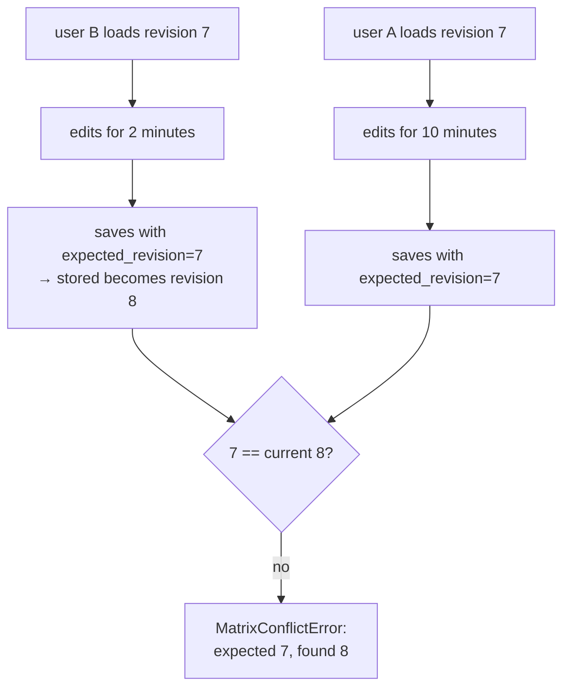

# Optimistic concurrency control

Let everyone edit, and detect a conflict at save time rather than preventing one
by locking. The right answer when a "transaction" is a person thinking for ten
minutes.

## What it is

**Pessimistic** control takes a lock before editing. Nobody else can touch the
record until you are done: safe, and useless when "done" means a human closing
a browser tab, which may be never.

**Optimistic** control assumes conflicts are rare:

1. Read the record, noting its **version**.
2. Edit locally, for as long as you like.
3. On save, send the version you started from.
4. The store compares. If the stored version has moved on, **refuse**.

Nobody is blocked. The cost is that a conflicting save is rejected and must be
redone, which is correct, because the alternative is one person's work silently
overwriting another's.

This is the **lost update** problem, and refusing is the only honest resolution
without a merge algorithm.

## The picture



Without the check, A's save would silently erase everything B did.

## Where this project uses it

`poggio_webapp/backend/harris_store.py`:

```python
def save_matrix(
    matrix_id: str,
    candidate: dict | HarrisMatrix,
    expected_revision: int,
) -> HarrisMatrix:
    """Validate and atomically save a matrix using optimistic concurrency."""
    matrix_id = _validate_matrix_id(matrix_id)
    current = load_matrix(matrix_id)
    if expected_revision != current.revision:
        raise MatrixConflictError(expected_revision, current.revision)
```

The error carries both numbers, so the interface can say what happened rather
than "conflict":

```python
class MatrixConflictError(HarrisStoreError):
    """Raised when an optimistic revision check fails."""

    def __init__(self, expected_revision: int, actual_revision: int):
        self.expected_revision = expected_revision
        self.actual_revision = actual_revision
        super().__init__(
            "Matrix revision conflict: expected "
            f"{expected_revision}, found {actual_revision}."
        )
```

### The server owns the version, not the client

```python
candidate_data.update(
    {
        "matrix_id": current.matrix_id,
        "revision": current.revision + 1,
        "created_at": current.created_at,
        "updated_at": updated_at,
    }
)
```

Four fields are **overwritten from the stored record** regardless of what the
client sent. A client cannot forge a revision number, spoof a creation time, or
move a matrix to a different ID. The version is a server-side fact.

### Monotonic timestamps

```python
updated_at = _utc_now()
if updated_at <= current.updated_at:
    updated_at = current.updated_at + timedelta(microseconds=1)
```

Two saves within one clock tick would otherwise produce equal timestamps, and
`list_matrices` sorts on `updated_at`. Forcing strict monotonicity keeps the
ordering total. A small guard against a clock that is not as fine-grained as the
code assumes. See also
[determinism and stable sorting](determinism-and-stable-sorting.md).

### The transaction shape, factored out

`poggio_webapp/backend/services/harris_workspace.py` exists because the
load-transform-save sequence was being spelled out inside view functions:

```python
def load_at_revision(matrix_id, expected_revision):
    """The stored matrix, or MatrixConflictError if it has moved on."""
    matrix = harris_store.load_matrix(matrix_id)
    if matrix.revision != expected_revision:
        raise harris_store.MatrixConflictError(
            expected_revision,
            matrix.revision,
        )
    return matrix


def import_sources(matrix_id, job_ids, revision):
    """Import jobs into the matrix and regenerate suggestions."""
    current = load_at_revision(matrix_id, revision)
    imported, warnings = import_source_jobs(current, job_ids, storage.JOBS_DIR)
    with_suggestions = generate_suggestions(imported, storage.JOBS_DIR)
    saved = harris_store.save_matrix(
        matrix_id,
        with_suggestions,
        expected_revision=revision,
    )
    return saved, warnings
```

The revision is checked **twice**: once on load, once inside `save_matrix`.
Redundant in a single-threaded read, and it means the window between load and
save is also covered. The module docstring says why it was extracted:

> Both flows are optimistic-concurrency transactions, and both were spelled out
> inline where they could not be exercised without an HTTP request.

### Validation is part of the transaction

```python
matrix = _validate_candidate(candidate_data)
_atomic_write(matrix, _matrix_path(matrix_id))
```

`_validate_candidate` runs both schema and
[graph validation](directed-acyclic-graphs.md), so an invalid matrix cannot be
persisted at all. The write is [atomic](atomic-file-writes.md), so a crash
mid-save leaves the previous revision intact.

Three guarantees composed: **no lost update, no invalid state, no torn file.**

## Why this and not something else

| Alternative | How it would handle two editors | Why it lost |
|---|---|---|
| **No control** | Last write wins | Silent data loss. The second saver never learns they erased the first. |
| **[Pessimistic locking](locks-and-critical-sections.md)** | Lock on open, release on save | A browser tab left open holds the lock forever. Needs timeouts, lock breaking, and a way to tell a user why they cannot edit. Right for short machine-held sections, which is exactly where this codebase *does* use locks. |
| **Last-writer-wins with a timestamp** | Compare `updated_at` | Depends on clock accuracy and still loses data, just with a rule. |
| **Automatic merge (CRDTs, operational transform)** | Merge both edits | What collaborative editors do, and a Harris Matrix is a **graph with global invariants**: acyclicity, correlation partitions. Two independently valid edits can merge into a cyclic graph. Merging would need domain-specific conflict resolution that is really an archaeological judgement, not an algorithm. |
| **Optimistic with a revision counter** *(chosen)* | Refuse the conflicting save | Nobody is blocked, no data is lost, and the conflict is surfaced to the person who can resolve it. |

That fourth row is the decisive one. An automatic merge would have to decide
what happens when one person adds `A → B` while another correlates A with B:
individually fine, jointly a
[relation within a correlation component](cycle-detection.md), which the
validator rejects. There is no correct automatic answer, so the design refuses
and hands the decision back.

## What it costs

One extra read per save, one integer per record.

The costs:

- Lost work on conflict. The refused save must be redone. Mitigated by
  making conflicts rare (this is a single-user local application) and by an
  error message naming both revisions.
- No merge assistance. The user is told the matrix moved on, not what
  changed. A diff view would be a real improvement.
- The revision must be round-tripped. A client that forgets to send it
  cannot save; that is the intended failure.
- It only covers whole-record saves. Two edits to unrelated parts of the
  same matrix still conflict. Finer granularity would need per-unit versioning
  and a merge policy: back to the previous row.

## Where else you meet it

- HTTP `ETag` and `If-Match`, which is exactly this pattern for web
  resources.
- Database `SELECT … FOR UPDATE` versus version columns: Django, Rails, and
  Hibernate all ship optimistic locking.
- Git, where a non-fast-forward push is a rejected optimistic write.
- Wikis, which detect edit conflicts and show both versions.
- Cloud storage APIs (S3, GCS), which offer generation preconditions.

## Related pages

- [Race conditions](race-conditions.md): the lost update this prevents.
- [Locks and critical sections](locks-and-critical-sections.md): the
  pessimistic alternative, used elsewhere here.
- [Atomic file writes](atomic-file-writes.md): the durability half.
- [Immutability and defensive copying](immutability-and-defensive-copying.md):
  why transforms return copies.
- [Build a Harris Matrix](../workflows/harris-matrix.md): the workflow.
