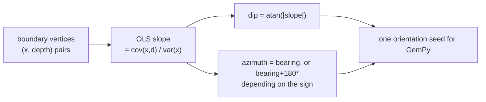

# Ordinary least squares

Fitting a straight line by minimising the sum of squared vertical distances.
How this project turns a traced boundary into the single slope that becomes a
geological dip.

## What it is

Given points `(xᵢ, yᵢ)`, find the line minimising `Σ(yᵢ − ŷᵢ)²`. Because the
objective is a smooth quadratic, the minimum has a closed form:

```
slope = Σ(xᵢ − x̄)(yᵢ − ȳ) / Σ(xᵢ − x̄)²
      = covariance(x, y) / variance(x)
```

One pass over the data, no iteration, no convergence criterion.

Squared errors rather than absolute ones is what buys the closed form —
the derivative of a square is linear, so setting it to zero gives a linear
system. The cost is that squaring weights outliers heavily.

The denominator is `n` times the variance of `x`, and it is **zero** exactly
when every point shares an x. There is then no spread to fit a slope against,
and every implementation must handle it.

## The picture



Why all the points, not just the ends:

```
vertices:   (0.0, 0.31) (0.5, 0.36) (1.0, 0.34) (1.5, 0.39) (2.0, 0.55)
                                                                  ↑
                                                     one badly placed vertex

endpoint slope:  (0.55 − 0.31) / 2.0 = 0.120    ← entirely determined by it
OLS slope:                             0.093    ← it is one of five votes
```

## Where this project uses it

### Deriving an orientation seed from one wall

`poggio_webapp/pipeline/convert_coords.py`:

```python
def least_squares_slope(xs, ds):
    """Best-fit slope (dz/dx) of depth vs. x over ALL points, not just the
    endpoints. Falls back to 0.0 if x has no spread (can't determine a slope).

    Restored from commit b01638d — this was dropped when the files were
    reorganized into numbered folders (c7ec511), silently reverting the
    orientation seeds to an endpoint-only slope."""
    n = len(xs)
    mean_x = sum(xs) / n
    mean_d = sum(ds) / n
    num = sum((x - mean_x) * (d - mean_d) for x, d in zip(xs, ds))
    den = sum((x - mean_x) ** 2 for x in xs)
    if den == 0:
        return 0.0
    return num / den
```

The docstring is a regression record. This function was **lost in a folder
reorganisation** and silently replaced by an endpoint-only slope — a change that
produced plausible numbers and quietly degraded every model built in between.
Keeping the commit hashes where the function lives means the story is available
to whoever next considers simplifying it.

The result becomes a dip and azimuth:

```python
dz_dx = least_squares_slope(xs, ds)

dip, azimuth = slope_to_orientation(
    slope=dz_dx,
    face_bearing=cfg["bearing_deg"],
)
```

and `slope_to_orientation` turns the **sign** into a direction:

```python
dip = math.degrees(math.atan(abs(slope)))

if slope >= 0:
    azimuth = face_bearing % 360.0
else:
    azimuth = (face_bearing + 180.0) % 360.0
```

Depth increases downward, so a positive depth-slope means the surface descends
along +x — it dips *toward* the face bearing. A negative slope flips it 180°.

The seed is placed on a **real traced point**, not at the fitted line's centroid:

```python
midx = xs[len(xs) // 2]
midd = ds[len(ds) // 2]
X, Y, Z = to_site(midx, midd)
```

A small but deliberate choice: the position is measured, only the orientation is
fitted.

### Measuring each wall's trace for a true-dip solve

`poggio_webapp/pipeline/true_dip.py`:

```python
def _wall_direction(points):
    """(direction, ordered points) for one wall's trace, or (None, ordered).

    The direction is (sin bearing, cos bearing, dZ/ds): one step along the wall
    moves that far horizontally and dZ/ds vertically. The slope is ordinary
    least squares over the whole trace rather than an endpoint difference, so
    one badly placed vertex cannot swing it.
    """
    ordered = sorted(points)
    n = len(ordered)
    if n < 2:
        return None, ordered

    s_values = [point[0] for point in ordered]
    z_values = [point[3] for point in ordered]
    s_mean = sum(s_values) / n
    z_mean = sum(z_values) / n
    variance = sum((s - s_mean) ** 2 for s in s_values)
    if variance == 0.0:
        return None, ordered

    slope = sum(
        (s - s_mean) * (z - z_mean) for s, z in zip(s_values, z_values)
    ) / variance
    return slope, ordered
```

Same computation, and the degenerate case returns `None` rather than `0.0` —
because here the slope feeds a [cross product](cross-product.md), and a
fabricated horizontal direction would produce a plausible wrong plane. The
caller turns it into a note:

```python
notes.append(
    f"surface {surface!r} on face {face!r} has too few "
    "distinct points along the wall to measure a slope; it "
    "was left out of the true-dip solve")
```

Two call sites, two different degenerate answers, each chosen for what consumes
it. That is the kind of detail that distinguishes a copied function from a
considered one.

## Why this and not something else

| Alternative | How it would fit | Why it lost |
|---|---|---|
| **Endpoint difference** | `(y_last − y_first) / (x_last − x_first)` | What the code accidentally regressed to, and the docstring records it. Determined entirely by two vertices, so one mis-clicked endpoint sets the whole orientation. |
| **OLS** *(chosen)* | Minimise squared vertical error | Closed form, one pass, uses every vertex, and no parameters. |
| **Total least squares (orthogonal regression)** | Minimise perpendicular distance | More symmetric — it does not privilege the y direction. Here x is the along-wall position, which is *known* accurately from calibration, while depth is the measured quantity. OLS's asymmetry matches that asymmetry in the data. |
| **[Robust regression](median-and-robust-statistics.md)** (Theil–Sen, RANSAC, Huber) | Downweight outliers | Genuinely more resistant to one badly placed vertex. Theil–Sen is O(n²) and deterministic; RANSAC is randomised, which conflicts with [determinism](determinism-and-stable-sorting.md). Boundary vertices are human-placed and reviewed, so gross outliers are rare — and the [validator](coefficient-of-variation.md) checks for them separately. |
| **Fit a curve** | Polynomial or spline | The output is a *single* dip and azimuth for GemPy's orientation seed. A curve would have to be reduced to one slope anyway, and would overshoot — see [linear interpolation](linear-interpolation.md). |
| **Weight by confidence** | Weighted least squares | Points do carry a `confidence` field, and it is a free-text note ("human-traced"), not a numeric weight. Turning prose into weights would be inventing precision. |

The comparison worth dwelling on is **total least squares**. It is the more
symmetric method, and OLS is right here for a reason specific to the data: along-wall
position comes from the [calibration](similarity-transforms.md) and is accurate,
while depth is what was traced. Minimising error in the *measured* variable is
the correct asymmetry.

## What it costs

O(n) in two passes — means, then the sums. Trivially fast on boundaries of tens
of vertices.

The costs:

- **Outlier sensitivity**, inherited from squaring. One vertex clicked 20 cm off
  moves the fit. Mitigated by human review and by the validator's separate
  checks rather than by a robust estimator.
- **`den == 0` must be handled.** Both implementations do, and differently, for
  reasons matched to their consumers.
- **A line is a model.** A real stratigraphic boundary is curved; the fitted
  slope is its best single-plane summary. That is exactly what a GemPy
  orientation seed is meant to be — a local gradient hint, not a claim that the
  layer is planar.
- **On one wall it is an *apparent* dip**, always shallower than the true dip.
  That is not a flaw in the fitting; it is a geometric fact about sections, and
  it is what [true dip](cross-product.md) exists to correct on merged trenches.

## Where else you meet it

- **Linear regression**, the foundation of applied statistics.
- **Calibration curves** in every measurement science.
- **Machine learning** — linear regression with squared loss is the entry point
  to the whole field, and the normal equations are OLS.
- **Trend lines** in every spreadsheet.
- **Surveying and geodesy**, where least squares adjustment reconciles redundant
  measurements — Gauss developed the method for exactly this.
- **Signal processing**, where matched filtering and Wiener filtering are least
  squares in disguise.

## Related pages

- [Mean and variance](mean-and-variance.md) — the ingredients.
- [Median and robust statistics](median-and-robust-statistics.md) — the robust
  alternative, and where it is used instead.
- [Cross product](cross-product.md) — what the fitted slopes feed on a merged
  trench.
- [Plane normals](plane-normals.md) — turning the result into dip and azimuth.
- [Compass bearings versus mathematical angles](compass-bearings-vs-mathematical-angles.md) —
  the azimuth convention.
