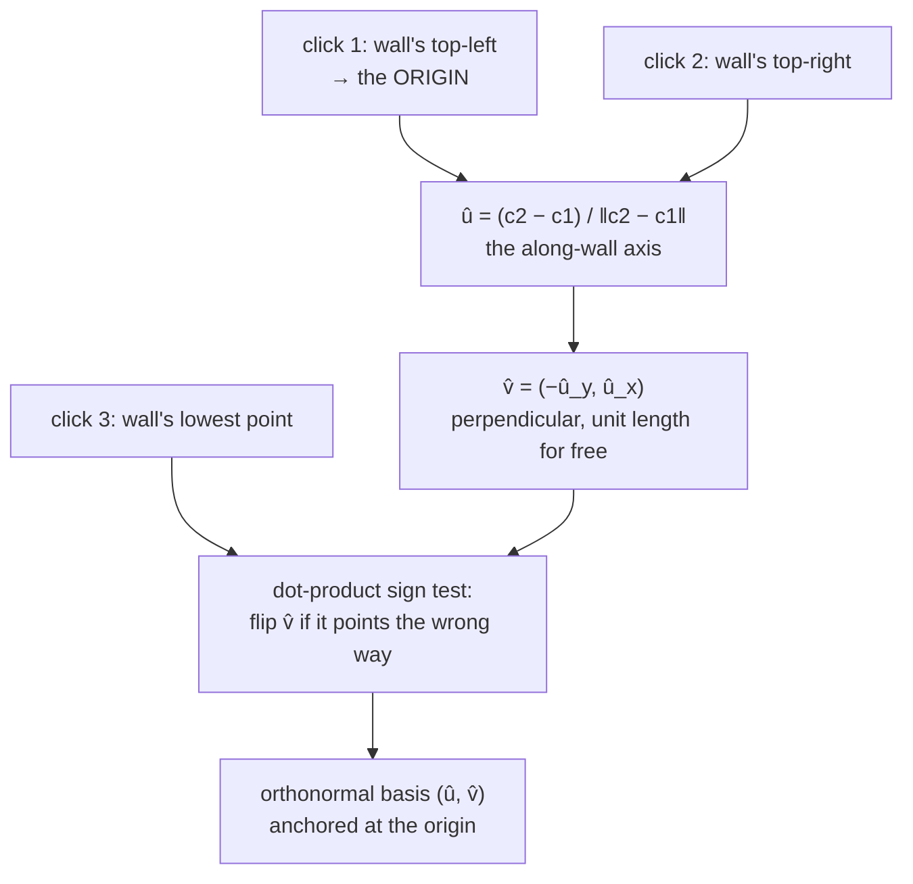

# Orthonormal bases

Two perpendicular unit vectors that define a new coordinate system. Building one
from the user's own clicks is what lets this project measure a drawing without
ever rotating the image.

## What it is

A **basis** is a set of directions that any position can be expressed in terms
of. A basis is **orthonormal** when its vectors are mutually perpendicular
(*ortho*) and each has length 1 (*normal*).

That combination has a valuable property: converting a point into the new basis
is just one [projection](vector-projection.md) per axis, with no matrix inverse
and no division.

```
new_x = (p − origin) · û
new_y = (p − origin) · v̂
```

For a general basis you would need to solve a linear system. For an orthonormal
one, the transpose *is* the inverse, and the whole conversion is two dot
products.

In 2D, building one is almost free: normalise any vector to get `û`, then rotate
it 90° to get `v̂ = (−û_y, û_x)`. Rotation preserves length, so `v̂` is a unit
vector automatically, and perpendicularity is guaranteed by construction.

## The picture



Three clicks give an origin and two axes. A fourth number (the real distance
between clicks 1 and 2) gives the scale.

## Where this project uses it

Three implementations of the same construction, in two languages.

`poggio_webapp/pipeline/manual_extraction.py`:

```python
dx, dy = rx - ox, ry - oy
pixel_span = math.hypot(dx, dy)
if pixel_span < 2:
    raise ValueError("the two top calibration points are too close together")

ux, uy = dx / pixel_span, dy / pixel_span
# One of the two perpendiculars points toward the user's lowest click.
vx, vy = -uy, ux
toward_lowest = (lx - ox) * vx + (ly - oy) * vy
if toward_lowest < 0:
    vx, vy = -vx, -vy

return Calibration(
    origin_x=ox,
    origin_y=oy,
    ux=ux,
    uy=uy,
    vx=vx,
    vy=vy,
    px_per_m=pixel_span / ref_meters,
    ref_x=rx,
    ref_y=ry,
)
```

`poggio_webapp/pipeline/detect_markers.py` builds the same thing as a frozen
dataclass, with the fields named for what they mean:

```python
@dataclass(frozen=True)
class SectionCoordinateTransform:
    """Transform image pixels into coordinates on a trench-profile plane."""

    origin_x: float
    origin_y: float

    # Unit vector running from the selected top-left point toward top-right.
    horizontal_x: float
    horizontal_y: float

    # Unit vector pointing downward on the trench profile.
    downward_x: float
    downward_y: float

    pixels_per_meter: float
```

`frozen=True` matters: a calibration is a fact about one photograph, and nothing
downstream should be able to mutate it. See
[immutability and defensive copying](immutability-and-defensive-copying.md).

`poggio_webapp/static/visualizer/coordinates.mjs` reconstructs it in the browser
from the stored calibration, so the overlay lands on the same pixels the
measurements came from:

```javascript
const u = { x: referenceX / referenceLength, y: referenceY / referenceLength };
let v = { x: -u.y, y: u.x };
const lowestX = lowest.x - origin.x;
const lowestY = lowest.y - origin.y;

if ((lowestX * v.x) + (lowestY * v.y) < 0) {
  v = { x: -v.x, y: -v.y };
}

return { origin, u, v, pxPerMeter };
```

Three copies of one construction is a duplication risk, and the repository
handles it the way duplication should be handled when it cannot be removed:
**each side's arithmetic is pinned by tests to fixed expected values**
(`tests/test_manual_routes.py` freezes the Python conversion's output and
`coordinates.test.mjs` freezes the browser's), so a drift on either side fails
its tests rather than misplacing a boundary.

## Why this and not something else

| Alternative | How it would work here | Why it lost |
|---|---|---|
| **Use the image's own axes** | Treat pixel rows as horizontal | Only correct for a perfectly level photograph. Every archival scan and every phone photo is slightly rotated. |
| **[Deskew the image](hough-line-transform.md) first** | Rotate to level, then use pixel axes | Available here, and it **resamples**, which is lossy, and it corrects only the rotation an edge detector happened to estimate. The basis corrects exactly the tilt the user's clicks define. This is why `deskew_flag=False` by default. |
| **A general (non-orthonormal) basis** | Let the two axes be any two independent directions | More general (it could absorb a shear), and the inverse becomes a matrix solve, and the guarantee that depth is measured perpendicular to the wall is lost. Perpendicularity is a *fact about the drawing*, not an approximation to relax. |
| **A full [affine transform](affine-transforms.md)** | Six parameters from three clicks | Strictly more expressive and would fit a shear or non-uniform scale, neither of which a flat drawing photographed square-on exhibits. It would also silently absorb a *bad* third click into a distortion instead of failing. |
| **A homography** | Four clicks, full perspective correction | Genuinely better for a photograph taken at an angle, where the sheet is keystoned. Costs a fourth click and is sensitive to its accuracy. A deliberate limitation. See the [drawing guidelines](../reference/drawing-guidelines.md). |
| **Orthonormal basis from three clicks** *(chosen)* | Two dot products to convert | Exact, lossless, minimal input, and the constraints it enforces are true statements about the subject. |

The principle worth extracting: **choose the least expressive transform that can
represent the truth.** A more general transform does not merely cost more: it
can absorb user error as apparent geometry, turning a mistaken click into a
distorted but self-consistent coordinate system. A rigid basis fails loudly
instead.

## What it costs

Building it: one `hypot`, two divisions, one sign test. Using it: two multiplies
and an add per axis.

The construction *guarantees* orthonormality, so no code ever verifies it,
which is the right kind of invariant, enforced by how the value is made rather
than by a check.

What it cannot represent:

- Perspective. A photograph taken at an angle keystones the sheet, and no
  rigid basis can correct that.
- Non-uniform scale. A sheet that has stretched unevenly with age.
- Lens distortion. Barrel distortion near the edges of a wide-angle phone
  photo.

All three are real, all three are unaddressed, and the honest mitigation is the
[drawing guidelines](../reference/drawing-guidelines.md) asking for a square-on
photograph.

## Where else you meet it

- 3D graphics. A camera's view matrix is an orthonormal basis: right, up,
  and forward.
- Robotics, where every joint frame is one.
- Principal component analysis, which finds an orthonormal basis aligned
  with the data's variance.
- The Fourier transform, whose sinusoids form an orthonormal basis for
  functions.
- Gram–Schmidt orthogonalisation, the general procedure for building one
  from arbitrary vectors. It is trivial in 2D, which is why this code needs only one
  rotation.

## Related pages

- [Unit vectors and normalisation](unit-vectors-and-normalisation.md): the
  "normal" half.
- [Dot product](dot-product.md): both the projection and the sign test.
- [Vector projection](vector-projection.md): what conversion actually computes.
- [Similarity transforms](similarity-transforms.md): basis plus scale plus
  origin.
- [Coordinate spaces](../concepts/coordinate-spaces.md): the spaces this moves
  between.
