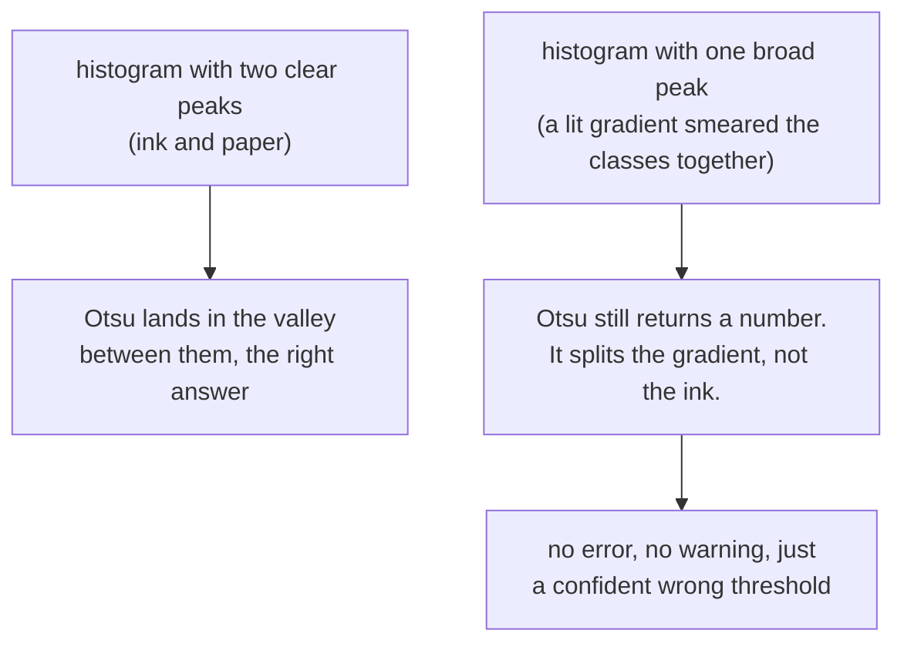

# Otsu's method

Choosing a threshold automatically by finding the value that splits the
histogram into the two most distinct groups. Considered here, and not used,
which is the interesting part.

## What it is

[Global thresholding](global-thresholding.md) needs someone to pick `T`. Otsu's
method picks it from the image itself.

Try every candidate `T` from 0 to 255. Each one splits the pixels into two
classes. For each split, compute the **between-class variance**:

```
σ²_between(T) = w₀(T) · w₁(T) · (μ₀(T) − μ₁(T))²
```

where `w` are the class proportions and `μ` the class means. Choose the `T` that
maximises it. Equivalently (and this is the intuition) it minimises the
variance *within* each class: it finds the split where each side is as
internally uniform as possible.

It runs in a single pass over the 256-bin histogram, so it is essentially free.

## The picture



That second path is the failure mode. Otsu **always** returns a threshold. It
has no way to say "these pixels do not form two groups." On an image where the
bimodality assumption is broken, it produces a plausible number that separates
the bright half of the paper from the dark half of the paper.

## Where this project uses it

Nowhere, and the record of why is in the code.

`poggio_webapp/pipeline/detect_markers.py` names the problem it needed to solve,
in its module docstring:

> **ADAPTIVE** thresholding for ink isolation (a fixed gray<130 threshold
> fragments light pencil and breaks under phone-photo lighting)

Otsu fixes the *hand-tuned constant* half of that complaint. It does not fix the
*phone-photo lighting* half at all, because it is still one threshold for the
whole image. The failure being described is spatial, and Otsu is not a spatial
method.

Both modules that binarise reach for [adaptive thresholding](adaptive-thresholding.md)
instead:

```python
# detect_markers.py
ad = cv2.adaptiveThreshold(
    gray, 255, cv2.ADAPTIVE_THRESH_MEAN_C, cv2.THRESH_BINARY_INV, block_px, C
)

# preprocess.py: high_contrast()
binimg = cv2.adaptiveThreshold(
    flat, 255, cv2.ADAPTIVE_THRESH_GAUSSIAN_C, cv2.THRESH_BINARY, blockSize=25, C=10
)
```

`preprocess.py` is the near-miss worth noticing. It calls
[background flattening](homomorphic-illumination-correction.md) first, which
removes the gradient, so by the time `high_contrast()` thresholds, the
bimodality assumption has been restored and Otsu **would** work. It still uses
adaptive, for defence in depth: flattening estimates the illumination rather
than measuring it, and a residual gradient costs nothing under a local
threshold.

## Why this and not something else

| Alternative | How it would work here | Why it lost |
|---|---|---|
| **Hand-picked constant** | `gray < 130` | The original tool's approach. Documented as breaking on real input. |
| **Otsu** | Compute `T` per image from the histogram | Removes the hand-tuning, keeps the one-`T`-per-image assumption. On a phone photo of a field sheet, that assumption is exactly what fails. |
| **[Adaptive thresholding](adaptive-thresholding.md)** *(chosen)* | A local `T` per neighbourhood | Handles the spatial variation directly. Costs a box or Gaussian filter over the image. |
| **Otsu applied per tile** | Local Otsu: Otsu on each block | A real technique (Bernsen and Sauvola are relatives) and better than both on some documents. It needs a per-tile fallback for tiles containing only paper, where "two classes" is a fiction and Otsu will confidently split noise. That is the same trap [CLAHE's clip limit](clahe.md) exists to avoid, and it needs its own tuning. |
| **[Flatten](homomorphic-illumination-correction.md) then Otsu** | Fix the image, then one `T` genuinely fits | Legitimate, and roughly what `preprocess.py` does, except it uses adaptive anyway, for the residual-gradient reason above. |

The generalisable lesson: **an automatic parameter is not the same as a robust
method.** Otsu removes a magic number, which feels like progress, while leaving
the modelling assumption that actually broke completely intact.

## What it costs

O(n) for the histogram plus O(256) for the search: the cheapest automatic
method there is, and cheaper than adaptive thresholding, which needs a filter
pass over the image.

The real cost is the silent failure. Otsu returns a number for a blank page, a
gradient, or a photograph of a table. Nothing in the interface distinguishes
"found a clean valley between two peaks" from "split a unimodal distribution
down the middle."

## Where else you meet it

- `cv2.threshold(..., cv2.THRESH_OTSU)` and ImageJ's default auto-threshold.
  It is the standard automatic choice in scientific imaging.
- Cell counting in microscopy, where fluorescence genuinely is bimodal and
  Otsu shines.
- Text binarisation for OCR on clean scans.
- k-means clustering with k = 2 on intensity is essentially the same
  objective, arrived at from a different direction.

## Related pages

- [Global thresholding](global-thresholding.md): the family this belongs to.
- [Adaptive thresholding](adaptive-thresholding.md): what this project uses
  instead, and why.
- [Homomorphic illumination correction](homomorphic-illumination-correction.md):
  the step that would have made Otsu viable.
- [Mean and variance](mean-and-variance.md): the statistic Otsu maximises.
