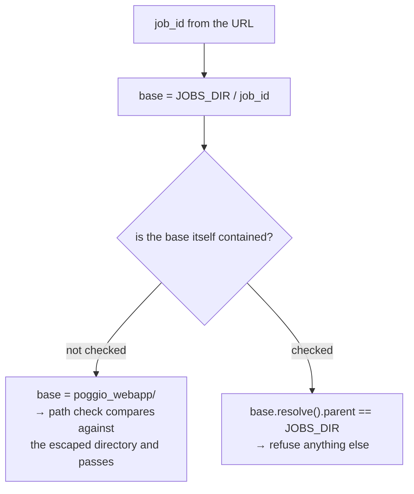

# Path traversal and containment

Using untrusted text to build a filesystem path, and the check that keeps the
result inside where it belongs. This repository had the bug, documented the fix,
applied it to one route, and missed the other — which makes it an unusually
honest case study.

## What it is

Any path built from user input can escape its intended directory:

```
base / "report.pdf"        → /jobs/abc/report.pdf        fine
base / "../../etc/passwd"  → /etc/passwd                 escaped
base / "/etc/passwd"       → /etc/passwd                 absolute overrides
```

Three defences, and they are not equivalent:

**Sanitise the input.** Strip or reject dangerous characters before joining.

**Resolve and contain.** Join, resolve symlinks and `..`, then verify the result
is inside the base.

**Validate the shape.** Require the input to match a strict pattern —
`^[0-9a-f]{12}$` — so nothing dangerous can be expressed at all.

The trap is that containment must be measured against a base that is **itself
trustworthy**. If the base was built from user input too, the check compares
against an already-escaped directory and passes.

## The picture



## Where this project uses it

### The bug, and the fix

`poggio_webapp/backend/jobs.py`:

```python
def job_dir(job_id):
    """The directory for one job, refusing any id that is not a child of it.

    The containment check is the point, not the existence check. ``job_id``
    arrives straight off the URL, and a Flask string converter rejects a slash
    but not a dot: ``/api/jobs/../file?path=storage.py`` resolved
    ``JOBS_DIR / ".."`` to ``poggio_webapp/`` and handed that to
    ``safe_job_path``, whose own containment test then compared against the
    already-escaped base and passed. Every file under the application root,
    and every other job's files, were readable through one route.

    This is the same escape ``naming.safe_filename`` documents closing for
    ``/api/trenches/<label>/file``; the fix was applied to one route and never
    generalised. Resolving first and requiring the parent to be the jobs root
    closes it for any id, including one that is nothing but dots.
    """
    d = storage.JOBS_DIR / job_id
    if d.resolve().parent != storage.JOBS_DIR.resolve() or not d.exists():
        abort(404, description="unknown job id")
    return d
```

`d.resolve().parent != storage.JOBS_DIR.resolve()` is the whole fix. A job
directory must be a **direct child** of the jobs root. `..` resolves to the
parent, whose parent is not the jobs root, so it is refused. Both sides are
resolved, so a symlinked root is compared correctly.

The second-layer check was always there and was measuring the wrong thing:

```python
def safe_job_path(job_id, rel_path):
    """Resolve rel_path under the job dir, refusing to escape it."""
    base = job_dir(job_id).resolve()
    target = (base / rel_path).resolve()
    if base not in target.parents and target != base:
        abort(400, description="invalid path")
    return target
```

Correct code, given a trustworthy `base`. The lesson is that
**a containment check is only as good as its base.**

### The same escape, documented years earlier

`poggio_webapp/naming.py`:

```python
def safe_filename(name, fallback="untitled"):
    """A filesystem-safe path component built from an arbitrary label.
    ...
    The dot case is not hypothetical. Dot is a legal filename character, so the
    substitution above passes ``".."`` through untouched, and the callers join
    the result onto a storage root. A trench labelled ``".."`` resolved one
    level up and made every file under poggio_webapp/ readable through
    /api/trenches/<label>/file, whose containment check then compared against
    the escaped directory. Names like ``"T104.2"`` are unaffected — only a
    component that is *nothing but* dots is rejected.
    """
    cleaned = _UNSAFE.sub("_", str(name)).strip("_")
    if not cleaned or set(cleaned) <= {"."}:
        return fallback
    return cleaned
```

The identical failure, on the trenches route, already found and fixed. The
generalisable observation: **when you fix a class of bug, search for the class,
not the instance.**

The trenches route consumes it:

```python
base = trench_dir(label).resolve()
target = (base / rel).resolve()
if base not in target.parents and target != base:
    abort(400, description="invalid path")
```

with `trench_dir` running the label through `safe_filename` first.

### Validate the shape, before touching disk

`poggio_webapp/backend/harris_store.py` uses the third defence:

```python
_MATRIX_ID = re.compile(r"[0-9a-f]{12}")


def _validate_matrix_id(matrix_id: str) -> str:
    if not isinstance(matrix_id, str) or _MATRIX_ID.fullmatch(matrix_id) is None:
        raise InvalidMatrixIdError(
            "Matrix ID must be exactly 12 lowercase hexadecimal characters."
        )
    return matrix_id
```

`fullmatch`, not `match` — `match` anchors only at the start, so
`abc123abc123../../etc` would pass. And the validation runs **before** any path
is built. `harris_import._validate_job_id` is identical.

This is the strongest of the three defences: a traversal cannot be *expressed*,
so no containment check is needed at all.

### Defence in depth for manifest artifacts

`poggio_webapp/backend/services/viewer_files.py`:

```python
def _resolve_manifest_artifact(manifest_directory, job_directory, path_str):
    if not isinstance(path_str, str) or not path_str:
        return None
    relative = Path(path_str)
    if relative.is_absolute() or ".." in relative.parts:
        return None
    candidate = (manifest_directory / relative).resolve()
    if not _is_within(candidate, job_directory) or not candidate.is_file():
        return None
    return candidate
```

Reject absolute paths, reject `..` segments, **then** resolve and check
containment. Belt and braces — and it is applied to a file this application
itself wrote, because a file on disk can be edited.

## Why this and not something else

| Alternative | How it would block `job_id = ".."` | Why it lost — or won |
|---|---|---|
| **`os.path.join` and hope** | Nothing | The bug. |
| **String checks for `".."`** | Reject the substring | Defeated by encodings, by `....//`, and by symlinks. Never the primary defence — used here only as a cheap early reject. |
| **`werkzeug.secure_filename`** | Strip dangerous characters | Right for an uploaded *filename*, and it mangles legitimate identifiers, so it is used at the [upload boundary](input-sanitisation.md) rather than for path components derived from IDs. |
| **Resolve and require containment** *(chosen for job_dir)* | `resolve().parent == root` | Handles `..`, symlinks, and encodings, because it compares the *resolved* result. |
| **Strict pattern validation** *(chosen for matrix and job IDs)* | `fullmatch(r"[0-9a-f]{12}")` | The strongest available: nothing dangerous is expressible. Needs the identifier to have a fixed known shape. |
| **Serve files from a database or a whitelist** | No filesystem paths at all | Eliminates the class, and gives up a job directory that a person can open and inspect — an archival requirement here. |

The instructive part is not which defence is best. It is that this repository
**had already written down the right answer** in `naming.py`, applied it to one
route, and left the other. The generalisable rule is the one now in
`job_dir`'s docstring: *"the fix was applied to one route and never
generalised."*

## What it costs

Two `resolve()` calls per request — filesystem syscalls, microseconds.

The costs:

- **`resolve()` touches the filesystem** and follows symlinks. Necessary: a
  purely lexical check would miss a symlinked escape.
- **Strict validation can reject legitimate input.** A 12-hex-character pattern
  is only viable because every ID in this system has that shape by construction.
- **It must be applied at every entry point.** That is precisely what went wrong
  — one route had it, one did not.
- **A containment check is only as good as its base**, which is the whole lesson
  of this page.

Regression tests now pin it, in `tests/test_job_path_containment.py`, including
the symlinked-root case.

## Where else you meet it

- **CWE-22**, "Improper Limitation of a Pathname to a Restricted Directory" — one
  of the most common web vulnerabilities.
- **Zip Slip**, where an archive entry named `../../` escapes on extraction.
- **Static file servers**, where this is the first thing to get right.
- **Container escapes**, the same idea one layer down.
- **Template engines and include directives**, where a path from user input
  selects a file to execute.

## Related pages

- [Input sanitisation](input-sanitisation.md) — the upload-side defence.
- [Regular expressions](regular-expressions.md) — `fullmatch` versus `match`.
- [Validation at trust boundaries](validation-at-trust-boundaries.md) — where
  these checks belong.
- [Dependency direction and leaf modules](dependency-direction-and-leaf-modules.md) —
  why `naming.py` exists.
- [Codebase review](../architecture/code-review.md) — the finding and its
  resolution.
