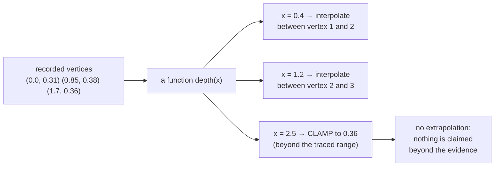

# Piecewise-linear functions

A boundary is not a curve — it is a sequence of straight segments. Treating it
as a *function* of position along the wall is what lets two independently traced
boundaries be compared at all.

## What it is

A piecewise-linear function is defined by a list of breakpoints, with
[linear interpolation](linear-interpolation.md) between consecutive pairs. It is
continuous, has corners at the breakpoints, and is fully described by the points
themselves — no coefficients, no fitting.

Three practical questions any implementation must answer:

1. **Which segment brackets this x?** A scan or a binary search.
2. **What happens outside the recorded range?** Clamp, extrapolate, or refuse.
3. **What about a vertical segment**, where two points share an x?

The answer to (2) is the one that carries meaning. **Clamping** says "beyond the
recorded range, assume the last known value" — a conservative claim.
**Extrapolating** says "the trend continues" — a claim about ground that was
never observed.

This project clamps, everywhere.

## The picture



Why the function view is necessary:

```
top boundary     ●─────●───────●──────●          x = 0.0, 0.6, 1.4, 2.2
bottom boundary    ●──────●─────────●            x = 0.3, 1.1, 1.9

no shared x stations at all — the two cannot be compared
point-by-point. Evaluating one AS A FUNCTION at the other's
x values is the only way to ask "does this cross that?"
```

## Where this project uses it

### Detecting layers that cross

`poggio_webapp/pipeline/validator.py`:

```python
def depth_at_x(boundary_pairs, x):
    if not boundary_pairs:
        return None
    pts = sorted(boundary_pairs)
    if x <= pts[0][0]:
        return pts[0][1]
    if x >= pts[-1][0]:
        return pts[-1][1]
    for (x0, y0), (x1, y1) in zip(pts, pts[1:]):
        if x0 <= x <= x1:
            if x1 == x0:
                return y0
            t = (x - x0) / (x1 - x0)
            return y0 + t * (y1 - y0)
    return None
```

All three questions answered: `sorted()` for bracketing, the two early returns
for clamping, and `x1 == x0` for the vertical case.

Used to enforce the one rule that is physically impossible to violate:

```python
if prev_bottom and bottom:
    for x, y in bottom:
        above = depth_at_x(prev_bottom, x)
        if above is not None and y < above - monotonic_tolerance_m:
            report.err(
                where,
                f"bottom at x={x} (depth {y:.2f}) is ABOVE "
                f"{prev_name}'s bottom (depth {above:.2f}) — layers cross",
            )
```

An **error**, not a warning — layers cannot cross. Compare the adjacent check on
tops, which is only a warning:

```python
if above is not None and abs(y - above) > top_continuity_tolerance_m:
    report.warn(
        where,
        f"top at x={x} (depth {y:.2f}) is far from "
        f"{prev_name} bottom (depth {above:.2f}) — "
        f"possible void/overlap",
    )
```

A gap between one layer's bottom and the next's top can be real — a void, or a
recording gap. Crossing cannot. The severity distinction is the archaeology
speaking through the code. See [error taxonomies](error-taxonomies.md).

### Assigning a feature to its layer

`poggio_webapp/pipeline/manual_extraction.py`:

```python
def _depth_at_x(points, x):
    rows = sorted((_xy(p) for p in points), key=lambda p: p[0])
    if x <= rows[0][0]:
        return rows[0][1]
    if x >= rows[-1][0]:
        return rows[-1][1]
    for (x1, y1), (x2, y2) in zip(rows, rows[1:]):
        if x1 <= x <= x2:
            if abs(x2 - x1) < 1e-9:
                return (y1 + y2) / 2
            t = (x - x1) / (x2 - x1)
            return y1 + t * (y2 - y1)
    return rows[-1][1]
```

Same structure, two deliberate differences: a **tolerance-based** vertical check
rather than exact equality, and a **midpoint** rather than the first value. The
inputs justify both — this path handles floats freshly produced by
[calibration](similarity-transforms.md), where exact equality is unlikely even
for a genuinely vertical segment.

The caller compares a feature's centre against both bounding boundaries:

```python
top_depth = _depth_at_x(top, x)
bottom_depth = _depth_at_x(bottom, x)
low, high = sorted((top_depth, bottom_depth))
if low - 0.02 <= depth <= high + 0.02:
    chosen = i
    break
```

`sorted((top_depth, bottom_depth))` rather than assuming top < bottom — a small
robustness against a mis-ordered pair. See
[point in polygon](point-in-polygon.md) for why this depth-band approach is used
rather than containment.

## Why this and not something else

| Alternative | What it would model | Why it lost |
|---|---|---|
| **Compare only at shared x values** | No function view at all | There usually are none. Two boundaries traced independently share almost no x stations, so this answers almost nothing. |
| **Resample both to a common grid** | Interpolate both at fixed intervals | Works, and replaces recorded vertices with synthetic ones, and introduces a grid spacing that has to be chosen. Evaluating one function at the other's real points uses only recorded positions. |
| **Fit a smooth curve** ([spline](linear-interpolation.md)) | A differentiable boundary | Overshoots, claiming excursions nobody recorded — the opposite of what a [fabrication-detecting](coefficient-of-variation.md) validator should do. |
| **Fit a polynomial or a regression line** | A trend | Discards the actual shape. A boundary is not a trend; its wiggles are the data. |
| **Extrapolate beyond the range** | A continuing trend | The tempting default, and it invents boundary where none was traced. Clamping asserts only "we last saw it here." |
| **Piecewise-linear with clamping** *(chosen)* | Exactly the recorded polyline | Uses only recorded vertices, claims nothing beyond them, identical in both implementations. |

The epistemic point is the same one that runs through
[linear interpolation](linear-interpolation.md): a boundary is a set of marks
and the lines a recorder drew between them. A piecewise-linear function *is*
that drawing, expressed as something computable. Any smoother or more extensive
model is a claim the evidence does not carry.

Clamping in particular is worth noticing. It is the difference between "beyond
2.2 m we have no record, so assume the last observation holds" and "beyond
2.2 m the boundary continues descending at 3°." The second sounds more
sophisticated and is unfounded.

## What it costs

O(n) per evaluation by linear scan; O(log n) with a binary search. Boundaries
have tens of vertices, so the scan is fine and simpler.

Both implementations **sort on every call**, which is O(n log n) and defensive
rather than necessary — the callers generally supply sorted points. It is cheap
insurance against a caller that does not, and against the
[validator's own warning](../reference/validation-rules.md) about x-coordinates
not running left to right.

The real costs:

- **Not differentiable at breakpoints.** Irrelevant here; nothing takes a
  derivative of a boundary. Slopes are fitted globally by
  [least squares](ordinary-least-squares.md) instead.
- **Clamping is a modelling choice**, and could be wrong for a boundary that
  genuinely continues past the sheet edge. It is the conservative wrong, which is
  the right kind.
- **The function view assumes single-valuedness** — one depth per x. A genuinely
  overhanging boundary, such as an undercut, cannot be represented at all. That
  is a real limitation of the whole data model, not just of this function.

## Where else you meet it

- **Every line chart** you have looked at joins its data points this way.
- **Terrain models**, where a triangulated irregular network is the 2D
  generalisation.
- **Audio envelopes** — attack, decay, sustain, release are piecewise-linear.
- **Tax brackets and tariff schedules**, which are piecewise-linear functions of
  income.
- **Optimisation**, where piecewise-linear approximation turns a non-linear
  program into a linear one.
- **Sensor calibration curves**, interpolating between reference measurements.

## Related pages

- [Linear interpolation](linear-interpolation.md) — the per-segment operation.
- [Point in polygon](point-in-polygon.md) — the containment question this
  replaces.
- [Ordinary least squares](ordinary-least-squares.md) — how a boundary's overall
  slope is measured instead.
- [Validation rules](../reference/validation-rules.md) — the errors and warnings
  this produces.
- [Layers and boundaries](../concepts/layers-and-boundaries.md) — the
  archaeological concept.
