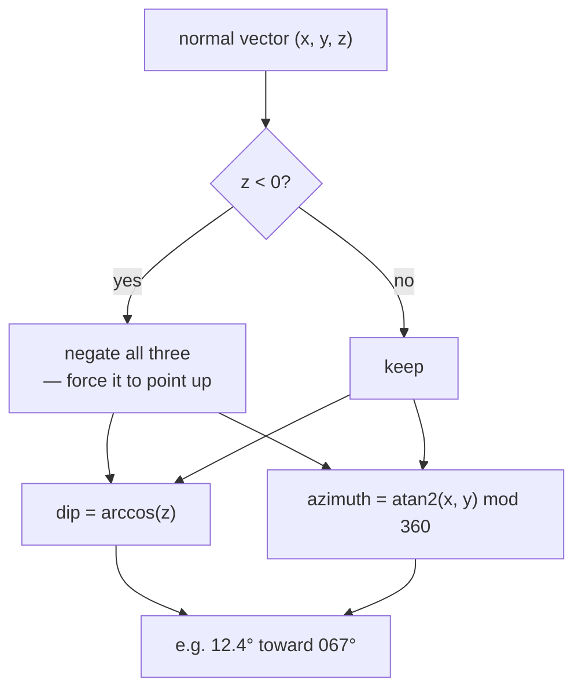

# Plane normals

A plane's orientation described by the single direction perpendicular to it —
and how that direction is converted into the dip and azimuth a geologist writes
down.

## What it is

A plane in 3D can be described by the vector perpendicular to it, its **normal**.
Any plane parallel to it has the same normal, so the normal captures orientation
and nothing else.

Two planes with the same normal are parallel. Two normals at angle θ belong to
planes at angle θ. All of a plane's orientation is in one vector.

For a geological surface, orientation is conventionally written as two angles:

- **Dip** — how steeply it tilts, 0° for horizontal, 90° for vertical.
- **Dip azimuth** — the compass bearing of the downhill direction.

Both come from the normal. For a normal `(x, y, z)` normalised and pointing
**upward**:

```
dip     = arccos(z)
azimuth = atan2(x, y)        note: (x, y), not (y, x)
```

`arccos(z)` works because a horizontal plane has normal `(0, 0, 1)` and
`arccos(1) = 0`; a vertical plane has `z = 0` and `arccos(0) = 90°`.

The azimuth uses `atan2(x, y)` because a compass bearing is measured **clockwise
from north**, whereas the mathematical convention is counter-clockwise from
east. Swapping the arguments performs that conversion. See
[compass bearings versus mathematical angles](compass-bearings-vs-mathematical-angles.md).

## The picture



```
horizontal bed   normal (0, 0, 1)        dip 0°
gentle east dip  normal (0.2, 0, 0.98)   dip 11.5°, azimuth 090°
vertical wall    normal (1, 0, 0)        dip 90°, azimuth 090°
```

## Where this project uses it

`poggio_webapp/pipeline/true_dip.py`, converting the
[cross product](cross-product.md) of two wall directions into a geological
orientation:

```python
def _dip_from_normal(normal):
    """(dip_degrees, azimuth_degrees) for a plane normal, pointing upward.

    For an upward normal the downhill horizontal direction is (n_x, n_y), and a
    compass bearing is atan2(east, north) -- not the mathematical atan2(y, x).
    """
    length = math.sqrt(sum(component ** 2 for component in normal))
    if length == 0.0:
        return None
    x, y, z = (component / length for component in normal)
    if z < 0:
        x, y, z = -x, -y, -z

    dip = math.degrees(math.acos(max(-1.0, min(1.0, z))))
    if math.hypot(x, y) == 0.0:
        # Perfectly flat: the dip direction is undefined, and the sign flip
        # above can leave negative zeros that atan2 would read as due south.
        return dip, 0.0
    # Near-flat surfaces keep their solved azimuth on purpose. Rounding it to
    # zero would not remove the orientation's pull on the model, it would aim
    # that same pull north. A surface too flat to trust has to be dropped, not
    # flattened -- and near-horizontal layers are the normal case here.
    return dip, math.degrees(math.atan2(x, y)) % 360.0
```

Five guards, each protecting a specific failure:

**`length == 0.0` → `None`.** A zero normal means the two wall directions were
parallel and the [cross product](cross-product.md) degenerated. The caller
already screens for this with the 10° separation threshold; this is the second
line of defence.

**`if z < 0: negate`.** `a × b = −(b × a)`, so the normal's sign depends on the
order the walls were paired in. Forcing it upward makes the answer independent
of that.

**`max(-1.0, min(1.0, z))` before `acos`.** After normalisation `z` should lie
in `[−1, 1]`, and floating-point rounding can produce `1.0000000000000002`,
which makes `math.acos` raise `ValueError`. The clamp is not paranoia; it is a
known consequence of [floating-point](floating-point-representation.md)
arithmetic.

**The negative-zero case.** After the sign flip, `x` and `y` can be `-0.0`, and
`atan2(-0.0, -0.0)` returns π — due south. A perfectly flat surface would be
reported as dipping south rather than as having no dip direction. Returning
`0.0` explicitly avoids a fabricated bearing.

**Near-flat surfaces keep their solved azimuth**, and the comment explains why
the seemingly tidier alternative is worse: zeroing a near-flat azimuth would not
remove the orientation's influence on the model, it would aim that influence
north. Since near-horizontal layers are the *normal* case in archaeological
stratigraphy, that would bias almost every model.

The single-wall path in `convert_coords.py` cannot use a normal at all — one
wall does not determine a plane — so it derives an apparent dip directly from
the slope:

```python
dip = math.degrees(math.atan(abs(slope)))

if slope >= 0:
    azimuth = face_bearing % 360.0
else:
    azimuth = (face_bearing + 180.0) % 360.0
```

## Why this and not something else

| Alternative | How it would represent orientation | Why it lost |
|---|---|---|
| **Strike and dip** | Strike is the horizontal line in the plane, dip is perpendicular to it | The traditional field notation, and it is ambiguous without a convention (right-hand rule, or a separate dip direction letter). GemPy wants dip and dip azimuth, so this is what the CSV must carry. |
| **Two apparent dips** | Report each wall's own measurement | What the pipeline does when it *cannot* solve — and it is known to be wrong in a systematic way: apparent dip is always shallower than true dip, and two of them disagree. |
| **A rotation matrix or quaternion** | Full orientation as 9 or 4 numbers | Over-specified. A plane has no notion of rotation *about* its normal, so those extra degrees of freedom are meaningless here. |
| **Plane equation coefficients** `ax + by + cz = d` | Keep the algebraic form | `(a, b, c)` *is* the normal, and `d` is position, which orientation does not need. This is the same thing plus an unused number. |
| **Normal → dip and azimuth** *(chosen)* | Two angles from three numbers | Matches what GemPy consumes and what a geologist writes on a field sheet. |

## What it costs

One square root, one `acos`, one `atan2`. Negligible.

The costs are all in edge cases, and the function handles four of them
explicitly. That density of guards in fifteen lines is not over-engineering: each
one corresponds to a real input — parallel walls, reversed pairing order,
floating-point overshoot, a perfectly flat surface — and each would otherwise
produce a plausible wrong number rather than an error.

The deeper limitation is that a normal describes a **plane**, not a surface. A
real stratigraphic boundary is curved, so the solved orientation is the best
single-plane summary of it. That is exactly what GemPy's orientation seeds are
meant to be — a local gradient hint, not a claim that the layer is flat.

## Where else you meet it

- **3D graphics.** Every lit surface has a normal; smooth shading interpolates
  them across a triangle.
- **Structural geology and mining**, where dip and dip azimuth are the standard
  notation for every measured plane.
- **Collision detection**, where a contact normal determines the response
  direction.
- **CAD and manufacturing**, where face normals define which side is material.
- **Ray tracing**, where reflection is computed by mirroring a ray about the
  normal.

## Related pages

- [Cross product](cross-product.md) — how the normal is obtained.
- [Compass bearings versus mathematical angles](compass-bearings-vs-mathematical-angles.md) —
  why `atan2(x, y)`.
- [Floating-point representation](floating-point-representation.md) — why the
  `acos` argument is clamped.
- [Ordinary least squares](ordinary-least-squares.md) — how each wall's slope is
  measured.
- [Apparent and true dip](../archaeology/index.md) — the archaeological meaning.
