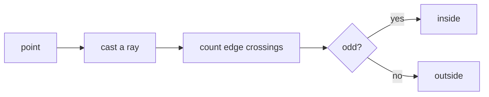

# Point in polygon

Deciding whether a point lies inside a closed shape. The obvious way to assign a
drawn feature to the layer that contains it — and deliberately not the way this
project does it.

## What it is

Two standard algorithms.

**Ray casting.** Shoot a ray from the point in any direction and count how many
polygon edges it crosses. Odd means inside, even means outside. O(n) in edge
count, and it needs care when the ray passes exactly through a vertex.

**Winding number.** Sum the signed angles subtended by each edge as seen from
the point. Zero means outside; non-zero means inside. More robust for
self-intersecting polygons, and it distinguishes regions that ray casting
conflates.

The two disagree on self-intersecting shapes, which is exactly why SVG offers
`even-odd` and `nonzero` as separate fill rules.

## The picture



```
      ┌──────────┐
      │          │
 ●────┼──→       │      one crossing → inside
      │          │
 ●────┼──────────┼──→   two crossings → outside
      └──────────┘
```

## Where this project uses it

Nowhere — and the reason is archaeological rather than computational.

The question that looks like it needs this is: **which layer does this feature
belong to?** A stone is drawn inside a band; the band is a
[locus](../archaeology/locus.md); the stone should be recorded in that locus's
`featuresInLayer`.

`poggio_webapp/pipeline/manual_extraction.py` answers it by **depth band**
instead:

```python
def _assign_features(feature_rows, layer_bands):
    assigned = [[] for _ in layer_bands]
    for feature in feature_rows:
        x = feature["approxXMeters"]
        depth = feature.pop("center_depth")
        chosen = None
        best_distance = float("inf")
        for i, (top, bottom) in enumerate(layer_bands):
            top_depth = _depth_at_x(top, x)
            bottom_depth = _depth_at_x(bottom, x)
            low, high = sorted((top_depth, bottom_depth))
            if low - 0.02 <= depth <= high + 0.02:
                chosen = i
                break
            distance = min(abs(depth - low), abs(depth - high))
            if distance < best_distance:
                best_distance = distance
                chosen = i
        if chosen is not None:
            assigned[chosen].append(feature)
    return assigned
```

The feature's centre is compared against the layer's top and bottom boundaries
**evaluated at that x**, by
[piecewise-linear interpolation](piecewise-linear-functions.md). If it falls
between them — within a 2 cm tolerance — it belongs to that layer. If it falls
between none, the *nearest* layer takes it.

Two properties this has that a containment test does not:

**A layer is not a polygon.** It is the region between two
[boundaries](../archaeology/index.md) that may not span the same x range, may be
open at the sheet edges, and are recorded as separate polylines. Turning them
into a closed polygon to test containment would mean *inventing* the closing
edges — a fabrication, in a pipeline that separately hunts for
[fabricated geometry](fabrication-detection.md).

**Every feature must land somewhere.** A stone traced slightly outside a band —
because the recorder's pen wandered, or because the boundary was traced a
millimetre high — must still be recorded. Ray casting returns a hard boolean and
would drop it. The nearest-band fallback cannot.

The 2 cm tolerance is the same acknowledgement in numeric form: hand-drawn
boundaries and hand-drawn features do not agree to the millimetre.

`detect_features.py` does not use containment either. Its
[deduplication](non-maximum-suppression.md) is
[IoU](intersection-over-union.md) on [bounding boxes](bounding-boxes.md), and
[contour hierarchy](contour-hierarchy.md) — which *would* give true nesting — is
explicitly discarded, for reasons set out on that page.

## Why this and not something else

| Alternative | How it would work here | Why it lost |
|---|---|---|
| **Ray casting on a closed layer polygon** | Build a polygon from top boundary + reversed bottom boundary, test the feature's centre | Requires inventing the closing edges at each end, where the layer runs off the sheet. Those invented edges then decide real assignments. |
| **[Contour hierarchy](contour-hierarchy.md)** | Use OpenCV's parent/child links | Gives containment in the **drawing**, which is not the same as containment in the **stratigraphy** — see that page. Also unavailable in the manual tracing path, which has no contours. |
| **Winding number** | More robust variant | Same objection: it still needs a closed polygon. |
| **Depth-band comparison** *(chosen)* | Interpolate both boundaries at the feature's x, compare | Uses only recorded geometry, needs no invented edges, and degrades to "nearest layer" rather than to "no layer". |
| **Ask the user** | Have the reviewer assign each feature | Already possible — the assignment is visible in the review interface and editable. The automatic pass is a default, not a verdict. |

The generalisable point: **the geometric question and the domain question are
not the same question.** "Is this point inside this polygon?" is well defined and
answerable. "Which stratigraphic unit does this stone belong to?" is what is
actually being asked, and the recorded evidence is two boundary polylines, not a
polygon. Answering the domain question directly avoids manufacturing the
geometry the other question would require.

## What it costs

The chosen approach is O(layers) per feature, with an O(log n) or O(n) boundary
interpolation each — cheaper than ray casting over a closed polygon, and it does
less work because the layer geometry is already in the form it needs.

Its limitations are real and bounded:

- **It uses the feature's centre only.** A large stone straddling a boundary is
  assigned by its midpoint. Visible to a reviewer looking at the drawing.
- **[Greedy first match](greedy-algorithms.md).** Where bands overlap within
  tolerance, the first containing layer wins rather than the best-fitting one.
- **The 2 cm tolerance is a fixed constant**, not derived from the drawing's
  scale.

All three are acceptable because a person reviews the result with the drawing in
front of them.

## Where else you meet it

- **GIS.** "Which county is this coordinate in?" is the canonical spatial join,
  and `ST_Contains` is ray casting.
- **Hit testing** in every user interface — deciding which shape you clicked.
- **Game engines**, for trigger volumes and area-of-effect.
- **Computer graphics**, where scanline rasterisation of a polygon is ray
  casting done per row.
- **Geofencing**, deciding whether a device has entered a region.

## Related pages

- [Piecewise-linear functions](piecewise-linear-functions.md) — how a boundary
  is evaluated at an arbitrary x.
- [Line segment intersection](line-segment-intersection.md) — the primitive ray
  casting would use.
- [Contour hierarchy](contour-hierarchy.md) — the other containment answer, also
  declined.
- [Signed area and the orientation test](signed-area-and-orientation-test.md) —
  the primitive beneath winding number.
- [Markers, features, and finds](../concepts/markers-features-and-finds.md) —
  the domain distinctions at stake.
