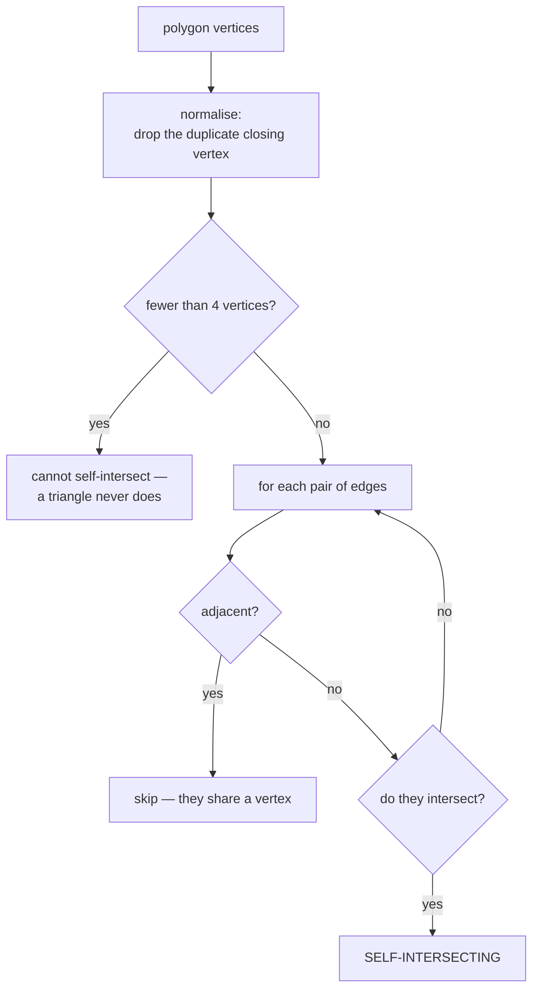

# Polygon self-intersection

Detecting a polygon that crosses itself. A shape that does is not a shape — its
area is meaningless and its interior is undefined — so this check gates every
polygon this project accepts.

## What it is

A polygon is **simple** when no two of its edges cross, except where adjacent
edges meet at their shared vertex. A polygon that crosses itself — a figure
eight, a bow tie, a badly closed outline — is **not simple**.

Why that matters beyond tidiness:

- **[Area](shoelace-formula.md) is meaningless.** The shoelace formula's
  overlapping lobes cancel, producing a number with no interpretation.
- **"Inside" is undefined.** Different fill rules (even-odd, non-zero winding)
  give different answers about which regions are interior.
- **Rendering is undefined.** Two SVG renderers can legitimately fill it
  differently.
- **Archaeologically it is nonsense.** A layer boundary that crosses itself
  describes a deposit occupying two places at once.

The brute-force detection is to test every pair of non-adjacent edges for
[intersection](line-segment-intersection.md). Adjacent pairs must be skipped —
they share a vertex by construction, and would report an intersection there.

## The picture



```
simple                   self-intersecting (bow tie)
┌─────┐                  ┌─────┐
│     │                   ╲   ╱
│     │                    ╲ ╱
└─────┘                     ╳
                           ╱ ╲
                          └───┘
```

## Where this project uses it

### Blocking finalization of a drawn face

`poggio_webapp/pipeline/editor/geometry.py`:

```python
def _polygon_self_intersects(vertices: list[dict]) -> bool:
    points = [_point_coordinates(vertex) for vertex in vertices]
    if any(point is None for point in points):
        return False
    if len(points) > 1 and points[0] == points[-1]:
        points.pop()
    if len(points) < 4:
        return False

    for first_edge in range(len(points)):
        first_edge_end = (first_edge + 1) % len(points)
        for second_edge in range(first_edge + 1, len(points)):
            second_edge_end = (second_edge + 1) % len(points)
            edges_are_adjacent = (
                first_edge_end == second_edge or second_edge_end == first_edge
            )
            if edges_are_adjacent:
                continue
            if _segments_intersect(
                points[first_edge],
                points[first_edge_end],
                points[second_edge],
                points[second_edge_end],
            ):
                return True

    return False
```

Three preconditions handled before the loop:

**Non-finite coordinates return `False`.** Not because a polygon with `NaN`
vertices is fine, but because that is a *different* error with its own message —
`_point_coordinates` already rejects non-finite values, and
[the caller reports it separately](../reference/validation-rules.md). One check,
one failure mode.

**The duplicate closing vertex is dropped.** Drawing tools commonly repeat the
first point at the end. Left in place, the final zero-length edge would produce
spurious results.

**Fewer than four vertices cannot self-intersect.** A triangle's three edges are
all mutually adjacent.

The caller, `poggio_webapp/pipeline/editor/validation.py`, turns it into a named
refusal:

```python
if _polygon_self_intersects(vertices):
    raise SelfIntersectingPolygonError(
        f'Face "{face_name}" polygon {polygon_id} self-intersects.'
    )
```

One error class per rule, so the message lives with the rule — see
[error taxonomies](error-taxonomies.md).

### Rejecting a degenerate layer fill in the browser

`poggio_webapp/static/visualizer/layer-fill.mjs`:

```javascript
if (
  polygon.length < 3
  || polygonArea(polygon) <= EPSILON
  || selfIntersects(polygon)
) {
  return null;
}
```

Here the polygon is *constructed* — the top boundary joined to the reversed
bottom boundary — so self-intersection means the two traced boundaries cross
each other. That happens when layers are recorded in the wrong order or a
boundary was mis-traced.

Returning `null` means the layer is not filled. The viewer shows the boundary
lines without a shaded band, which is visibly different from a wrong fill. See
[fail-closed design](fail-closed-design.md).

### Blocking a bad drawing in the canvas editor

`poggio_webapp/static/canvas/grid.mjs` carries the third copy, so the user is
told while drawing rather than at finalization.

## Why this and not something else

| Alternative | How it would work | Why it lost |
|---|---|---|
| **Do not check** | Accept whatever is drawn | The failure is silent and downstream: a meaningless area, an ambiguous fill, and a stratigraphic claim that cannot be true. Better to refuse at the point of drawing. |
| **Bentley–Ottmann sweep line** | O((n + k) log n) plane sweep | Asymptotically far better and the right choice at thousands of vertices. It is substantially more code, needs a priority queue and careful degenerate handling, and would be duplicated in Python and JavaScript. Hand-drawn polygons have tens of vertices, where O(n²) is dozens of comparisons. |
| **A geometry library (Shapely / JTS)** | `polygon.is_valid` | Robust and well-tested, and a heavyweight dependency — impossible in the browser without a build step, which this project deliberately does not have. |
| **Check only on save** | Validate at finalization | Done, and the canvas editor also checks *while drawing*, so a mistake is caught before the user has moved on. |
| **Repair automatically** | Split the polygon at crossings, keep the largest piece | Silently changes what the archaeologist drew. This repository's convention is to report rather than guess — see [codebase review](../architecture/code-review.md). |
| **Brute-force pairwise** *(chosen)* | O(n²) [segment intersection](line-segment-intersection.md) tests | Simple enough to be obviously correct, identical in two languages, no dependency, fast enough at this scale. |

The judgement about repair is the interesting one. An automatic fix would be
convenient and would substitute the software's interpretation for the
recorder's. A refusal with a specific message returns the decision to the person
who drew it.

## What it costs

O(n²) [intersection tests](line-segment-intersection.md), each O(1). For a
40-vertex polygon that is about 740 pairs — microseconds.

It becomes a problem at hundreds of vertices. Nothing here reaches that: editor
polygons are hand-drawn, and
[Ramer–Douglas–Peucker](ramer-douglas-peucker.md) caps detected feature outlines
at 80 points before storage.

The subtle costs are in the definition:

- **Adjacent edges must be skipped**, or every polygon reports as
  self-intersecting.
- **Collinear overlap** — two edges lying along the same line — is genuinely a
  self-intersection and is caught only by the collinear branch of the
  intersection test.
- **Tolerance policy differs by input.** The Python is exact; the JavaScript uses
  an epsilon because its coordinates have been through
  [interpolation](linear-interpolation.md). Both are right for their inputs.

## Where else you meet it

- **GIS validation.** `ST_IsValid` in PostGIS; "self-intersection" is the single
  most common reason a shapefile is rejected.
- **3D printing**, where a self-intersecting cross-section cannot be sliced into
  a fillable region.
- **SVG and font rendering**, where fill rules exist precisely because
  self-intersecting paths are ambiguous.
- **CAD**, validating a profile before extrusion or revolution.
- **Game level editors**, validating collision meshes.

## Related pages

- [Line segment intersection](line-segment-intersection.md) — the inner test.
- [Signed area and the orientation test](signed-area-and-orientation-test.md) —
  the primitive beneath it.
- [Shoelace formula](shoelace-formula.md) — the measure this precondition
  protects.
- [Validation rules](../reference/validation-rules.md) — the message a user
  sees.
- [Trace the layers](../workflows/03-trace-layers.md) — the workflow where it
  fires.
