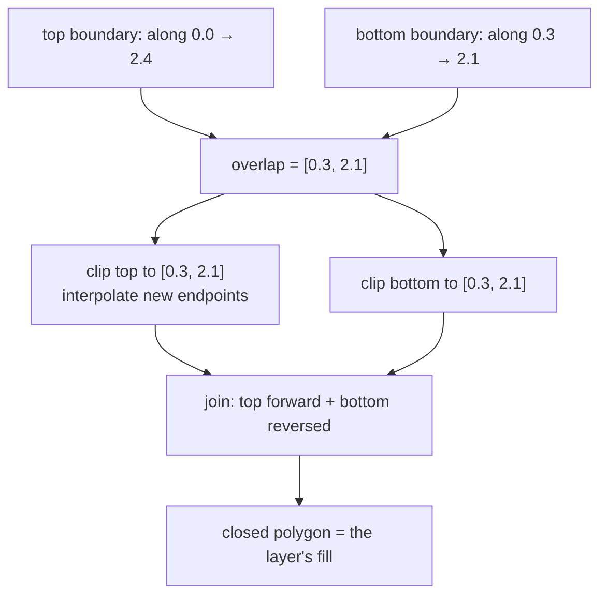

# Polyline clipping

Cutting two polylines down to the range where both exist, inserting interpolated
endpoints at the cuts. What makes it possible to shade the band between two
boundaries that were traced over different spans.

## What it is

Two boundary polylines rarely cover the same horizontal extent. One was traced
from 0.0 m to 2.4 m, the next from 0.3 m to 2.1 m. Joining them into a filled
band directly would produce a polygon with a spurious diagonal edge across each
end.

Clipping fixes it in three steps:

1. Give every point a common one-dimensional parameter — how far *along* a
   shared axis it sits.
2. Find the overlapping interval `[low, high]` where both polylines exist.
3. Cut each polyline to that interval, **interpolating a new endpoint** wherever
   a segment crosses a boundary of the interval.

Step 3 is what distinguishes clipping from filtering. Discarding out-of-range
points would leave the polyline ending at whatever vertex happened to be inside;
interpolation places the endpoint exactly on the cut.

## The picture



```
before clipping                    after clipping
top    ●───●───●───●───●           ○───●───●───○
bottom     ●───●───●                   ●───●
                                   ↑           ↑
                          interpolated endpoints,
                          exactly on the overlap bounds
```

## Where this project uses it

`poggio_webapp/static/visualizer/layer-fill.mjs`, to shade the band belonging to
each layer.

### Establishing a common axis

```javascript
const candidates = [topPoints, bottomPoints]
  .map((points) => {
    const start = points[0];
    const end = points[points.length - 1];
    const dx = end.x - start.x;
    const dy = end.y - start.y;
    return { dx, dy, length: Math.hypot(dx, dy) };
  })
  .sort((a, b) => b.length - a.length);
const axis = candidates[0];
if (!axis || axis.length <= EPSILON) return null;

const ux = axis.dx / axis.length;
const uy = axis.dy / axis.length;
const addAlong = (point) => ({
  ...point,
  along: (point.x * ux) + (point.y * uy),
});
```

The **longer** of the two polylines defines the axis, because a longer baseline
is better conditioned — projecting onto a nearly-degenerate short vector would
amplify noise. See [vector projection](vector-projection.md).

### Requiring monotonicity

```javascript
function normalizeDirection(points) {
  const normalized = points[points.length - 1].along < points[0].along
    ? [...points].reverse()
    : [...points];
  for (let index = 1; index < normalized.length; index += 1) {
    if (normalized[index].along + EPSILON < normalized[index - 1].along) {
      return null;
    }
  }
  return normalized;
}
```

Both polylines are turned to run in the same direction, and any that doubles
back is **refused** rather than repaired. A boundary that reverses along the
wall is not a valid section boundary, and clipping it would produce a tangled
polygon.

### The clip itself

```javascript
function clipPolyline(points, low, high) {
  const clipped = [];
  for (let index = 0; index < points.length - 1; index += 1) {
    const start = points[index];
    const end = points[index + 1];
    if (end.along < low - EPSILON || start.along > high + EPSILON) {
      continue;
    }
    if (Math.abs(end.along - start.along) <= EPSILON) {
      if (start.along >= low - EPSILON && start.along <= high + EPSILON) {
        appendDistinct(clipped, start);
        appendDistinct(clipped, end);
      }
      continue;
    }
    const segmentLow = Math.max(low, start.along);
    const segmentHigh = Math.min(high, end.along);
    if (segmentLow > segmentHigh + EPSILON) continue;
    appendDistinct(clipped, interpolate(start, end, segmentLow));
    appendDistinct(clipped, interpolate(start, end, segmentHigh));
  }
  return clipped;
}
```

Four cases, all handled: segments entirely outside are skipped; **vertical**
segments (zero extent along the axis) are handled separately because
`interpolate` would divide by zero; segments partly inside are clipped at both
ends; and `appendDistinct` suppresses duplicate points at segment joins.

### Joining and validating

```javascript
const polygon = [];
clippedTop.forEach((point) => appendDistinct(polygon, point));
[...clippedBottom].reverse().forEach((point) => {
  appendDistinct(polygon, point);
});
...
if (
  polygon.length < 3
  || polygonArea(polygon) <= EPSILON
  || selfIntersects(polygon)
) {
  return null;
}
```

Top forward, bottom reversed — the standard way to close a band. Then three
gates: enough vertices, non-degenerate [area](shoelace-formula.md), and
[simple](polygon-self-intersection.md).

Returning `null` means the layer is drawn as two boundary lines with no shading —
visibly different from a wrong fill, and honest about the fact that the two
boundaries could not be reconciled. See [fail-closed design](fail-closed-design.md).

## Why this and not something else

| Alternative | How it would work here | Why it lost |
|---|---|---|
| **Join the raw polylines** | Top forward, bottom reversed, no clipping | Produces a spurious diagonal edge wherever the two spans differ — a wedge of shading over ground neither boundary describes. |
| **Filter out-of-range points** | Drop points outside the overlap | Leaves the polyline ending at an arbitrary vertex rather than on the cut, so the polygon's ends are ragged and depend on where vertices happened to fall. |
| **Extrapolate the shorter boundary** | Extend it to match the longer | **Invents geometry.** The shorter boundary was traced over a shorter span because that is what the recorder could see. Extending it manufactures evidence — the exact failure the [validator's fabrication checks](coefficient-of-variation.md) exist to detect. |
| **Sutherland–Hodgman polygon clipping** | The general algorithm | Clips a polygon against a convex region. Here there is no polygon yet — that is what is being built — and the clip region is a 1D interval, not a 2D window. |
| **Resample both to a common grid** | Interpolate both at fixed intervals | Would work, and it replaces recorded vertices with synthetic ones. Clipping keeps every original point and adds only the two endpoints the cut requires. |
| **Clip to the overlap with interpolated ends** *(chosen)* | Cut, interpolate, join, validate | Shades only where both boundaries actually exist; every interior point is a recorded one. |

The principle running through this: **shade only where there is evidence.** A
fill is a visual claim that a layer occupies that space, and the code declines to
make that claim beyond where both bounding boundaries were traced. Compare
`build_gempy`'s `single_face_note`, which flags surfaces extrapolated across the
whole model extent — the same concern, stated rather than avoided, because the
model cannot avoid it.

## What it costs

O(n) in vertex count — one pass per polyline — plus O(n) for the monotonicity
check and O(n²) for the final
[self-intersection](polygon-self-intersection.md) test, which dominates.

The correctness costs:

- **The common axis is an approximation.** For a strongly curved boundary,
  "distance along the axis" is not the same as arc length. Section boundaries
  are near-horizontal, so this is small.
- **Vertical segments need their own branch**, since interpolation by `along`
  would divide by zero.
- **`EPSILON` appears seven times** in this file. Every one is guarding a
  comparison on coordinates that have been through arithmetic — see
  [epsilon comparison](epsilon-comparison.md).

## Where else you meet it

- **Graphics clipping.** Cohen–Sutherland and Liang–Barsky clip lines to a
  viewport; every renderer does this before rasterising.
- **GIS**, clipping features to a map extent or a study area.
- **Video editing**, trimming clips to a common time range.
- **Time-series analysis**, aligning two series to their overlapping period
  before comparison.
- **Audio**, cross-fading between two takes over their shared region.

## Related pages

- [Linear interpolation](linear-interpolation.md) — how the cut endpoints are
  computed.
- [Vector projection](vector-projection.md) — how the common axis is built.
- [Shoelace formula](shoelace-formula.md) — the area gate on the result.
- [Polygon self-intersection](polygon-self-intersection.md) — the validity gate.
- [Epsilon comparison](epsilon-comparison.md) — why tolerances appear
  throughout.
