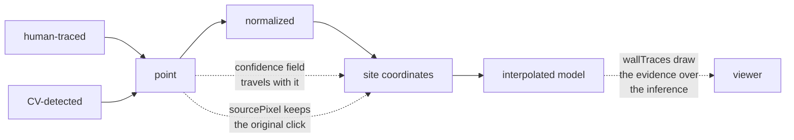

# Provenance and data lineage

Recording where each value came from and what produced it. In a pipeline that
mixes measurement, inference, and machine output, provenance is what lets a
reader tell them apart afterwards.

## What it is

**Provenance** is the origin of a value. **Lineage** is the chain of
transformations from source to result.

Both matter here because the outputs are indistinguishable by appearance. A
coordinate traced by a person, a coordinate detected by computer vision, and a
coordinate a model invented are all just numbers in a CSV. Nothing about the
number says which it is.

So provenance has to be **carried alongside the data**, at the granularity where
the distinction matters: per point, not per file.

## The picture



## Where this project uses it

### Per-point confidence

`poggio_webapp/pipeline/manual_extraction.py`:

```python
point = {
    "xMeters": x,
    "depthMeters": max(0.0, depth),
    "confidence": "human-traced",
    "sourcePixel": [pixel_x, pixel_y],
}
```

Two provenance fields on every single point. `confidence` says **how it was
obtained**; `sourcePixel` keeps **the pixel it came from**, so the browser can
redraw it on the original image and a reader can check it against the ink.

The values in use are `"human-traced"`, `"human-entered"`, and
`"human-verified"`. The third is assigned only when verified text backed it:

```python
"confidence": (
    "human-verified" if verified_info else "human-entered"
),
```

Typed and confirmed are different claims, and the field records which.

### A provenance statement written into the document

`poggio_webapp/pipeline/assign_markers.py` appends a line to the sheet's
marginalia:

```python
marginalia.append(
    f"[provenance] boundary coordinates from CV marker detection "
    f"({len(markers)} candidates: {n_boundary} boundary + "
    f"{n_noise + len(missing)} noise); "
    f"Gemini assigned loci/labels only and generated no geometry"
)
```

A sentence, in the data, saying which component produced the geometry and which
did not, with counts. Anyone reading the extraction in five years learns how it
was made without reading the code.

That claim is backed by [construction](separation-of-concerns.md), not merely
asserted: `_assemble` reads coordinates exclusively from `markers`, and the
model's response schema has no coordinate field.

### Source references on imported units

`poggio_webapp/pipeline/harris_matrix.py` defines the reference shape, and
`poggio_webapp/pipeline/harris_import.py` attaches one to every imported unit:

```python
class SourceRef(_HarrisModel):
    job_id: MatrixId
    schema_type: SourceSchemaType
    face: HumanText
    layer_index: NonNegativeInteger
    source_label: str | None
```

Every Harris unit carries a list of these (which job, which face, which layer
index, and **the label as originally written**):

```python
preserved_label = _source_label(raw_label)
clean_label = _clean_text(preserved_label)
```

`source_label` keeps the raw value even when the display label was cleaned or
substituted. The unit's own ID is derived from this same source position (see
[content-addressed identifiers](content-addressed-identifiers.md)), so identity
*is* provenance.

Re-importing merges references rather than replacing them, so a unit recorded on
two walls accumulates both:

```python
for source_ref in imported_unit.source_refs:
    if source_ref not in existing_unit.source_refs:
        existing_unit.source_refs.append(source_ref)
```

### Who asserted a relationship

```python
RelationSource = Literal["manual", "suggestion"]
```

A relation records whether a person asserted it or a machine proposal was
accepted. And `evidence` is required, so the *reason* travels with the claim.
See [JSON schema design](json-schema-design.md).

### Machine proposal versus human decision

`poggio_webapp/pipeline/detect_features.py` keeps both:

```python
"suggested_type": suggested_type,
"feature_type": suggested_type,
"status": "pending",
"source": "cv",
```

`suggested_type` is what the detector said; `feature_type` is what the reviewer
settles on. Keeping both means a later reader can see where the machine and the
person disagreed.

### Links back to the published record

`poggio_webapp/pipeline/provenance.py` extends the same idea beyond the
machine: it records which site record a job's data came from (an Open Context
or ARK URI, a Kobo submission UUID, a trenchbook page). Each value is validated
by its shape and never fetched, and only the project's own hosts are accepted,
so a stored link is one the operator vouched for. See
[provenance links](../archaeology/provenance-links.md) for the archaeological
side of these fields.

### Lineage as directory structure

Each stage writes into its own folder (`01_scan/`, `02_preprocess/`,
`03_extraction/`, `04_normalize_validate/`, `05_convert_coords/`,
`06_gempy_model/`), and `01_scan/` holds the **untouched upload**. Every derived
artifact can be traced back, and every step re-run.

`meta.json` records the chain: `scan_path`, `clean_image_path`,
`extraction_path`, `normalized_path`, `points_csv`, `orientations_csv`,
`model_outputs`.

`normalizer` returns a log of every change it made; `validator` returns a report;
`merge_walls`, `true_dip`, and `convert_coords` all return `notes`. Diagnostics
as data rather than as side effects. See
[pure functions](pure-functions-and-testability.md).

### Evidence drawn over inference

`poggio_webapp/pipeline/build_gempy.py`:

```python
def wall_traces(points):
    """One polyline per (face, surface): the points actually traced on that
    wall, in along-wall order.

    A viewer can draw these over the interpolated surfaces so a reader can
    tell data from interpolation -- everything away from a trace is the
    interpolator's guess.
    """
```

The strongest provenance mechanism in the project: the recorded points are
shipped **alongside** the model so the two can be seen together.

## Why this and not something else

| Alternative | How it would record origin | Why it lost |
|---|---|---|
| **Nothing** | Trust the reader to remember | Six months later nobody remembers which extraction was traced and which was machine-generated. |
| **A note in the README** | Document the process | Describes the *typical* case. It cannot say that *this* boundary was traced and *that* one detected. |
| **File-level metadata only** | One provenance record per document | Too coarse. A single extraction can mix CV-detected geometry with human-verified labels, which `assign_markers` produces routinely. |
| **A full provenance graph (PROV-O)** | Formal W3C provenance model | The rigorous answer, and heavy machinery for a local single-user tool. The fields here capture the distinctions that actually matter. |
| **Per-value fields plus stage folders** *(chosen)* | `confidence`, `sourcePixel`, `source_refs`, `source`, notes, and untouched originals | Granular where it matters, cheap, and readable in a text editor. |

The judgement is **granularity**. Provenance at the wrong level is nearly
useless: file-level would miss the CV/model split within one document, and
field-level for every value would be unusable. Per-point for geometry and
per-assertion for interpretation is where the distinctions live.

## What it costs

Two extra fields per point. On a boundary of forty points that is a few hundred
bytes.

The costs:

- Verbosity. `sourcePixel` roughly doubles a point's size. Worth it: it is
  what lets an overlay land on the exact ink.
- It must be maintained through every transformation. A stage that dropped
  `confidence` would silently erase the distinction.
- `confidence` is free text, not an enumeration, so `"human-traced"` and
  `"human traced"` would differ. Convention rather than constraint.
- It records the *claim*, not the truth. A point marked `"human-traced"` was
  produced by the tracing path. It does not prove a human traced it accurately.

## Where else you meet it

- Museum and archival practice, where provenance is the object's ownership
  history and is itself evidence.
- Scientific data management: FAIR principles, ORCID, DOIs.
- Machine learning, where dataset lineage decides whether a model can be
  audited.
- Build systems and SBOMs, tracking which source produced which artifact.
- Version control, which is lineage for source code.
- Journalism, where sourcing conventions do exactly this job for prose.

## Related pages

- [Interpolation versus measurement](interpolation-vs-measurement.md): the
  distinction provenance preserves.
- [Human-in-the-loop review](human-in-the-loop-review.md): where the human's
  decision is recorded.
- [Separation of concerns](separation-of-concerns.md): why the CV/model split is
  structural.
- [Content-addressed identifiers](content-addressed-identifiers.md): identity
  derived from source position.
- [Accuracy and provenance](../concepts/accuracy-and-provenance.md): the concept
  page.
