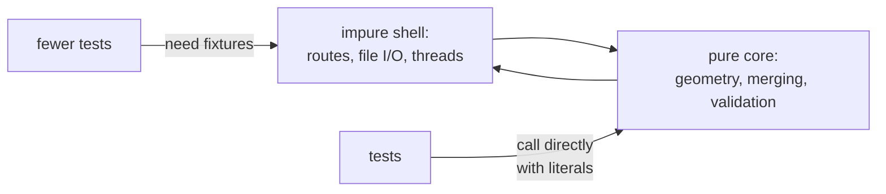

# Pure functions and testability

A function whose output depends only on its inputs, with no side effects. Easy
to test, and the reason most of this project's 1135 Python tests and its
standalone browser tests run on literal inputs, with no fixtures, no server,
and no disk.

## What it is

A **pure** function:

- returns the same output for the same input, always
- reads nothing outside its arguments
- changes nothing outside its return value

Impurity is not a flaw. A program that touched nothing would do nothing. The
discipline is to **concentrate** impurity: keep the transformations pure, push
the file reads, HTTP handling, and clock access to the edges.

What purity buys for testing:

| Property | Consequence |
|---|---|
| No setup | call it with literals |
| No teardown | nothing to clean up |
| Deterministic | no flaky tests |
| Fast | no I/O |
| Parallel-safe | no shared state |
| Composable | tested in isolation, trusted in combination |

## The picture



## Where this project uses it

### Geometry with nothing but arguments

`poggio_webapp/pipeline/editor/geometry.py`:

```python
"""Plane-geometry primitives for polygon validation.

Nothing here knows about editors, faces or jobs -- these are orientation,
segment intersection and self-intersection on lists of points.
"""
```

```python
def _direction(start, end, point):
    return (end[0] - start[0]) * (point[1] - start[1]) - (end[1] - start[1]) * (
        point[0] - start[0]
    )
```

Three tuples in, a number out. A test is one line with three literals: no job,
no file, no application.

### Merging, with the purity stated as a guarantee

`poggio_webapp/pipeline/merge_walls.py`:

```python
def merge_extractions(sheets, correlation=None):
    """Merge per-wall extractions into one multi-face trenchProfiles document.
    ...
    Returns (merged, notes) where merged == {'trenchProfiles': [...]}.
    Inputs are never mutated.
    """
```

"Inputs are never mutated" is a contract, delivered by
[copying at the boundary](immutability-and-defensive-copying.md). A test can
pass a dict, assert on the result, and reuse the same dict for the next case.

The **notes** pattern is what keeps it pure. A function that logged its warnings
would need a logger; returning them as data means the caller decides:

```python
merged, merge_notes = merge_walls.merge_extractions(
    sheets, correlation=body.get("correlation")
)
...
notes.extend(merge_notes)
```

Every pipeline module does this: `normalizer` returns a log, `validator`
returns a `Report`, `true_dip` returns notes, `convert_coords` returns notes.
Diagnostics as return values rather than as side effects.

### Injected dependencies where purity is impossible

`poggio_webapp/static/canvas/grid.mjs`:

```javascript
export function debounce(callback, waitMilliseconds, timers = globalThis) {
```

`timers` defaults to the real global and can be replaced with a fake clock. A
test advances time deterministically rather than sleeping. One parameter is the
difference between a tested debounce and an untested one.

`poggio_webapp/pipeline/harris_suggestions.py` takes its filesystem root as a
parameter:

```python
def generate_suggestions(
    matrix: HarrisMatrix,
    jobs_dir: Path,
    tolerance_m: float = 0.02,
) -> HarrisMatrix:
```

`jobs_dir` and even the **tolerance** are arguments. A test can point at a
fixture directory and vary the threshold without touching global state.

`validator.validate` does the same for its three thresholds:

```python
def validate(data, monotonic_tolerance_m=DEFAULT_MONOTONIC_TOLERANCE_M,
             top_continuity_tolerance_m=DEFAULT_TOP_CONTINUITY_TOLERANCE_M,
             max_plausible_depth_m=DEFAULT_MAX_PLAUSIBLE_DEPTH_M):
```

Defaults for production, parameters for tests (and for an operator with a
different site).

### Impurity concentrated at the edges

`run_validate` is the impure wrapper around the pure `validate`:

```python
def run_validate(input_path: str, ...):
    """Returns a dict: {errors: [...], warnings: [...], ok: bool}"""
    data = json.load(open(input_path))
    report = validate(data, monotonic_tolerance, ...)
    return {...}
```

The file read is one line at the top. Everything below is pure and separately
testable.

### The fixture that makes the impure parts safe

`tests/conftest.py`:

```python
@pytest.fixture(autouse=True)
def storage_dirs(tmp_path, monkeypatch):
    """Redirect every on-disk storage root at a fresh tmp_path.
    ...
    Autouse: no test may write to the real ``poggio_webapp/jobs``. A test that
    patched the wrong target used to pass while quietly writing into the
    developer's working tree, which is a worse failure than a red test.
    """
```

Where impurity is unavoidable, it is **contained**: every test gets a fresh
temporary directory, automatically. See
[late binding](late-binding-vs-import-time-binding.md).

### The measurable result

```
1135 Python tests collected
21 browser test files, each a plain node script with no framework
```

Most of those call pipeline functions directly. The Flask `client` fixture
exists and is used where routing genuinely needs testing, the minority. The
full Python run is dominated by a handful of integration and subprocess tests,
not by the hundreds of pure-function tests.

## Why this and not something else

| Alternative | How it would test the merge rules | Why it lost |
|---|---|---|
| **Test through the HTTP API only** | Build a request, post JSON, assert on the response | Tests the whole stack, and is slow, needs fixture data on disk, and a failure does not say *which* layer broke. |
| **Mock the dependencies** | Patch `open`, patch `storage`, patch the clock | Works, and mocks encode assumptions about *how* the code works, so a refactor breaks tests that should not care. |
| **Pure core, thin impure shell** *(chosen)* | Call `merge_extractions(sheets)` with literals | Fast, precise, and the test reads as a specification of the rule. |
| **Property-based testing** | Generate random inputs, assert invariants | Excellent *given* pure functions: a natural next step for the geometry primitives, which are ideal candidates. |
| **Integration tests only** | End-to-end runs | Present here too (`test_merge_integration.py`), and complementary rather than sufficient. |

The load-bearing observation is in `manual_extraction.py`'s own docstring:

> It is domain logic, not an HTTP concern: it holds no Flask imports and can be
> unit-tested without an app, which is how tests/test_manual_routes.py and
> tests/test_locus_top_boundaries.py had been using it all along -- by importing
> a route module to get at it.

The tests were already treating it as pure logic. The refactor made the
structure admit it.

## What it costs

More parameters, more return values, more files.

The costs:

- Threading arguments through. `jobs_dir` and `tolerance_m` are passed
  explicitly rather than read from a module. Verbose, and the reason the
  functions are testable.
- Notes instead of logging means every caller must decide what to do with
  them. A caller that ignores the list loses the diagnostics, and callers here
  propagate them into `meta.json` and the API response.
- Purity is a convention. Nothing prevents a pipeline function opening a
  file. The absence of Flask imports is the closest thing to enforcement.
- Some things cannot be pure. `start_task` spawns a thread; `_atomic_write`
  writes a file. Those are the shell, and they have the fewest tests, which is
  the trade-off accepted.

## Where else you meet it

- Functional programming: Haskell's type system makes the pure/impure split
  explicit.
- "Functional core, imperative shell", the name for exactly this
  architecture.
- React, where pure components and pure reducers are the standard.
- Property-based testing (QuickCheck, Hypothesis), which requires purity to
  work.
- Spreadsheets, where every cell is a pure function of other cells.
- Build systems, where pure steps enable caching and parallelism.

## Related pages

- [Separation of concerns](separation-of-concerns.md): how the core and shell
  are split.
- [Immutability and defensive copying](immutability-and-defensive-copying.md):
  the no-mutation half of purity.
- [Determinism and stable sorting](determinism-and-stable-sorting.md): the
  same-output-for-same-input half.
- [Late binding versus import-time binding](late-binding-vs-import-time-binding.md):
  how the impure parts stay redirectable.
- [Running the tests](../reference/running-the-tests.md): the suites.
