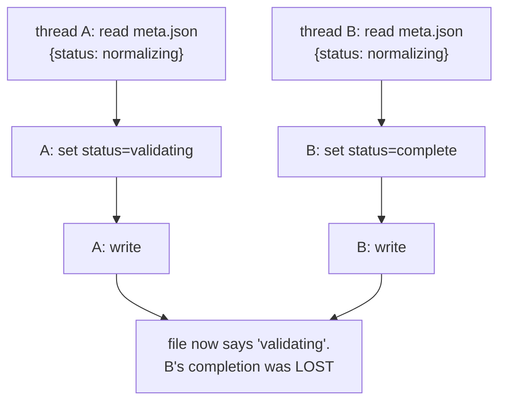

# Race conditions

A bug whose appearance depends on timing. Two threads each do something correct,
and the *interleaving* produces a state neither intended.

## What it is

A race condition arises when the outcome depends on the order in which
concurrent operations happen to run. The characteristic properties are what make
them hard:

- Intermittent: usually the timing is fine.
- Not reproducible: a debugger changes the timing.
- Invisible in the code: each thread's path is individually correct.

Three classic shapes, all present as risks in this codebase:

| Shape | Example |
|---|---|
| **Check-then-act** | "is the job idle?" → yes → start it; another thread did the same |
| **Read-modify-write** | read `meta.json`, change one field, write it back; another write is lost |
| **Time-of-check to time-of-use** | validate a path, then open it; it changed in between |

## The picture



Both threads read the same starting state, both wrote a correct-looking update,
and one update vanished.

## Where this project prevents them

### Check-then-act: starting the pipeline twice

`poggio_webapp/backend/services/editor_pipeline.py`:

```python
# Serializes the read-decide-write on meta.json in finalize_editor, so two
# concurrent finalize requests cannot both decide the job is idle and start
# the pipeline twice.
FINALIZATION_LOCK = threading.Lock()
```

The scenario is real: a user double-clicks Finalize, or a browser retries a
slow request. Two threads read `meta.json`, both see a job that is not yet
running, and both launch a GemPy build over the same output directory: two
processes writing the same files.

### Read-modify-write: losing a status update

The same file:

```python
with META_LOCK:
    meta = read_meta(job_directory)
    meta.update(
        {
            "status": "complete",
            "stage": "complete",
            "message": STATUS_MESSAGES["complete"],
        }
    )
    ...
    write_meta(job_directory, meta)
```

The worker thread writes completion; request threads write progress. Without the
lock, the interleaving in the diagram above loses one of them.

Note the **re-read inside the lock** elsewhere in the same module:

```python
with META_LOCK:
    task_id = start_task(...)
    meta = read_meta(job_directory)
    meta.update({"task_id": task_id, "gempy_task_id": task_id})
    write_meta(job_directory, meta)
```

A `meta` variable from earlier in the function is stale by definition, because the
pipeline has written to the file several times since. Re-reading inside the lock
is what makes the update a genuine read-modify-write rather than a blind
overwrite of everything that happened in between.

### Iterate-and-delete

`poggio_webapp/backend/tasks.py`:

```python
def _evict_finished():
    for task_id in list(TASKS):
        if len(TASKS) <= MAX_RETAINED_TASKS:
            return
        if TASKS[task_id]["status"] in _FINISHED:
            del TASKS[task_id]
```

Two races handled at once. `list(TASKS)` materialises the keys before iterating,
because deleting from a dict while iterating it raises `RuntimeError`, a
single-threaded hazard. And the whole call sits inside `_TASKS_LOCK`, because two
threads evicting concurrently could both read the same length and both delete.

### Time-of-check to time-of-use: unique ID allocation

`poggio_webapp/backend/harris_store.py`:

```python
for _attempt in range(100):
    matrix_id = secrets.token_hex(6)
    matrix_directory = _matrix_directory(matrix_id)
    if matrix_directory.exists():
        continue

    ...
    try:
        matrix_directory.mkdir()
    except FileExistsError:
        continue
    _atomic_write(matrix, matrix_directory / "matrix.json")
    return matrix
```

The `exists()` check is a *hint*, not a guarantee: the directory can be created
between the check and the `mkdir`. So the `mkdir` is wrapped in
`try/except FileExistsError` and the loop retries.

This is the textbook TOCTOU remedy: **do not check then act; act and handle
failure.** `mkdir` is atomic at the filesystem level, so it either wins or
raises. The `exists()` check remains only as a cheap fast path.

### Lost updates across users

`harris_store.save_matrix` faces the same shape between *users* rather than
threads, and answers it differently:

```python
current = load_matrix(matrix_id)
if expected_revision != current.revision:
    raise MatrixConflictError(expected_revision, current.revision)
```

A lock cannot help when two people have a matrix open for ten minutes. See
[optimistic concurrency control](optimistic-concurrency-control.md).

## Why this and not something else

| Alternative | How it would avoid the races | Why it lost, or won |
|---|---|---|
| **Single-threaded everything** | No concurrency at all | Removes the class entirely, and a GemPy build would block the request for minutes. |
| **[Locks](locks-and-critical-sections.md)** *(chosen for machine-written state)* | Serialise the compound operations | Simple, local, and each lock carries a comment naming the sequence it protects. |
| **[Optimistic concurrency](optimistic-concurrency-control.md)** *(chosen for user-edited state)* | Detect the conflict, refuse the write | Right when the "transaction" spans a human's editing session. |
| **[Immutable data](immutability-and-defensive-copying.md)** *(used throughout the Harris code)* | Nothing shared is mutated | Removes read-modify-write races by construction. Cheap for small documents. |
| **Atomic filesystem operations** *(used for ID allocation and writes)* | Let the OS arbitrate | `mkdir` and `os.replace` are atomic; building on them beats reimplementing exclusion. |
| **A database** | Transactions | Real isolation guarantees, and a job directory stops being a self-contained folder. |

Four strategies in one codebase, each matched to the shape of the race. That is
the point worth taking: there is no single answer, and the choice follows from
*who* is racing and *how long* the operation lasts.

## What it costs

Prevention is nearly free: a few lock acquisitions, a retry loop, some
`deepcopy` calls.

What is expensive is **not** preventing them:

- They pass tests. A race that needs a specific interleaving will not appear
  in a single-threaded test run. The defences above are tested sequentially
  (eviction order, the stale-revision refusal), but no test forces a genuine
  interleaving, because writing a reliable one means controlling the scheduler.
- They are found in production, intermittently, and reported as "it
  sometimes does something odd."
- The symptom is far from the cause. A lost status update shows up as a
  browser polling forever, not as a message about `meta.json`.

That is why the defences here are accompanied by comments naming the exact
sequence they protect. The comment is the regression test.

## Where else you meet it

- Bank account transfers, the canonical read-modify-write example.
- Web double-submits, where a payment is taken twice.
- File-upload handlers, where TOCTOU on a path check is a security
  vulnerability, closely related to
  [path traversal](path-traversal-and-containment.md).
- The Therac-25 radiation accidents, caused by a race between an operator's
  input and the machine's state.
- Distributed systems, where every message ordering is a potential race.

## Related pages

- [Locks and critical sections](locks-and-critical-sections.md): the primary
  defence here.
- [Threads and the GIL](threads-and-the-gil.md): what is already atomic.
- [Optimistic concurrency control](optimistic-concurrency-control.md): the
  defence for user-edited state.
- [Atomic file writes](atomic-file-writes.md): using the OS as arbiter.
- [Immutability and defensive copying](immutability-and-defensive-copying.md):
  removing the shared state.
